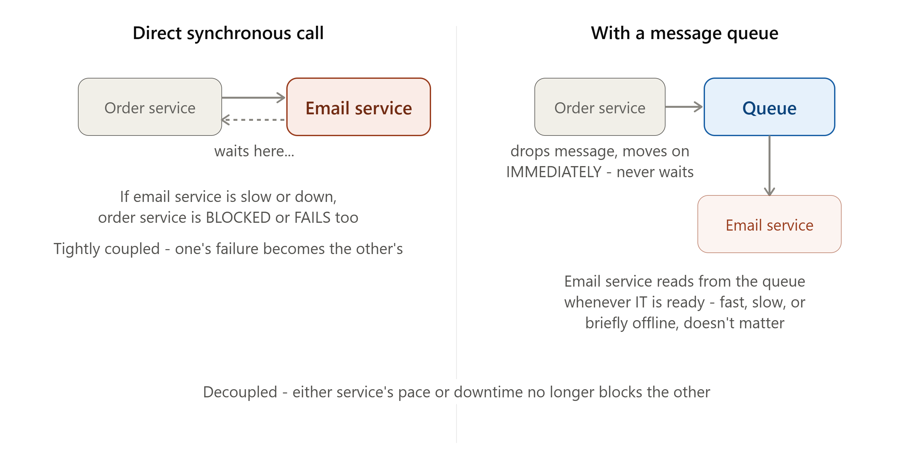
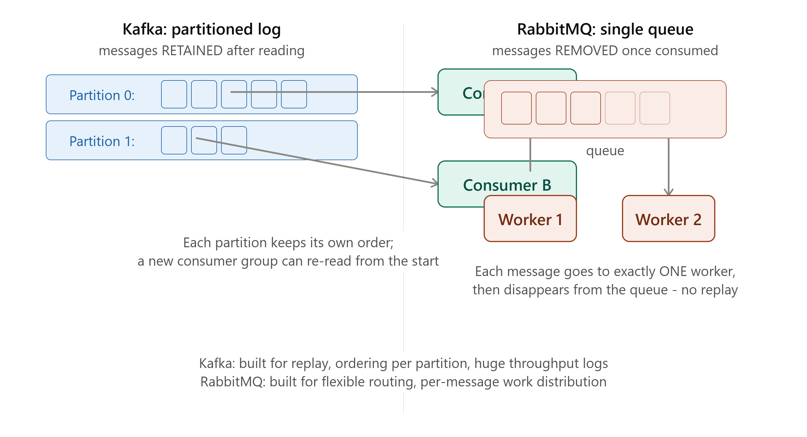

# DAY 15 — Message Queues

### (Why Decoupling Matters, Kafka vs RabbitMQ vs SQS, Producer-Consumer Implementation)

> **Why this day matters:** Welcome to Week 3 — distributed systems components, the pieces that connect independent services together. Today's topic, message queues, is the single technique that solves a problem you've now seen hinted at MULTIPLE times already (Day 13's Saga choreography, Day 14's "in a real system, fan-out would be pushed onto a queue") without it being fully explained. Today, it gets fully explained — and you'll build a real, working producer-consumer system.

> Two diagrams were rendered above — refer to them throughout **Section 1** (why decoupling matters) and **Section 3** (Kafka's partitioned log vs RabbitMQ's queue model).

---

## TABLE OF CONTENTS — DAY 15

1. Why Message Queues Exist — The Decoupling Problem
2. Core Message Queue Concepts
3. Kafka vs RabbitMQ vs SQS — Architectural Differences
4. Implementation — A Working Producer-Consumer System in Node.js (Both RabbitMQ and Kafka)
5. Delivery Guarantees — At-Most-Once, At-Least-Once, Exactly-Once
6. Day 15 Cheat Sheet

---

## 1. WHY MESSAGE QUEUES EXIST — THE DECOUPLING PROBLEM



### What

A message queue is an intermediary system that lets one part of your application (a **producer**) send a message WITHOUT waiting for whatever's going to process it, and lets another part (a **consumer**) process that message WHENEVER it's ready — completely decoupling the TIMING and the FAILURE MODES of the producer from the consumer. Refer to the diagram rendered above this lesson.

### Why

Think back to every example you've built so far in this course where one service calls another directly and waits (a normal HTTP/REST call, Day 3) — User signs up → your code directly calls an Email Service to send a welcome email → your code waits for that to finish → THEN responds to the user. This has two real, serious problems:

1. **Tight coupling of failure**: if the Email Service is down, slow, or having issues, the USER SIGNUP ITSELF fails or hangs — even though signup has nothing fundamentally to do with email delivery succeeding at that exact moment.
2. **Tight coupling of speed**: the user has to wait for the SLOWEST step in the entire chain, even for work that doesn't need to happen synchronously at all (does the user really need to wait for an email to be SENT before seeing "signup successful"? No — they just need the signup itself to succeed).

A message queue solves both: the signup process drops a "send welcome email" message onto a queue (a fast, simple, reliable operation) and immediately returns success to the user — the Email Service consumes that message and sends the email WHENEVER it's ready, completely independently, with its own failures isolated from the signup flow entirely.

### Background

Message queuing as a concept goes back to IBM's MQSeries in the 1990s, used heavily in enterprise systems integrating different software systems that couldn't communicate directly or reliably. The need exploded in relevance with the rise of **microservices architectures** (Day 19-20 topics) in the 2010s — once a single monolithic application gets split into many independent services (exactly the trend discussed throughout Day 13's Saga Pattern lesson), having those services communicate ASYNCHRONOUSLY via queues, rather than via many tightly-coupled direct synchronous calls, became essential to keeping the overall system resilient and performant.

### How — The General Flow

1. A **Producer** (e.g., your signup API) creates a message (e.g., `{ event: "user_signed_up", userId: 42, email: "..." }`) and sends it to the queue.
2. The **Queue** (managed by RabbitMQ, Kafka, SQS, etc.) durably stores this message, typically persisting it to disk, so it survives even if the queue server itself restarts.
3. One or more **Consumers** (e.g., the Email Service) continuously poll/listen to the queue, pick up messages, and process them — at THEIR OWN pace, independent of how fast or slow the Producer is sending new messages.
4. Once successfully processed, the consumer acknowledges the message (telling the queue "I'm done with this one, you can remove/mark it processed").

### Real-world example

Almost every "send a notification," "process an uploaded video," "generate a report," or "update a search index" task at any company with meaningful scale is handled via a message queue rather than a direct synchronous call — this is genuinely one of the most universally-applicable patterns in all of backend engineering, and you will use it in nearly every production Node.js system you ever build professionally, beyond a small/simple project.

### Interview Angle

"How would you handle sending a welcome email after signup without slowing down the signup request?" → message queue, with the decoupling reasoning above (failure isolation AND speed isolation) — this is one of the most common, most directly practical system design interview questions.

### How to teach this

> "Imagine a restaurant where the waiter personally walks your order back to the kitchen, stands there and WAITS while it's cooked, and only THEN goes to take the next table's order. If the kitchen is slow, EVERY table suffers, because the waiter is stuck waiting. Now imagine the waiter just drops the order slip into a rack in the kitchen (the queue) and IMMEDIATELY moves on to the next table. The chefs (consumers) pick up order slips from the rack whenever THEY'RE ready, cooking at their own pace — a slow chef doesn't freeze the waiter in place. That rack — decoupling the waiter's speed from the kitchen's speed — is exactly what a message queue does for your services."

---

## 2. CORE MESSAGE QUEUE CONCEPTS

A few foundational vocabulary terms you need before comparing specific technologies in Section 3:

- **Producer**: Anything that creates and sends messages onto the queue.
- **Consumer**: Anything that reads and processes messages from the queue.
- **Message**: The actual data being passed — typically a small, structured payload (often JSON).
- **Queue/Topic**: The named channel messages are sent to and read from (terminology differs slightly by technology, covered in Section 3).
- **Acknowledgment (ACK)**: The consumer's signal back to the queue confirming "I successfully processed this message" — this directly determines the **delivery guarantee** behavior covered in Section 5.
- **Dead Letter Queue (DLQ)**: A separate queue where messages get moved if they FAIL to be processed successfully after a certain number of retry attempts — preventing one persistently-failing message from blocking the queue forever, while still preserving it for later manual inspection/debugging rather than silently dropping it.

### Implementation — Why a DLQ matters, concretely

```js
async function processMessage(message, retryCount = 0) {
  const MAX_RETRIES = 3;
  try {
    await sendWelcomeEmail(message.userId);
    return { success: true };
  } catch (err) {
    if (retryCount >= MAX_RETRIES) {
      console.log(
        `Message failed ${MAX_RETRIES} times, moving to Dead Letter Queue`,
      );
      await deadLetterQueue.send(message); // preserve it for manual investigation
      return { success: false, movedToDLQ: true };
    }
    console.log(`Retry ${retryCount + 1}/${MAX_RETRIES} for message`);
    return processMessage(message, retryCount + 1);
  }
}
```

Without a DLQ, a message that fails due to a genuine bug (e.g., malformed data) could either be retried FOREVER (consuming resources endlessly) or silently DROPPED (losing the failure information entirely) — neither is acceptable in a real production system; a DLQ gives you a clean, deliberate place to inspect what actually went wrong.

---

## 3. KAFKA vs RABBITMQ vs SQS — ARCHITECTURAL DIFFERENCES



Refer to the diagram rendered above this lesson throughout this section — this is where "message queue" stops being one single thing and becomes a category with genuinely different underlying architectures, similar in spirit to Day 8's "NoSQL is not one thing" lesson.

### 3.1 — Apache Kafka

**What**: Kafka is fundamentally a **distributed, partitioned, replicated LOG** — messages published to a "topic" are appended to the end of a log and, critically, **RETAINED** for a configurable period (hours, days, or even indefinitely) even AFTER being read by consumers.
**Why this specific design**: Kafka was built at LinkedIn specifically to handle MASSIVE THROUGHPUT (millions of messages/second across a cluster) and to allow MULTIPLE independent consumer groups to each read the SAME stream of messages, potentially at different times, and even REPLAY old messages — none of which a traditional "remove once consumed" queue naturally supports.
**How — Partitions and Consumer Groups**: A Kafka "topic" is split into multiple **partitions** (directly connecting to **Day 11's sharding concept** — this is genuinely the same idea, applied to a message log instead of a database), each maintaining its own strict message ORDER. Multiple consumers, organized into a **consumer group**, each take responsibility for a SUBSET of the partitions, allowing horizontal scaling of consumption (Day 4's horizontal scaling concept, again reapplied) — and because messages are RETAINED, a completely different, NEW consumer group can independently re-read the ENTIRE topic from the beginning, without affecting other consumer groups at all.
**Best for**: High-throughput event streaming, event sourcing, analytics pipelines, scenarios where you need MULTIPLE different services to independently consume the SAME stream of events, or need to replay historical events.

### 3.2 — RabbitMQ

**What**: RabbitMQ is a more traditional **message broker**, built around the concept of QUEUES where each individual message is typically delivered to and consumed by exactly ONE consumer, and then REMOVED from the queue.
**Why this specific design**: RabbitMQ excels at flexible, sophisticated MESSAGE ROUTING (via "exchanges" that can route messages to different queues based on rules/patterns) and classic task-distribution patterns — "here's a list of jobs, distribute them across however many workers are currently available," directly echoing **Day 4's load-balancing "least connections" reasoning**, just applied to background jobs instead of HTTP requests.
**How**: A Producer sends a message to an "exchange," which routes it to one or more "queues" based on configured rules; Consumers ("workers") pull messages off a queue, and once acknowledged, that message is gone for good — there's no "replay" concept the way Kafka has.
**Best for**: Task queues/background job processing (resize this image, generate this PDF, send this notification), complex routing scenarios, and situations where you genuinely want a message consumed exactly once and then discarded, not retained for replay.

### 3.3 — Amazon SQS (Simple Queue Service)

**What**: A fully-managed, cloud-native (AWS) queue service, conceptually similar to RabbitMQ's queue model (each message typically processed once, then removed) but offered as a managed service requiring zero infrastructure setup/maintenance on your part.
**Why**: For teams already using AWS, SQS removes essentially ALL the operational burden (Day 1's "Maintainability" pillar, directly reapplied) of running and scaling your own RabbitMQ or Kafka cluster — AWS handles all the underlying scaling, replication, and availability.
**How**: Producers send messages via a simple API call; Consumers poll the queue for new messages; SQS handles all the distributed-systems complexity (replication for durability, scaling) invisibly, behind a simple API.
**Best for**: Teams already on AWS wanting queue functionality WITHOUT operating their own queue infrastructure — trading some flexibility/control for operational simplicity, a very similar trade-off to Day 11's "managed cloud load balancer vs hand-rolled" discussion.

### Comparison Table

|                                   | Kafka                                                    | RabbitMQ                                | SQS                                |
| --------------------------------- | -------------------------------------------------------- | --------------------------------------- | ---------------------------------- |
| Core model                        | Partitioned, retained log                                | Traditional queue (consume-once)        | Managed queue (consume-once)       |
| Message retention after consuming | Yes (configurable)                                       | No                                      | No (with some newer exceptions)    |
| Replay support                    | Yes                                                      | No                                      | No                                 |
| Throughput                        | Very high                                                | High                                    | High (managed, auto-scales)        |
| Routing flexibility               | Limited (topic/partition based)                          | Very flexible (exchanges/routing rules) | Simple (basic queue model)         |
| Operational burden                | You manage the cluster (or use a managed Kafka offering) | You manage the broker                   | Zero (fully managed by AWS)        |
| Best for                          | Event streaming, multiple independent consumers, replay  | Task queues, complex routing            | Task queues, AWS-native simplicity |

### Interview Angle

"Kafka or RabbitMQ — which would you use for X?" — the strong answer identifies WHICH specific property matters for the use case: need REPLAY or multiple independent consumer groups reading the same stream? → Kafka. Need a simple, flexible task queue with complex routing, consumed once? → RabbitMQ. Already deep in AWS and want zero operational burden? → SQS.

---

## 4. IMPLEMENTATION — A WORKING PRODUCER-CONSUMER SYSTEM IN NODE.JS

### RabbitMQ Example (using the `amqplib` library)

```js
const amqp = require("amqplib");

// --- PRODUCER ---
async function publishSignupEvent(userId, email) {
  const connection = await amqp.connect("amqp://localhost");
  const channel = await connection.createChannel();
  const queueName = "user_signups";

  await channel.assertQueue(queueName, { durable: true }); // durable = survives broker restart

  const message = JSON.stringify({ userId, email, timestamp: Date.now() });
  channel.sendToQueue(queueName, Buffer.from(message), { persistent: true }); // persisted to disk

  console.log(`Published signup event for user ${userId}`);
  await channel.close();
  await connection.close();
}

// --- CONSUMER (the Email Service, running as a separate, independent process) ---
async function startEmailConsumer() {
  const connection = await amqp.connect("amqp://localhost");
  const channel = await connection.createChannel();
  const queueName = "user_signups";

  await channel.assertQueue(queueName, { durable: true });
  channel.prefetch(1); // only take 1 unacknowledged message at a time - simple flow control

  console.log("Email consumer waiting for messages...");

  channel.consume(queueName, async (msg) => {
    const event = JSON.parse(msg.content.toString());
    console.log(`Processing signup event for user ${event.userId}`);

    try {
      await sendWelcomeEmail(event.email); // the actual slow/risky work
      channel.ack(msg); // tell RabbitMQ: success, remove this message permanently
    } catch (err) {
      console.error("Failed to send email:", err.message);
      channel.nack(msg, false, true); // tell RabbitMQ: failed, requeue for retry
    }
  });
}

async function sendWelcomeEmail(email) {
  // Simulated email sending
  console.log(`Sending welcome email to ${email}`);
}

startEmailConsumer();
// In your actual signup endpoint:
// app.post('/signup', async (req, res) => {
//   const user = await createUser(req.body);
//   await publishSignupEvent(user.id, user.email); // fire and move on - doesn't wait for email
//   res.status(201).json(user);
// });
```

### Kafka Example (using the `kafkajs` library)

```js
const { Kafka } = require("kafkajs");

const kafka = new Kafka({
  clientId: "signup-service",
  brokers: ["localhost:9092"],
});

// --- PRODUCER ---
async function publishSignupEventKafka(userId, email) {
  const producer = kafka.producer();
  await producer.connect();

  await producer.send({
    topic: "user-signups",
    messages: [
      {
        key: String(userId),
        value: JSON.stringify({ userId, email, timestamp: Date.now() }),
      },
    ],
  });
  // The 'key' here matters: Kafka uses it to consistently route this message
  // to the SAME partition every time for the SAME userId - directly reusing
  // the hash-based partitioning idea from Day 11

  console.log(`Published signup event for user ${userId} to Kafka`);
  await producer.disconnect();
}

// --- CONSUMER (as part of a named consumer group) ---
async function startEmailConsumerKafka() {
  const consumer = kafka.consumer({ groupId: "email-service-group" });
  await consumer.connect();
  await consumer.subscribe({ topic: "user-signups", fromBeginning: false });

  await consumer.run({
    eachMessage: async ({ partition, message }) => {
      const event = JSON.parse(message.value.toString());
      console.log(
        `[Partition ${partition}] Processing signup for user ${event.userId}`,
      );
      await sendWelcomeEmail(event.email);
      // Kafka auto-commits offsets by default in kafkajs, marking progress
      // through the partition - conceptually similar to RabbitMQ's ack,
      // but tracking POSITION in a retained log, not deleting the message
    },
  });
}

startEmailConsumerKafka();
```

**The genuinely important implementation difference to notice**: RabbitMQ's `channel.ack(msg)` PERMANENTLY REMOVES that message — it's gone. Kafka's consumer instead tracks an **offset** (a position/pointer) within each partition's retained log — the message itself STAYS in the log (per its retention policy), and a completely different consumer group could independently come along later and read that same message again, starting from the beginning if it wanted to. This is the EXACT architectural distinction illustrated in the diagram rendered above this lesson, now visible directly in working code.

---

## 5. DELIVERY GUARANTEES — AT-MOST-ONCE, AT-LEAST-ONCE, EXACTLY-ONCE

### What

This describes how many times a message might actually get PROCESSED by a consumer, especially in the presence of failures (a consumer crashing mid-processing, a network issue between ack and the broker, etc.) — a genuinely important, frequently-tested concept.

- **At-most-once**: A message is delivered either once, or not at all — it is NEVER redelivered, even if the consumer crashes before fully processing it. Risk: potential message LOSS.
- **At-least-once**: A message is GUARANTEED to be delivered, but MIGHT be delivered/processed MORE than once (e.g., if a consumer processes a message successfully but crashes before sending the acknowledgment, the broker will redeliver it, since it never got confirmation). Risk: potential DUPLICATE processing.
- **Exactly-once**: The message is guaranteed to be processed EXACTLY one time, no more, no less — the ideal, but genuinely the HARDEST to achieve in a truly distributed system, and most "exactly-once" claims in real systems actually mean "exactly-once EFFECT," achieved through additional application-level techniques (see below), not a free guarantee from the queue itself.

### Why At-Least-Once Is the Most Common Real-World Default, and Why It Connects Directly Back to Day 1

Most production message queue setups (including the RabbitMQ/Kafka examples above) default to **at-least-once** delivery, specifically because it's the SAFER failure mode compared to at-most-once (you'd rather risk a duplicate than risk silently LOSING a message entirely) — but this means YOUR consumer code must be written to handle the possibility of processing the SAME message more than once, SAFELY. **This is precisely Day 1's idempotency concept, reappearing here in a brand-new context** — recall Day 1's payment-charging idempotency-key example; the EXACT same principle applies to message queue consumers.

### Implementation — Making a Consumer Idempotent (directly reusing Day 1's pattern)

```js
async function processSignupEvent(event) {
  // Use the event's own natural unique identifier as an idempotency key -
  // directly reusing Day 1's idempotency-key pattern, applied to message
  // queue consumption instead of payment API calls
  const alreadyProcessed = await redisClient.get(
    `processed_event:${event.userId}:${event.timestamp}`,
  );

  if (alreadyProcessed) {
    console.log("Duplicate message detected, skipping (already processed)");
    return;
  }

  await sendWelcomeEmail(event.email);

  // Mark as processed AFTER successfully completing the work, with a
  // reasonable expiration (Day 5's TTL concept) - we don't need to
  // remember this forever, just long enough to catch realistic redeliveries
  await redisClient.set(
    `processed_event:${event.userId}:${event.timestamp}`,
    "1",
    { EX: 86400 },
  );
}
```

This single pattern — checking a unique identifier against a fast store (Redis) before doing real work, and recording completion afterward — is exactly how real production systems achieve a PRACTICAL "exactly-once effect" on top of an underlying "at-least-once" delivery guarantee, without needing the queue technology itself to solve this (which, as noted above, true exactly-once delivery is genuinely very hard to guarantee at the infrastructure level alone).

### Interview Angle

"What happens if a message gets processed twice?" → at-least-once is the common default, and the expected fix is making consumers IDEMPOTENT (directly citing Day 1's exact concept) rather than trying to force the queue itself to guarantee exactly-once, which is the harder, less commonly achieved path.

### How to teach this

> "At-most-once is like a postal worker who, if they're not 100% sure they delivered your package, just shrugs and moves on — sometimes packages get lost. At-least-once is a postal worker who keeps re-attempting delivery until THEY get confirmation, even if that means occasionally delivering the SAME package twice if your confirmation slip got lost on its way back to them. Exactly-once would mean a postal worker who can SOMEHOW guarantee delivery happens precisely once no matter what fails along the way — genuinely very hard to build for real. Most real systems choose at-least-once, and then make sure that receiving the same package twice doesn't actually cause any problem (e.g., you just discard the duplicate at your door) — that 'discarding duplicates safely' part is exactly what making your consumer idempotent means."

---

## 6. DAY 15 CHEAT SHEET

```
WHY MESSAGE QUEUES EXIST
  Decouple PRODUCER from CONSUMER: producer drops a message and moves on,
  consumer processes whenever ready - isolates both FAILURE and SPEED
  Direct synchronous calls: one service's slowness/downtime blocks the other
  Queue in between: neither blocks the other

CORE CONCEPTS
  Producer / Consumer / Message / Queue-or-Topic / Acknowledgment (ACK)
  Dead Letter Queue (DLQ): catches messages that fail repeatedly, instead
  of retrying forever or silently dropping them

KAFKA
  Partitioned, RETAINED log - messages stay even after being read
  Multiple consumer groups can independently re-read/replay the same stream
  Partitions = Day 11's sharding concept, reapplied to a message log
  Best for: event streaming, high throughput, multiple independent consumers

RABBITMQ
  Traditional queue - message consumed ONCE then removed, no replay
  Flexible routing via exchanges; great for task/job distribution
  Best for: background job queues, complex routing needs

SQS
  Managed, AWS-native, RabbitMQ-like consume-once model
  Zero operational burden - AWS handles scaling/replication/availability
  Best for: AWS-native teams wanting simplicity over flexibility

DELIVERY GUARANTEES
  At-most-once  - might LOSE messages, never duplicates
  At-least-once - guaranteed delivery, but might DUPLICATE (the common default)
  Exactly-once  - the ideal, genuinely hard to achieve at the infra level alone
  FIX for at-least-once duplicates: make consumers IDEMPOTENT
  (directly reusing Day 1's idempotency-key pattern, applied to message
  processing instead of payment APIs)
```

---

### What's next (Day 16 preview)

Tomorrow builds directly on today: the **Pub-Sub pattern** (Publish-Subscribe) versus the Queue pattern you just learned — a genuinely important distinction (one message can go to MANY subscribers, not just one consumer) — and **Event-Driven Architecture** as a broader design philosophy. You'll implement Pub-Sub using **Redis** specifically, which finally fully resolves the "WebSocket scaling needs a pub/sub backplane" cliffhanger first raised back on Day 3 and Day 4.

**Say "Day 16" whenever you're ready.**
