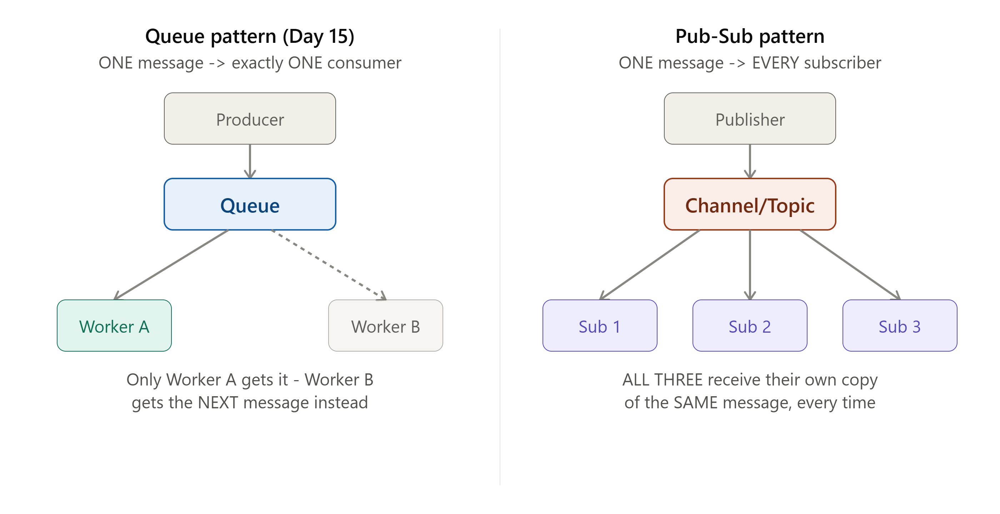
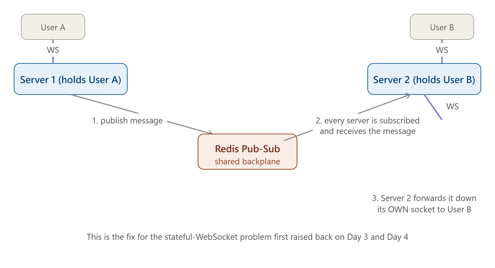

# DAY 16 — Pub-Sub, Event-Driven Architecture, and the WebSocket Scaling Resolution

### (Publish-Subscribe Pattern, Event-Driven Design, Redis Pub-Sub Implementation)

> **Why this day matters:** Today resolves a cliffhanger that's been quietly sitting in this course since Day 3 and Day 4: "WebSocket connections are stateful, and scaling them needs a pub/sub backplane — covered in full on Day 16." That day is today. You'll also learn the Pub-Sub pattern as its own first-class concept (distinct from Day 15's queue pattern, a distinction that's commonly confused), and Event-Driven Architecture as a broader design philosophy that ties directly into Day 13's Saga choreography style.

> Two diagrams were rendered above — refer to them throughout **Section 1** (Queue vs Pub-Sub) and **Section 3** (the full WebSocket-scaling resolution, the payoff of this entire day).

---

## TABLE OF CONTENTS — DAY 16

1. Pub-Sub vs Queue — The Critical Distinction
2. Event-Driven Architecture
3. THE PAYOFF — Resolving WebSocket Scaling with Redis Pub-Sub
4. Implementation — Full Pub-Sub System Using Redis in Node.js
5. Day 16 Cheat Sheet

---

## 1. PUB-SUB vs QUEUE — THE CRITICAL DISTINCTION



### What

**Publish-Subscribe (Pub-Sub)** is a messaging pattern where a **Publisher** sends a message to a named **channel/topic**, and EVERY single **Subscriber** currently listening to that channel receives their OWN independent copy of that message. This is fundamentally different from Day 15's **Queue pattern**, where a message goes to exactly ONE consumer (whichever one happens to pick it up), even if multiple consumers are competing to read from the same queue. Refer to the diagram rendered above this lesson — this single visual is the entire concept.

### Why this distinction is so commonly confused, and why it matters

Many people use "pub-sub" and "message queue" as loose synonyms — but they solve genuinely DIFFERENT problems, and picking the wrong one for your use case causes real bugs:

- If you need to distribute WORK across multiple competing workers, where each unit of work should be handled by exactly ONE worker (e.g., "process this image" — you don't want 5 different workers all processing the SAME image redundantly) → you want the **Queue pattern** (Day 15).
- If you need to NOTIFY multiple, independent interested parties that something happened, where EACH of them needs to independently react (e.g., "a new order was placed" — the Inventory Service, the Analytics Service, AND the Notification Service ALL need to know, independently, and none of them should "steal" this event from the others) → you want the **Pub-Sub pattern**.

### Background

Pub-Sub as an architectural pattern predates modern message queues, with roots in event-notification systems going back decades — but it became a standard, name-recognized building block in modern backend systems specifically because of exactly the multi-interested-party problem above, which became increasingly common as systems were broken into more and more independent microservices (Day 13/19-20), each often needing to react to the SAME real-world business events for entirely different reasons.

### How

1. A **Publisher** sends a message to a named channel (e.g., `order_placed`).
2. The Pub-Sub system broadcasts that message to EVERY currently-subscribed listener on that channel — not just one.
3. Each **Subscriber** processes the message independently, completely unaware of (and unaffected by) how many OTHER subscribers also received the same message.

### A Crucial Nuance: Classic Pub-Sub (like Redis Pub-Sub) Typically Has NO Persistence

This is genuinely important and a common gotcha: in BASIC Pub-Sub implementations (Redis Pub-Sub specifically, used in Section 3-4), if NO subscriber is actively listening at the exact moment a message is published, that message is **simply lost** — there's no queue holding it for later, unlike Day 15's durable queues. This makes classic Pub-Sub a poor fit for situations where you need GUARANTEED delivery even if a consumer is temporarily offline (for that, you'd want Kafka's topic model from Day 15, which DOES retain messages, or a hybrid approach) — but it makes classic Pub-Sub PERFECT for real-time, "right now or not at all" use cases, which is exactly the WebSocket scenario in Section 3.

### Real-world example

A real e-commerce order-placed event is a textbook Pub-Sub use case: the moment an order is placed, the Inventory Service needs to decrement stock, the Email Service needs to send a confirmation, and the Analytics Service needs to log the event for reporting — ALL THREE need their own independent copy of that SAME event, and none of them should compete with each other to "claim" it the way Day 15's queue workers compete for a single job.

### Interview Angle

"What's the difference between a message queue and pub-sub?" → ONE consumer per message (queue, work distribution) vs EVERY subscriber per message (pub-sub, event notification) — and a strong answer immediately follows with a concrete example of each, exactly like the order-placed example above.

### How to teach this

> "A queue is like a single stack of customer service tickets — whichever support agent is free next picks up the NEXT ticket, and once it's picked up, no other agent sees it. Pub-Sub is like an office-wide announcement over a loudspeaker — EVERYONE in the building hears the SAME announcement at the SAME time, and each person decides independently what to do about it (one person grabs their coat because it announced rain, another ignores it because it's not relevant to them) — nobody 'steals' the announcement from anyone else; it's broadcast to all."

---

## 2. EVENT-DRIVEN ARCHITECTURE

### What

Event-Driven Architecture (EDA) is a broader system design PHILOSOPHY where services communicate primarily by producing and reacting to **events** ("something happened": `order_placed`, `user_signed_up`, `payment_failed`) rather than by directly calling each other's APIs synchronously. Both Day 15's queues and this day's Pub-Sub pattern are TOOLS commonly used to implement this broader philosophy.

### Why

Recall **Day 13's two Saga coordination styles**: Orchestration (a central coordinator explicitly directs each step) versus **Choreography** (services react to each other's events independently, with no central coordinator). Choreography IS event-driven architecture, applied specifically to the Saga problem — and EDA as a general philosophy extends this same "react to events, don't be told what to do by a central authority" idea across an ENTIRE system's architecture, not just one specific multi-step transaction.

The core benefit, directly extending Day 15's decoupling lesson: services in an event-driven system don't need to know about each other AT ALL. The Order Service doesn't need to know that an Email Service, an Analytics Service, and an Inventory Service all care about "order placed" — it just publishes the event and moves on. NEW services can be added later (e.g., a brand-new Fraud Detection Service) that ALSO cares about "order placed," WITHOUT requiring any change whatsoever to the Order Service's code — it was never aware of, or coupled to, its specific consumers in the first place.

### Background

Event-driven architecture has roots in much older event-notification and pub-sub systems (Section 1), but it gained massive, renewed prominence through the 2010s specifically alongside the microservices movement (Day 13, Day 19-20) — as companies broke monoliths into many independent services, EDA became the natural communication philosophy for keeping those services genuinely independent, rather than recreating a "distributed monolith" where every service still directly, synchronously calls every other service (which would reintroduce all of Day 15's original tight-coupling problems, just spread across a microservices architecture instead of a single codebase).

### How — Choreography vs Orchestration, Revisited from Day 13

Now that you fully understand Pub-Sub (Section 1) and message queues (Day 15), Day 13's choreography concept becomes concrete: each service SUBSCRIBES to the specific events it cares about, and PUBLISHES its own events when ITS work is done, creating a chain of reactions with no single service directing the whole flow:

```
OrderService:    publishes "OrderPlaced"
InventoryService: subscribes to "OrderPlaced" -> reserves stock
                   -> publishes "InventoryReserved" OR "InventoryReservationFailed"
PaymentService:   subscribes to "InventoryReserved" -> charges payment
                   -> publishes "PaymentCompleted" OR "PaymentFailed"
ShippingService:  subscribes to "PaymentCompleted" -> ships the order
-- If "PaymentFailed" is published, InventoryService ALSO subscribes
   to that event, and reacts by releasing the reservation
   (this is EXACTLY Day 13's compensating transaction, now implemented
   via events instead of a central orchestrator explicitly calling it)
```

### Trade-offs

- **Pro**: Maximum decoupling — services can be added, removed, or modified independently; no single service needs to know about all the others; naturally resilient (Day 1) since no central coordinator is a single point of failure.
- **Con**: The OVERALL flow of "what happens when an order is placed" is no longer written down in ONE place — it's SPREAD across however many services subscribe to relevant events, which can make the system genuinely harder to understand, trace, and debug as a whole (a real, common complaint about choreography-style EDA at scale) — this is exactly why Day 13 presented orchestration as a real alternative for cases where having ONE clear, traceable, central flow definition is more valuable than maximum decoupling.

### Interview Angle

"How would you design a system where many services need to react to the same business event, without tight coupling?" → Event-Driven Architecture, using Pub-Sub (Section 1) or a retained-log system like Kafka (Day 15) as the underlying mechanism — and being ready to discuss the choreography-vs-orchestration trade-off (Day 13) shows you can connect this to material from earlier in the course, exactly the kind of synthesis a strong candidate demonstrates.

---

## 3. THE PAYOFF — RESOLVING WEBSOCKET SCALING WITH REDIS PUB-SUB



This is the moment Day 3 and Day 4 set up. Refer to the SECOND diagram rendered above this lesson throughout this section.

### Recap of the Problem (from Day 3 and Day 4)

Recall: **Day 3** taught you WebSockets are inherently STATEFUL — a specific connection lives on ONE specific server process for its entire duration. **Day 4** explained that stateless design is what makes horizontal scaling (Day 1) work cleanly, and explicitly flagged WebSockets as the hard exception, previewing that the fix involves "sticky sessions + a pub/sub backplane (Redis Pub/Sub), covered in full on Day 16."

The concrete problem: imagine a chat application with 2 server instances behind a load balancer (Day 4). User A connects via WebSocket to Server 1. User B connects via WebSocket to Server 2. **When User A sends a chat message, Server 1 needs to deliver it to User B — but Server 1 has NO direct access to User B's WebSocket connection, because that connection physically lives in Server 2's memory, in a completely separate process.** Server 1 literally cannot reach across process/machine boundaries to push data down a socket it doesn't hold.

### How — The Resolution, Step by Step

1. User A's message arrives at Server 1 (which holds User A's WebSocket connection).
2. Instead of trying (and failing) to deliver it directly, Server 1 **publishes** the message to a Redis Pub-Sub channel (Section 1's pattern) — something like a channel named `chat_messages`.
3. **EVERY server instance** (Server 1, Server 2, and any others) is SUBSCRIBED to this same shared Redis channel — this is the "backplane" terminology Day 4 used: a shared communication layer connecting all server instances together, regardless of how many there are or which one any specific user happens to be connected to.
4. Server 2 receives the published message (since it's subscribed) and checks: "do I currently hold a WebSocket connection for the intended recipient (User B)?" — if yes, Server 2 forwards the message down ITS OWN WebSocket connection to User B.
5. Server 1, ALSO receiving its own published message back (since it's subscribed to the same channel), checks the same thing, finds it does NOT hold User B's connection, and simply ignores it for delivery purposes.

**This completely solves the problem**: it doesn't matter how many server instances exist, or which specific instance any given user is connected to — Redis Pub-Sub acts as the shared nervous system connecting all of them, ensuring a message published by ANY server can reach the SPECIFIC server that needs to actually deliver it, without any server needing direct knowledge of any other server's connections.

### Implementation — The Full, Working Resolution in Node.js

```js
const WebSocket = require("ws");
const redis = require("redis");

const wss = new WebSocket.Server({ port: 8080 });
const localConnections = new Map(); // userId -> WebSocket, ONLY for users connected to THIS server instance

const redisPublisher = redis.createClient();
const redisSubscriber = redis.createClient(); // Redis requires a SEPARATE client for subscribing

async function setup() {
  await redisPublisher.connect();
  await redisSubscriber.connect();

  // EVERY server instance subscribes to the SAME shared channel - this is the backplane
  await redisSubscriber.subscribe("chat_messages", (message) => {
    const { recipientId, payload } = JSON.parse(message);

    // Does THIS specific server instance hold the recipient's connection?
    const recipientSocket = localConnections.get(recipientId);
    if (recipientSocket && recipientSocket.readyState === WebSocket.OPEN) {
      recipientSocket.send(JSON.stringify(payload)); // deliver it locally
      console.log(
        `Delivered message to ${recipientId} (connected to THIS server)`,
      );
    }
    // If we don't hold that connection, we simply do nothing - some OTHER
    // server instance, also subscribed to this same channel, will handle it
  });
}

wss.on("connection", (socket, req) => {
  const userId = getUserIdFromRequest(req); // e.g., from an auth token
  localConnections.set(userId, socket);
  console.log(`User ${userId} connected to THIS server instance`);

  socket.on("message", async (data) => {
    const { recipientId, text } = JSON.parse(data);

    // Instead of trying to find the recipient locally (which might fail if
    // they're on a DIFFERENT server), ALWAYS publish to the shared backplane -
    // this works correctly regardless of which server holds the recipient
    await redisPublisher.publish(
      "chat_messages",
      JSON.stringify({
        recipientId,
        payload: { from: userId, text, timestamp: Date.now() },
      }),
    );
  });

  socket.on("close", () => {
    localConnections.delete(userId);
  });
});

setup();
```

**Walking through why this is correct, regardless of scale**: run this EXACT code as 5 separate server instances, all connected to the SAME Redis instance, all behind a Day 4 load balancer. ANY user connected to ANY of those 5 instances can message ANY other user, connected to ANY of those 5 instances — because the message ALWAYS goes through the shared Redis channel first, and EVERY instance checks its OWN local connection map upon receiving it. No instance needs to know how many other instances exist, or which one holds which user — this is genuinely the same kind of elegant decoupling Section 1 and Day 15 described, just applied specifically to solve the stateful-WebSocket problem.

### The Sticky Sessions Piece (completing Day 4's mention)

One remaining piece, briefly: the load balancer (Day 4) still needs **sticky sessions** for the INITIAL WebSocket connection itself — once User A establishes a WebSocket connection to Server 1, every subsequent piece of that SAME connection's traffic must continue routing to Server 1 (you can't have a load balancer randomly redirect an already-established, stateful WebSocket connection to a different backend mid-conversation) — this is typically achieved via Day 4's IP Hash algorithm, or cookie-based session affinity at the load balancer level. **Sticky sessions solve "getting connected to the right server initially"; Redis Pub-Sub (just implemented above) solves "communicating ACROSS servers once connected."** Both pieces are needed together for a complete, correct solution.

### Interview Angle

"How would you scale a real-time chat application across multiple servers?" — this is now a question you can answer COMPLETELY and CONFIDENTLY, citing: WebSockets for the real-time connection (Day 3), sticky sessions at the load balancer for initial connection routing (Day 4), and a Redis Pub-Sub backplane for cross-server message delivery (today) — this exact answer, delivered fluently, is a strong signal of genuine, connected understanding across multiple weeks of material, not memorized fragments.

---

## 4. IMPLEMENTATION — A FULL GENERAL-PURPOSE PUB-SUB SYSTEM IN NODE.JS

Beyond the WebSocket-specific case above, here's Pub-Sub used for the general Event-Driven Architecture pattern from Section 2 — multiple, independent services all reacting to the same business event:

```js
const redis = require("redis");

// --- PUBLISHER (Order Service) ---
async function publishOrderPlaced(order) {
  const publisher = redis.createClient();
  await publisher.connect();

  await publisher.publish(
    "order_placed",
    JSON.stringify({
      orderId: order.id,
      userId: order.userId,
      items: order.items,
      total: order.total,
    }),
  );

  console.log(`Published order_placed event for order ${order.id}`);
  await publisher.disconnect();
}

// --- SUBSCRIBER 1 (Inventory Service) - completely independent of the others ---
async function startInventorySubscriber() {
  const subscriber = redis.createClient();
  await subscriber.connect();
  await subscriber.subscribe("order_placed", async (message) => {
    const order = JSON.parse(message);
    console.log(`[Inventory] Reserving stock for order ${order.orderId}`);
    await reserveStock(order.items);
  });
}

// --- SUBSCRIBER 2 (Email Service) - also completely independent ---
async function startEmailSubscriber() {
  const subscriber = redis.createClient();
  await subscriber.connect();
  await subscriber.subscribe("order_placed", async (message) => {
    const order = JSON.parse(message);
    console.log(`[Email] Sending confirmation for order ${order.orderId}`);
    await sendOrderConfirmationEmail(order.userId, order.orderId);
  });
}

// --- SUBSCRIBER 3 (Analytics Service) - also independent; could be ADDED
// later without touching the Order Service's code AT ALL ---
async function startAnalyticsSubscriber() {
  const subscriber = redis.createClient();
  await subscriber.connect();
  await subscriber.subscribe("order_placed", async (message) => {
    const order = JSON.parse(message);
    console.log(`[Analytics] Logging order ${order.orderId} for reporting`);
    await logOrderEvent(order);
  });
}

startInventorySubscriber();
startEmailSubscriber();
startAnalyticsSubscriber();
// Each of these would, in reality, be a SEPARATE running process/service -
// shown together here purely for illustration
```

Notice: `publishOrderPlaced` has ZERO knowledge of any of the three subscribers — it doesn't import them, call them, or even know they exist. This is Section 2's Event-Driven Architecture benefit, made completely concrete: you could delete the Analytics subscriber entirely, or add a brand-new Fraud Detection subscriber tomorrow, and the Order Service's code would never need to change.

---

## 5. DAY 16 CHEAT SHEET

```
PUB-SUB vs QUEUE (the critical distinction)
  Queue (Day 15):   ONE message -> ONE consumer (work distribution, competing workers)
  Pub-Sub (today):  ONE message -> EVERY subscriber (event notification, broadcast)
  Classic Pub-Sub (Redis): NO persistence - if nobody's listening, message is LOST
  (unlike Day 15's durable queues) - fine for real-time, wrong for guaranteed delivery

EVENT-DRIVEN ARCHITECTURE (EDA)
  Philosophy: services react to EVENTS, not direct synchronous calls
  Directly IS Day 13's "Choreography" Saga style, generalized across a
  whole system's architecture, not just one transaction
  Pro: maximum decoupling, services added/removed without touching others
  Con: overall flow is SPREAD across services, harder to trace as a whole
  (exactly why Day 13's Orchestration remains a valid alternative)

THE WEBSOCKET SCALING RESOLUTION (Day 3 + Day 4 cliffhanger, resolved)
  Problem: WebSocket connections are stateful, tied to ONE server instance;
  Server 1 can't directly reach a user connected to Server 2
  Fix, in two parts:
    1. STICKY SESSIONS at the load balancer (Day 4's IP Hash) - gets the
       INITIAL connection routed to, and kept on, the right server
    2. REDIS PUB-SUB BACKPLANE - every server subscribes to a shared channel;
       any server can PUBLISH a message, and whichever server actually
       holds the recipient's connection forwards it down that local socket
  Both pieces needed together: sticky sessions solve "connect to the right
  server", pub-sub backplane solves "communicate across servers after that"
```

---

### What's next (Day 17 preview)

Tomorrow goes deep on something you've used in nearly every single lesson since Day 1 but haven't fully systematized yet: **Caching at Scale** — Redis internals (its core data structures, and persistence via RDB vs AOF), and the FOUR caching strategies (Cache-aside, Read-through, Write-through, Write-back/Write-around) properly compared against each other for the first time, plus a full, honest treatment of cache invalidation — the problem jokingly called one of the two hardest things in computer science, first mentioned back on Day 5.

**Say "Day 17" whenever you're ready.**
