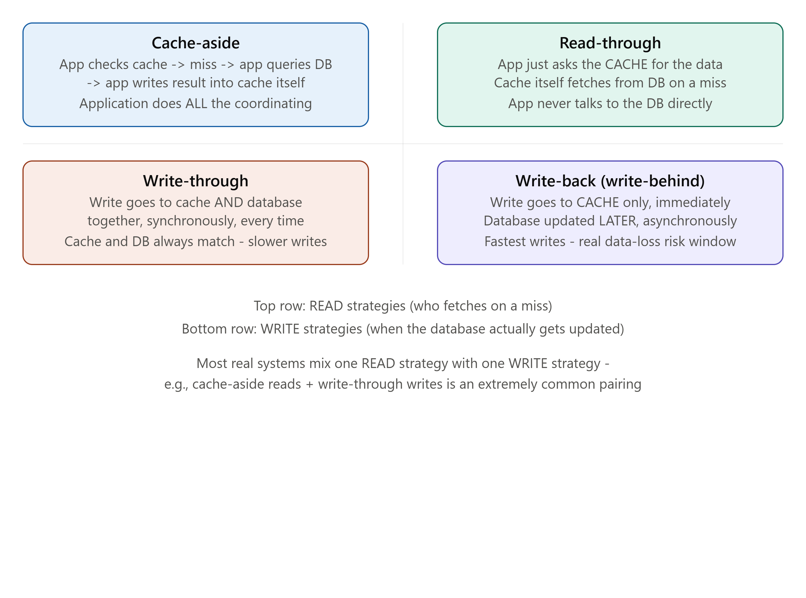
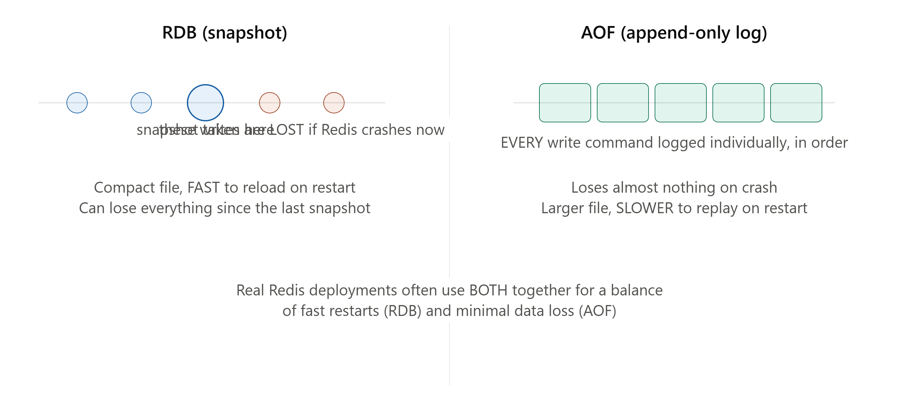

# DAY 17 — Caching at Scale

### (Redis Internals, RDB vs AOF Persistence, the Four Caching Strategies, Cache Invalidation)

> **Why this day matters:** You've used Redis and the cache-aside pattern in nearly every lesson since Day 1 — but always as a tool applied to a specific problem, never fully systematized on its own terms. Today gives you the complete picture: what Redis actually is internally, how it survives restarts without losing everything, all FOUR caching strategies properly compared (not just the one you've been using), and an honest treatment of cache invalidation — the problem jokingly called one of the two hardest things in computer science, first mentioned back on Day 5.

> Two diagrams were rendered above — refer to them throughout **Section 2** (the four caching strategies) and **Section 1** (RDB vs AOF persistence).

---

## TABLE OF CONTENTS — DAY 17

1. Redis Internals — Data Structures and Persistence (RDB vs AOF)
2. The Four Caching Strategies — Properly Compared
3. Cache Invalidation — The Genuinely Hard Problem
4. Implementation — All Four Strategies in Node.js
5. Day 17 Cheat Sheet

---

## 1. REDIS INTERNALS — DATA STRUCTURES AND PERSISTENCE

### What

Redis is an **in-memory data store** — meaning data lives primarily in RAM (which is why it's so fast — recall Day 5's "RAM is faster than disk" foundational caching principle), supporting several distinct DATA STRUCTURES beyond simple key-value strings, and offering configurable PERSISTENCE mechanisms so data can survive a restart, despite living primarily in volatile memory.

### Why this matters beyond "Redis is a fast key-value cache"

You've used Redis constantly throughout this course (Days 1, 4, 5, 7, 8, 10, 13, 15, 16) purely as a simple key-value store — but Redis offers several RICHER data structures that solve specific problems more elegantly than a plain string value would, and understanding its persistence options matters because "in-memory" sounds, at first, like "data disappears the moment the server restarts" — which would make it useless for several of the durability-sensitive things you've used it for (like Day 11's atomic counter, or Day 7's URL shortener's ID generator).

### How — Redis's Core Data Structures (briefly, since you've used some already)

- **Strings**: The simplest type — what you've used for most of this course (`SET key value`).
- **Lists**: Ordered collections, efficient to push/pop from either end — useful for Day 14's feed-store pattern (a sorted list of post IDs).
- **Sets**: Unordered, unique collections — useful for things like "set of user IDs who liked this post" (automatic deduplication).
- **Sorted Sets (ZSETs)**: Like a Set, but each member has an associated SCORE, kept automatically sorted by that score — genuinely perfect for leaderboards, or Day 14's feed store (score = timestamp, automatically giving you a reverse-chronological feed for free).
- **Hashes**: A key mapping to MULTIPLE field-value pairs (similar to a small JSON object) — useful for storing a structured record (like a user session with several fields) under ONE key, rather than needing separate keys for each field.

### How — Persistence: RDB vs AOF (refer to the diagram rendered above this lesson)

**RDB (Redis Database) — Snapshotting**:

- **What**: Periodically (e.g., every few minutes, or after a configured number of writes) Redis saves a complete, point-in-time SNAPSHOT of its entire in-memory dataset to a single file on disk.
- **Why**: This file is compact, and — critically — FAST to load back into memory when Redis restarts, since it's just one complete picture to read back in, rather than replaying a long history of individual operations.
- **The weakness**: ANY writes that happened AFTER the most recent snapshot, but BEFORE a crash, are **permanently lost** — exactly as shown in the diagram, where the writes occurring after the snapshot point vanish if Redis crashes before the NEXT snapshot.

**AOF (Append-Only File) — Command Logging**:

- **What**: Instead of periodic snapshots, Redis logs EVERY single write command (e.g., `SET`, `INCR`, `LPUSH`) to a file, in order, as it happens.
- **Why**: On restart, Redis can REPLAY this entire log of commands to perfectly reconstruct the exact final state — losing, at most, a tiny, configurable window of the very last few commands (depending on how often the log is flushed to disk), dramatically less data loss exposure than RDB's "since the last snapshot" risk.
- **The weakness**: The file grows continuously and can become large over time (Redis does support periodic "compaction"/rewriting to keep this manageable), and REPLAYING a long log on restart is slower than RDB's "just load one snapshot" approach.

**The Real-World Answer**: Many production Redis deployments use **BOTH simultaneously** — RDB for fast restarts/backups, AOF for minimal data-loss exposure — directly echoing the EXACT same "use the right tool for the right job, even within the same system" philosophy seen repeatedly throughout this course (Day 8's polyglot persistence, Day 14's hybrid fan-out strategy).

### Real-world example

This is EXACTLY why Day 7's URL shortener and Day 11's consistent-hashing counter examples could safely rely on Redis for something as important as a globally unique ID counter — with AOF enabled, even if the Redis process crashes, the counter's exact value (and every increment that led to it) can be fully reconstructed from the log, rather than being lost.

### Interview Angle

"Is Redis durable? What happens if it crashes?" → the honest, nuanced answer: by default, Redis is an in-memory store with a real risk of data loss on crash, but RDB and AOF (used together) make it genuinely durable for production use — being able to name the SPECIFIC trade-off (snapshot speed vs log completeness) demonstrates real depth here.

---

## 2. THE FOUR CACHING STRATEGIES — PROPERLY COMPARED



Refer to the FIRST diagram rendered above this lesson throughout this section. You've been using ONE of these four (Cache-Aside) constantly since Day 1 — today, you learn all four, and crucially, how to MIX a read strategy with a write strategy, since they're independent choices.

### 2.1 — Cache-Aside (Lazy Loading) — What You've Been Using All Along

**What**: The APPLICATION code is responsible for checking the cache first, and on a miss, fetching from the database and explicitly writing the result into the cache itself. This is the EXACT pattern from Day 1, Day 5, Day 7, and Day 14 — `if (cached) return cached; else { fetch from DB; write to cache; return }`.
**Why**: Simple to reason about, and naturally resilient — if the cache is completely down, the application can still fall through to the database directly (just slower), since the application itself controls the logic, not the cache.
**Weakness**: The FIRST request for any given piece of data ALWAYS experiences a cache miss (a "cold cache") and pays the full database latency — and the application code has to explicitly remember to write to the cache on every miss, which is a real source of bugs if forgotten somewhere in a large codebase.

### 2.2 — Read-Through

**What**: Conceptually similar to Cache-Aside, but the CACHE ITSELF (or a layer immediately in front of it, often provided by caching libraries/infrastructure) is responsible for fetching from the database on a miss — the application simply asks the cache for data, and is COMPLETELY UNAWARE of whether that data came from the cache directly or was just freshly fetched from the database behind the scenes.
**Why**: Centralizes the "fetch on miss" logic in ONE place (the caching layer itself) rather than scattering that logic throughout application code wherever a cache lookup happens — reducing the risk of the "developer forgot to populate the cache" bug mentioned above.
**Weakness**: Requires a caching layer/library that actually SUPPORTS this pattern (knows how to reach your specific database to fetch on a miss) — plain Redis, by itself, doesn't know how to query YOUR database; you'd need an additional library/layer configured with that knowledge, making this somewhat less universally simple to set up than Cache-Aside.

### 2.3 — Write-Through

**What**: Every WRITE operation updates BOTH the cache AND the database, SYNCHRONOUSLY, as a single logical operation — the write isn't considered "done" until both have been updated.
**Why**: Guarantees the cache and database are NEVER out of sync — directly solving the core risk of caching (Day 5's "stale data" warning) for the write path specifically, since the cache is updated at the EXACT same moment as the database, never lagging behind.
**Weakness**: Every write now pays the cost of TWO operations instead of one, directly costing LATENCY (Day 6's latency concept, reapplied) — and if you're caching data that's WRITTEN far more often than it's actually READ, you're paying this double-write cost constantly for data that may rarely even benefit from being cached at all.

### 2.4 — Write-Back (Write-Behind)

**What**: A write updates ONLY the cache immediately, and the corresponding database update happens LATER, asynchronously (often batched together with other pending writes) — directly mirroring **Day 10's asynchronous replication trade-off**, just applied to the cache-vs-database relationship instead of leader-vs-follower.
**Why**: The FASTEST possible write path — the client gets an immediate "success" response the moment the cache is updated, without waiting for the (often slower) database write at all.
**The Critical Weakness — directly echoing Day 10's exact risk**: if the cache crashes BEFORE the pending write is flushed to the database, that write is **permanently lost** — the EXACT same "asynchronous replication can lose recent writes on a crash" risk from Day 10, just relocated to the cache layer. This makes Write-Back appropriate ONLY for data where this loss risk is genuinely acceptable (again, directly echoing Day 1/7/10's repeated "click counts and likes can tolerate loss; financial transactions cannot" reasoning).

### Mixing Read and Write Strategies (the key insight this section adds)

These four aren't really "pick exactly one" — READ strategies (Cache-Aside, Read-Through) and WRITE strategies (Write-Through, Write-Back) are actually TWO SEPARATE DECISIONS, and you mix one of each:

- **Cache-Aside reads + Write-Through writes**: an extremely common, sensible pairing — reads are simple and resilient (Cache-Aside), writes guarantee cache/database consistency (Write-Through). This is genuinely a very common real-world default.
- **Read-Through + Write-Back**: prioritizes maximum read AND write speed, accepting more staleness/loss risk — appropriate for high-throughput, loss-tolerant data.

### Comparison Table

| Strategy      | Type  | Speed               | Consistency risk              | Best for                                       |
| ------------- | ----- | ------------------- | ----------------------------- | ---------------------------------------------- |
| Cache-Aside   | Read  | Fast after warm-up  | Stale until next write/expiry | General purpose (what you've used all course)  |
| Read-Through  | Read  | Same as Cache-Aside | Same                          | Centralizing fetch-on-miss logic               |
| Write-Through | Write | Slower writes       | Always consistent             | Data where staleness is unacceptable           |
| Write-Back    | Write | Fastest writes      | Real data-loss risk on crash  | High-volume, loss-tolerant data (likes, views) |

### Interview Angle

"What caching strategy would you use here?" — a strong answer explicitly separates the READ decision from the WRITE decision (most candidates conflate these into one undifferentiated "caching strategy" choice), and justifies each based on the SPECIFIC data's consistency/loss tolerance, directly reusing the "different NFRs for different data within the same system" reasoning from Day 7, Day 12, and Day 14.

---

## 3. CACHE INVALIDATION — THE GENUINELY HARD PROBLEM

### What

Cache invalidation is the problem of ensuring that when the underlying SOURCE data changes, the CACHED copy is updated or removed accordingly — so the cache never serves data that's meaningfully, harmfully out of date.

### Why this is genuinely hard (not just an exaggerated joke)

The famous line — "there are only two hard things in computer science: cache invalidation, and naming things" (often extended with "...and off-by-one errors") — is genuinely earned, not just a meme, for a concrete reason: **the cache and the source of truth are TWO SEPARATE pieces of data, in two separate locations, and keeping them in sync requires either (a) the cache knowing EXACTLY when and what changed, or (b) the cache aggressively expiring things it's not sure about, neither of which is simple at scale.** This connects directly back to **Day 12's CAP/consistency theory** — cache invalidation is fundamentally a CONSISTENCY problem, just at the application-caching layer instead of the database-replication layer.

### How — The Main Invalidation Strategies

**1. TTL-Based Expiration (what you've used throughout this course)**
**What**: Simply set an expiration time on every cached entry (Day 5's `EX` parameter, used repeatedly) — after that time, the entry is automatically removed/considered stale, forcing the next request to re-fetch fresh data.
**Why**: Simple, requires NO explicit coordination between the part of your system that WRITES data and the cache — the cache just naturally "ages out" on its own.
**Weakness**: There's an unavoidable WINDOW where data can be stale (between when the source actually changed and when the TTL expires) — choosing the right TTL is a genuine, deliberate trade-off between freshness and cache-hit-rate (Day 5), with no universally "correct" value; it depends entirely on how tolerant the specific data is of staleness (directly reusing every "different data, different tolerance" example from this entire course).

**2. Explicit Invalidation on Write**
**What**: When the underlying data CHANGES, the code performing that change EXPLICITLY deletes (or updates) the corresponding cache entry, immediately, rather than waiting for a TTL to naturally expire.
**Why**: Eliminates the staleness window almost entirely — the cache is corrected the MOMENT the source data changes, not minutes later.
**How**:

```js
async function updateProductPrice(productId, newPrice) {
  await db.products.update(productId, { price: newPrice });
  await redisClient.del(`product:${productId}`); // explicit invalidation -
  // the NEXT read will naturally miss the cache and re-fetch the fresh price
}
```

**Weakness**: Requires EVERY single code path that modifies this data to remember to also invalidate the cache — miss even ONE such path (a forgotten admin tool, a batch script, a different microservice that also writes to this table) and you have a silent, hard-to-detect staleness bug. This is a genuinely common, real-world source of "why is the cache showing old data" production incidents.

**3. Write-Through (Section 2.3, revisited as an invalidation strategy)**
Since Write-Through updates the cache AT THE SAME TIME as the database, it's ALSO, by definition, a form of cache invalidation — there's never a stale window to begin with, for writes that go through this specific path.

### The Hardest Sub-Problem: The "Thundering Herd" / "Cache Stampede"

**What**: If a HEAVILY-requested cache key expires (or is invalidated) at a moment of high traffic, MANY simultaneous requests can ALL experience a cache miss at the SAME instant, and ALL of them rush to the database simultaneously to re-fetch/recompute the same data — briefly creating a massive, unnecessary spike of duplicate load on the database, potentially serious enough to overwhelm it (directly recalling **Day 11's bottleneck discussion**, and **Day 7's "popular link" caching-effectiveness reasoning**, now showing its dark-side failure mode).
**How to fix it — Locking/Single-Flight Pattern**:

```js
const pendingFetches = new Map(); // tracks in-flight database fetches per key

async function getCachedProduct(productId) {
  const cacheKey = `product:${productId}`;
  const cached = await redisClient.get(cacheKey);
  if (cached) return JSON.parse(cached);

  // If ANOTHER request is ALREADY fetching this exact key, just wait for
  // and reuse ITS result, instead of triggering a duplicate database query
  if (pendingFetches.has(cacheKey)) {
    return pendingFetches.get(cacheKey);
  }

  const fetchPromise = (async () => {
    const product = await db.products.findById(productId);
    await redisClient.set(cacheKey, JSON.stringify(product), { EX: 3600 });
    pendingFetches.delete(cacheKey);
    return product;
  })();

  pendingFetches.set(cacheKey, fetchPromise);
  return fetchPromise;
}
```

This pattern ensures that even if 10,000 simultaneous requests arrive for the SAME just-expired key, only ONE actual database query happens — every other request simply waits for and reuses that single in-flight fetch's result, completely eliminating the stampede.

### Interview Angle

"What happens if a popular cache key expires under heavy traffic?" → the Thundering Herd / Cache Stampede problem, with the single-flight/locking pattern as the expected fix — this is a genuinely advanced, real-world question that signals strong, practical caching knowledge specifically because it goes beyond the basic cache-aside pattern most candidates stop at.

### How to teach this

> "TTL-based expiration is like a 'best by' date on a carton of milk — simple, automatic, but there's always a window where the milk might already be slightly off before the date technically passes, or might still be fine for a while after. Explicit invalidation is like a roommate who PROMISES to text you the instant the milk goes bad — much more precise, but it completely depends on them ACTUALLY remembering to text every single time, and if even one roommate forgets once, you're drinking spoiled milk without knowing it. A Cache Stampede is like the ENTIRE household discovering the milk simultaneously expired and ALL FIVE roommates rushing to the store at the exact same moment to each separately buy a new carton — when really, just ONE trip would have covered everyone."

---

## 4. IMPLEMENTATION — ALL FOUR STRATEGIES IN NODE.JS

```js
const redisClient = require("redis").createClient();

// --- 2.1 CACHE-ASIDE (read) ---
async function getCacheAside(productId) {
  const cached = await redisClient.get(`product:${productId}`);
  if (cached) return JSON.parse(cached);

  const product = await db.products.findById(productId);
  await redisClient.set(`product:${productId}`, JSON.stringify(product), {
    EX: 3600,
  });
  return product;
}

// --- 2.2 READ-THROUGH (conceptual wrapper - centralizes the fetch-on-miss logic) ---
class ReadThroughCache {
  constructor(fetchFn, ttlSeconds) {
    this.fetchFn = fetchFn;
    this.ttl = ttlSeconds;
  }
  async get(key) {
    const cached = await redisClient.get(key);
    if (cached) return JSON.parse(cached);
    const fresh = await this.fetchFn(key); // the cache layer itself knows how to fetch
    await redisClient.set(key, JSON.stringify(fresh), { EX: this.ttl });
    return fresh;
  }
}
const productCache = new ReadThroughCache(
  (key) => db.products.findById(key.split(":")[1]),
  3600,
);
// Application code now NEVER touches the database directly for this:
// const product = await productCache.get(`product:${productId}`);

// --- 2.3 WRITE-THROUGH (write) ---
async function updatePriceWriteThrough(productId, newPrice) {
  await db.products.update(productId, { price: newPrice }); // database first
  await redisClient.set(
    `product:${productId}`,
    JSON.stringify(await db.products.findById(productId)),
    { EX: 3600 },
  ); // cache updated synchronously, same operation - never out of sync
}

// --- 2.4 WRITE-BACK (write) ---
const pendingWrites = new Map();
async function updatePriceWriteBack(productId, newPrice) {
  await redisClient.set(`product:${productId}:price`, newPrice); // cache ONLY, immediately
  pendingWrites.set(productId, newPrice); // queue the database write for later
  return { success: true }; // client gets an instant response
}
setInterval(async () => {
  // Periodically flush pending writes to the database, batched together -
  // exactly Day 10's asynchronous-replication-style risk window applies here:
  // anything in `pendingWrites` is LOST if the process crashes before this runs
  for (const [productId, price] of pendingWrites) {
    await db.products.update(productId, { price });
  }
  pendingWrites.clear();
}, 5000);
```

---

## 5. DAY 17 CHEAT SHEET

```
REDIS INTERNALS
  In-memory data store - RAM, not disk, is why it's fast (Day 5's core principle)
  Data structures beyond strings: Lists, Sets, Sorted Sets (ZSETs - great for
  leaderboards/feeds), Hashes (structured records under one key)

PERSISTENCE: RDB vs AOF
  RDB - periodic full snapshot; FAST restart, but loses everything since
        the last snapshot on a crash
  AOF - logs EVERY write command; minimal loss on crash, but SLOWER restart
        (replaying the whole log)
  Real systems often use BOTH together for balance

FOUR CACHING STRATEGIES (2 read + 2 write - mix one of each!)
  READ:
    Cache-Aside    - APP checks cache, fetches DB on miss, writes to cache itself
    Read-Through   - CACHE LAYER itself fetches on miss, app is unaware
  WRITE:
    Write-Through  - write to cache AND db SYNCHRONOUSLY, always consistent, slower
    Write-Back     - write to cache ONLY, db updated LATER async, fastest,
                      real data-loss risk on crash (Day 10's async-replication
                      risk, relocated to the cache layer)
  COMMON PAIRING: Cache-Aside reads + Write-Through writes

CACHE INVALIDATION (the genuinely hard problem)
  TTL expiration       - simple, automatic, but has an inherent staleness window
  Explicit invalidation - precise, but EVERY write path must remember to do it
                          (a common, real source of stale-cache bugs)
  Thundering Herd / Cache Stampede - many simultaneous misses on a popular
  expired key all hit the DB at once
  FIX: single-flight/locking pattern - only ONE actual fetch happens,
       everyone else waits for and reuses that one in-flight result
```

---

### What's next (Day 18 preview)

Tomorrow covers **Rate Limiting** — the algorithms (Token Bucket, Leaky Bucket, Fixed Window, Sliding Window) that protect your APIs from being overwhelmed by too many requests from a single client, directly building on Day 4's load balancer health checks and Day 1's idempotency-key concepts. You'll implement a working rate limiter middleware in Node.js, backed by Redis, exactly the way real production APIs (Stripe, GitHub, Twitter) actually do it.

**Say "Day 18" whenever you're ready.**
