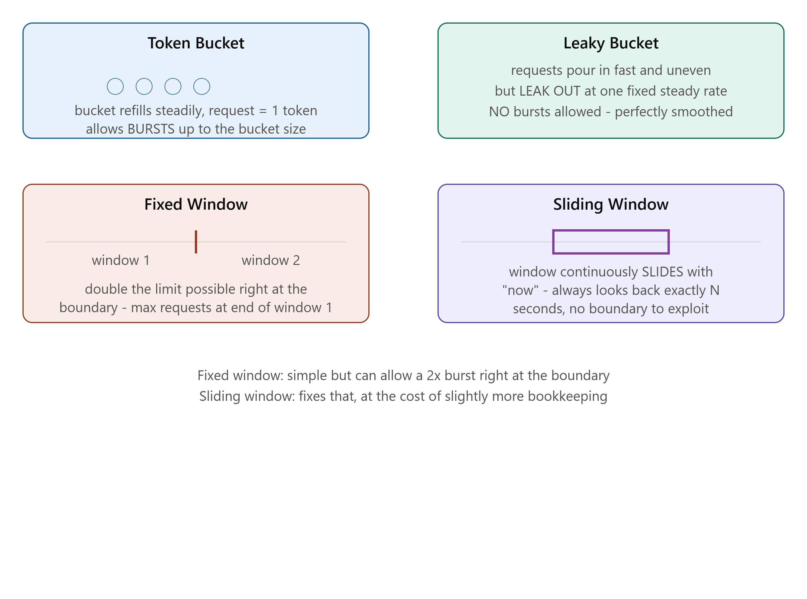

# DAY 18 — Rate Limiting

### (Token Bucket, Leaky Bucket, Fixed Window, Sliding Window — Built as Real Redis-Backed Middleware)

> **Why this day matters:** Every public API you've ever used (Stripe, GitHub, Twitter) enforces rate limits — and as a backend developer, you will be expected to BUILD this, not just consume it. Rate limiting directly protects everything you've built so far this course: your load balancer (Day 4), your database (Day 9-11), your cache (Day 17) — all of it can be brought down by one misbehaving or malicious client sending too many requests, and rate limiting is the defense.

> The diagram rendered above this lesson compares all four algorithms side by side — refer back to it throughout this entire lesson.

---

## TABLE OF CONTENTS — DAY 18

1. Why Rate Limiting Exists
2. Token Bucket
3. Leaky Bucket
4. Fixed Window Counter
5. Sliding Window
6. Where to Enforce Rate Limits (Architecture Placement)
7. Implementation — A Complete Redis-Backed Rate Limiter Middleware
8. Day 18 Cheat Sheet

---



## 1. WHY RATE LIMITING EXISTS

### What

Rate limiting is the practice of restricting how many requests a given client (identified by user ID, API key, or IP address — recall Day 2's IP address discussion) can make to your system within a given time window, REJECTING or delaying requests beyond that limit.

### Why

Without rate limiting, a SINGLE client — whether malicious (a deliberate attack) or simply buggy (a client-side infinite retry loop, a misconfigured script) — can send an overwhelming volume of requests, consuming resources that should be fairly shared among ALL your users. This directly threatens **every pillar from Day 1**: it threatens **Availability** (legitimate users can't get through because the system is saturated), it can threaten **Reliability** (an overloaded database might start returning errors or corrupted partial results), and it's a direct, practical application of the **estimation work from Day 6** — your entire system was likely sized around an EXPECTED peak RPS; rate limiting is what actually ENFORCES that no single client can single-handedly blow past those assumptions.

### Background

Rate limiting concepts originate from network engineering and telecommunications (controlling data flow across constrained network links, going back decades), but became a standard, expected feature of nearly every public-facing API as the API economy grew through the 2010s — companies like Twitter, Stripe, and GitHub all publish explicit rate limit numbers and headers as part of their API contracts, making this a near-universal expectation for ANY serious public API today.

### How — The General Mechanism

1. Identify the client making the request (by API key, user ID, or IP address).
2. Track how many requests that specific client has made within a relevant time window.
3. If the client is within their allowed limit, let the request through normally.
4. If the client has EXCEEDED their limit, reject the request — typically with HTTP status `429 Too Many Requests` (a status code you can now correctly place within Day 2's 4xx client-error category) — often along with a `Retry-After` header telling the client when they can try again.

### Interview Angle

"Why would you add rate limiting to an API?" → protecting availability/reliability from abusive or buggy clients, and enforcing the capacity assumptions made during estimation (Day 6) — a strong answer connects this back to WHY the system was sized the way it was in the first place, rather than treating rate limiting as an isolated, unrelated feature.

---

## 2. TOKEN BUCKET

### What

Imagine a bucket that holds a maximum number of "tokens," which refills at a steady rate over time. Each incoming request must "spend" one token to proceed; if the bucket is empty, the request is rejected (or queued). Refer to the diagram rendered above this lesson.

### Why

This is, by far, the MOST POPULAR rate limiting algorithm in real-world use, specifically because it elegantly supports **bursting**: if a client has been idle for a while (tokens have been accumulating, up to the bucket's maximum capacity), they can legitimately send a quick BURST of several requests all at once — using up their accumulated tokens — without being unfairly punished simply for being "bursty" rather than perfectly steady. This matches REAL client behavior far better than a strategy that demands perfectly even request spacing.

### How

1. The bucket has a maximum CAPACITY (e.g., 10 tokens) and a REFILL RATE (e.g., 1 token added every second, up to the maximum capacity).
2. Each request checks: is there at least 1 token currently available? If yes, consume 1 token, allow the request. If no, reject it.
3. Tokens continuously refill over time, independent of whether requests are arriving or not — so a client that's been quiet for 10 seconds, with a refill rate of 1/sec and a max capacity of 10, will have a FULL bucket of 10 tokens ready, letting them legitimately burst 10 requests at once before needing to slow down.

### Implementation

```js
class TokenBucket {
  constructor(capacity, refillRatePerSecond) {
    this.capacity = capacity;
    this.refillRate = refillRatePerSecond;
    this.tokens = capacity; // start full
    this.lastRefillTimestamp = Date.now();
  }

  _refill() {
    const now = Date.now();
    const elapsedSeconds = (now - this.lastRefillTimestamp) / 1000;
    const tokensToAdd = elapsedSeconds * this.refillRate;
    this.tokens = Math.min(this.capacity, this.tokens + tokensToAdd);
    this.lastRefillTimestamp = now;
  }

  tryConsume() {
    this._refill();
    if (this.tokens >= 1) {
      this.tokens -= 1;
      return true; // allowed
    }
    return false; // rejected - no tokens left
  }
}

const bucket = new TokenBucket(10, 1); // capacity 10, refills 1 token/sec
console.log(bucket.tryConsume()); // true - bucket starts full
// ... after 10 rapid calls, further immediate calls return false until tokens refill
```

### Real-world example

Stripe's public API documentation explicitly describes a token-bucket-style rate limiting model — allowing legitimate short bursts of API activity (common during, e.g., a batch operation a developer triggers) while still protecting the overall system from sustained excessive load.

### Interview Angle

"Design a rate limiter that allows occasional bursts but limits sustained load" → Token Bucket is the precise, correct answer, and explicitly naming "bursting" as the specific property it provides (versus the smoother alternatives below) shows real understanding.

---

## 3. LEAKY BUCKET

### What

Conceptually the INVERSE of Token Bucket: imagine a bucket that requests POUR INTO (potentially quickly and unevenly), but which LEAKS OUT at a fixed, constant, steady rate, regardless of how fast things are pouring in. If the bucket overflows (too many requests arrive before they can "leak out"), the excess is rejected.

### Why

Token Bucket explicitly ALLOWS bursts. Leaky Bucket explicitly PREVENTS them — it enforces a perfectly SMOOTH, steady outflow rate no matter how the requests actually arrived. This matters when the THING BEING PROTECTED (e.g., a downstream service, a hardware resource) genuinely cannot handle bursts well, even brief ones, and needs a strictly even rate of work — Leaky Bucket guarantees this evenness; Token Bucket does not.

### How

1. Incoming requests are added to a queue (the "bucket"), up to a maximum queue size.
2. Requests are processed ("leaked out") at a FIXED rate (e.g., exactly 1 every 100ms), regardless of how many are currently waiting.
3. If the queue/bucket is already full when a new request arrives, that request is rejected outright.

### Implementation

```js
class LeakyBucket {
  constructor(capacity, leakRatePerSecond) {
    this.capacity = capacity;
    this.queue = [];
    this.leakRatePerSecond = leakRatePerSecond;
    setInterval(() => this._leak(), 1000 / leakRatePerSecond);
  }

  _leak() {
    if (this.queue.length > 0) {
      const request = this.queue.shift();
      request.resolve(true); // process this one request, at the steady fixed rate
    }
  }

  tryEnqueue() {
    if (this.queue.length >= this.capacity) {
      return Promise.resolve(false); // bucket full - reject immediately
    }
    return new Promise((resolve) => {
      this.queue.push({ resolve });
    });
  }
}

const leakyBucket = new LeakyBucket(20, 5); // capacity 20, processes exactly 5/sec, always
```

### Interview Angle

"Token Bucket vs Leaky Bucket — what's the actual difference?" — a precise, commonly-tested distinction: Token Bucket allows BURSTS (irregular output matching irregular, accumulated demand), Leaky Bucket enforces a perfectly SMOOTH, even output rate regardless of input pattern. Being able to state this one-sentence distinction crisply is exactly what's being tested.

### How to teach this

> "Token Bucket is like a gym membership with rollover credits — if you skip a few days, those visits 'bank up,' and you can go to the gym several times in one day to catch up, using your saved-up credits. Leaky Bucket is like a strict factory conveyor belt that moves at EXACTLY one item per second, no matter how many items get dumped onto the loading end at once — extra items just pile up and overflow if too many arrive before the belt can carry them away, but the belt itself NEVER speeds up or allows a 'rush' through."

---

## 4. FIXED WINDOW COUNTER

### What

Divide time into fixed, non-overlapping windows (e.g., one window per calendar minute: 12:00:00-12:00:59, 12:01:00-12:01:59...), and simply count how many requests a client has made WITHIN the current window — rejecting requests once the count exceeds the limit for that window, then resetting the count to zero at the start of the next window. Refer to the diagram rendered above this lesson.

### Why

This is the SIMPLEST possible rate-limiting algorithm to understand and implement — just a counter, reset on a clock-aligned schedule.

### The Critical Weakness — The Boundary Burst Problem (clearly visible in the diagram)

Imagine a limit of "100 requests per minute." A client could send 100 requests in the LAST second of window 1 (e.g., at 12:00:59), and then IMMEDIATELY send ANOTHER 100 requests in the FIRST second of window 2 (at 12:01:00) — that's 200 requests within roughly ONE ACTUAL SECOND of real time, yet the algorithm sees this as two perfectly compliant, separate windows, each individually under the 100-request limit. **The "rate" being enforced isn't actually a true, consistent rate at all — it's vulnerable to this exact boundary-straddling burst**, exactly as the diagram illustrates with the "double the limit possible right at the boundary" callout.

### Implementation

```js
async function fixedWindowRateLimit(
  redisClient,
  clientId,
  limit,
  windowSeconds,
) {
  const currentWindow = Math.floor(Date.now() / 1000 / windowSeconds);
  const key = `ratelimit:${clientId}:${currentWindow}`;

  const count = await redisClient.incr(key);
  if (count === 1) {
    await redisClient.expire(key, windowSeconds); // auto-cleanup, Day 5's TTL concept reused
  }

  return count <= limit;
}
```

### Interview Angle

"What's wrong with Fixed Window rate limiting?" → the boundary burst problem, ideally illustrated with concrete numbers exactly like the example above — this is THE expected setup question that leads directly into Sliding Window (Section 5) as the fix.

---

## 5. SLIDING WINDOW

### What

Instead of rigid, clock-aligned windows, track requests within a CONTINUOUSLY MOVING window of the last N seconds, measured relative to the CURRENT moment — "how many requests has this client made in the last 60 seconds, counting backward from right now" — rather than "how many requests in THIS calendar-aligned minute." Refer to the diagram rendered above this lesson.

### Why

This directly solves Fixed Window's boundary problem: there's no fixed "reset point" for a client to exploit, since the window is always relative to "now," continuously sliding forward — a burst spanning what WOULD have been a window boundary under Fixed Window now gets correctly counted as the genuinely-too-many requests it actually is, within any given trailing 60-second span.

### How — Two Common Implementation Approaches

**Approach A: Sliding Window Log (precise, but more memory-intensive)**
Store the EXACT TIMESTAMP of every request a client makes; on each new request, count how many stored timestamps fall within the last N seconds (discarding older ones), and compare against the limit.

```js
async function slidingWindowLogRateLimit(
  redisClient,
  clientId,
  limit,
  windowSeconds,
) {
  const key = `ratelimit:log:${clientId}`;
  const now = Date.now();
  const windowStart = now - windowSeconds * 1000;

  // Remove timestamps older than our sliding window (Redis sorted set, Day 17's ZSET)
  await redisClient.zRemRangeByScore(key, 0, windowStart);

  const requestCount = await redisClient.zCard(key);
  if (requestCount >= limit) return false; // already at limit within this trailing window

  await redisClient.zAdd(key, { score: now, value: `${now}-${Math.random()}` });
  await redisClient.expire(key, windowSeconds);
  return true;
}
```

This directly reuses **Day 17's Sorted Set (ZSET)** data structure — the "score" is the timestamp, letting Redis efficiently remove old entries and count remaining ones, exactly the kind of practical reapplication of earlier material this course has built toward.

**Approach B: Sliding Window Counter (an efficient approximation, blending Fixed Window's simplicity with Sliding Window's accuracy)**
Keep TWO fixed-window counters (the current window AND the previous one), and calculate a WEIGHTED estimate of how many requests fall within the trailing N-second window, based on how far into the current window you currently are:

```js
async function slidingWindowCounterRateLimit(
  redisClient,
  clientId,
  limit,
  windowSeconds,
) {
  const now = Date.now() / 1000;
  const currentWindowStart = Math.floor(now / windowSeconds) * windowSeconds;
  const previousWindowStart = currentWindowStart - windowSeconds;

  const currentCount = parseInt(
    (await redisClient.get(`rl:${clientId}:${currentWindowStart}`)) || 0,
  );
  const previousCount = parseInt(
    (await redisClient.get(`rl:${clientId}:${previousWindowStart}`)) || 0,
  );

  // How far are we into the CURRENT window? (0.0 = just started, 1.0 = about to end)
  const elapsedInCurrentWindow = (now - currentWindowStart) / windowSeconds;
  // Weight the previous window's count by how much of IT still "overlaps"
  // our trailing view - this is the approximation that avoids needing
  // to store every individual timestamp like Approach A does
  const estimatedCount =
    previousCount * (1 - elapsedInCurrentWindow) + currentCount;

  if (estimatedCount >= limit) return false;

  await redisClient.incr(`rl:${clientId}:${currentWindowStart}`);
  await redisClient.expire(
    `rl:${clientId}:${currentWindowStart}`,
    windowSeconds * 2,
  );
  return true;
}
```

**This is exactly the approach used by Cloudflare's publicly-documented rate limiting implementation** — a deliberate trade-off: slightly less mathematically precise than the full Log approach, but dramatically cheaper to store (two integers per client, rather than a potentially large list of individual timestamps), which matters enormously at real internet scale.

### Comparison Table

| Algorithm              | Allows bursts?                     | Boundary problem?      | Storage cost             | Precision   |
| ---------------------- | ---------------------------------- | ---------------------- | ------------------------ | ----------- |
| Token Bucket           | Yes (up to bucket capacity)        | No                     | Low (2 numbers)          | Exact       |
| Leaky Bucket           | No (smooths everything)            | No                     | Moderate (queue)         | Exact       |
| Fixed Window           | Yes, unintentionally at boundaries | YES (the weakness)     | Very low (1 number)      | Approximate |
| Sliding Window Log     | No                                 | No                     | Higher (every timestamp) | Exact       |
| Sliding Window Counter | Slightly                           | No (effectively fixed) | Low (2 numbers)          | Approximate |

### Interview Angle

"How would you fix Fixed Window's boundary problem?" → Sliding Window, and being ready to discuss BOTH implementation approaches (the precise Log approach vs the cheaper Counter approximation) — explicitly naming the storage-vs-precision trade-off between them — demonstrates the kind of "I know there's a cheaper, real-world-deployed approximation, not just the textbook-precise version" depth that distinguishes strong answers.

---

## 6. WHERE TO ENFORCE RATE LIMITS (ARCHITECTURE PLACEMENT)

A genuinely important, practical question, directly reusing concepts from **Day 4 (Load Balancers/Reverse Proxies)** and **Day 5 (Proxies)**:

- **At the Reverse Proxy / API Gateway level** (Day 5/19): rate limiting enforced HERE, before requests even reach your application servers, protects EVERYTHING downstream (app servers, database, cache) from ever even seeing excess traffic — generally the preferred, most efficient placement.
- **At the Application level** (what Section 7's implementation demonstrates): more flexible (can apply different limits to different specific endpoints, or based on application-specific logic like a user's subscription tier), but the excess requests have ALREADY consumed some resources (a network connection, a bit of app server processing) just to be rejected.
- **Distributed rate limiting requires a SHARED store**: if you have multiple app server instances (Day 4's horizontal scaling), a rate limit counter stored in ONE server's local memory would be just as broken as Day 4's "broken stateful shopping cart" example — EVERY instance needs to check/update the SAME shared counter, which is exactly why ALL the implementations in this lesson use Redis (Day 17) as that shared store, rather than in-memory JavaScript variables.

### Interview Angle

"Where would you place rate limiting in your architecture?" → ideally at the gateway/reverse-proxy layer for maximum protection, with Redis as the shared counter store given horizontal scaling (Day 4) — and explicitly explaining WHY a local in-memory counter would be broken across multiple instances shows you're connecting this to the stateless-services lesson from Day 4, not treating rate limiting as an isolated new topic.

---

## 7. IMPLEMENTATION — A COMPLETE REDIS-BACKED RATE LIMITER MIDDLEWARE

Bringing it all together into real, usable Express middleware — the way you'd actually ship this in a production Node.js API:

```js
const redisClient = require("redis").createClient();

function createRateLimiter({ limit, windowSeconds, keyGenerator }) {
  return async function rateLimitMiddleware(req, res, next) {
    const clientId = keyGenerator(req); // e.g., API key, user ID, or IP (Day 2)
    const allowed = await slidingWindowCounterRateLimit(
      redisClient,
      clientId,
      limit,
      windowSeconds,
    );

    if (!allowed) {
      res.set("Retry-After", String(windowSeconds));
      return res.status(429).json({
        // 429 Too Many Requests - Day 2's status code knowledge
        error: "Rate limit exceeded",
        retryAfterSeconds: windowSeconds,
      });
    }

    next();
  };
}

// Using it: different limits for different endpoints, exactly the kind
// of flexibility application-level rate limiting (Section 6) provides
const standardLimiter = createRateLimiter({
  limit: 100,
  windowSeconds: 60,
  keyGenerator: (req) => req.user?.id || req.ip, // prefer authenticated user ID, fall back to IP
});

const strictLimiter = createRateLimiter({
  limit: 5,
  windowSeconds: 60,
  keyGenerator: (req) => req.ip, // e.g., for a login endpoint, to slow down brute-force attempts
});

app.use("/api/", standardLimiter);
app.post("/api/login", strictLimiter, loginHandler); // stricter limit on a sensitive endpoint
```

Notice the login endpoint deliberately uses a STRICTER, IP-based limiter — directly connecting rate limiting to a genuine SECURITY use case (slowing down password brute-force attempts), beyond just general traffic/abuse protection.

---

## 8. DAY 18 CHEAT SHEET

```
WHY RATE LIMITING EXISTS
  Protects Availability + Reliability (Day 1) from abusive/buggy clients
  Enforces the capacity assumptions made during estimation (Day 6)
  Returns HTTP 429 Too Many Requests (Day 2), often with Retry-After header

TOKEN BUCKET
  Bucket of tokens, refills steadily, 1 token = 1 request
  ALLOWS BURSTS up to bucket capacity (rewards idle clients banking tokens)
  Most popular real-world choice (Stripe-style)

LEAKY BUCKET
  Requests queue in, processed OUT at a fixed steady rate, no bursts allowed
  Use when the protected resource genuinely can't handle ANY burst

FIXED WINDOW COUNTER
  Simple counter per clock-aligned time window, resets each window
  WEAKNESS: boundary burst problem - up to 2x the limit possible by
  straddling the edge between two windows

SLIDING WINDOW
  Counts requests in a continuously moving trailing window, not clock-aligned
  Log approach: exact, stores every timestamp (Redis ZSET, Day 17 reused)
  Counter approach: cheap APPROXIMATION using current+previous window counts,
  weighted by elapsed time (what Cloudflare actually uses in production)
  Fixes Fixed Window's boundary problem

ARCHITECTURE PLACEMENT
  Best: at the gateway/reverse proxy (Day 5/19) - protects everything downstream
  MUST use a SHARED store (Redis) for the counter across multiple app
  server instances (Day 4) - a local in-memory counter is the exact same
  broken pattern as Day 4's stateful shopping cart bug
```

---

### What's next (Day 19 preview)

Tomorrow starts the final stretch of distributed systems components: **Microservices vs Monolith** — the real trade-offs (not just "microservices are modern, monoliths are old"), **Service Discovery** (how services find each other's addresses in a constantly-changing cluster), and the **API Gateway pattern** — which is exactly where today's rate limiter would actually live in a real microservices architecture. You'll build a basic API Gateway in Node.js that routes to two separate microservices.

**Say "Day 19" whenever you're ready.**
