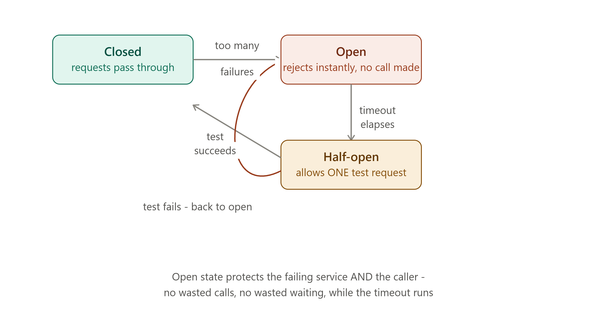
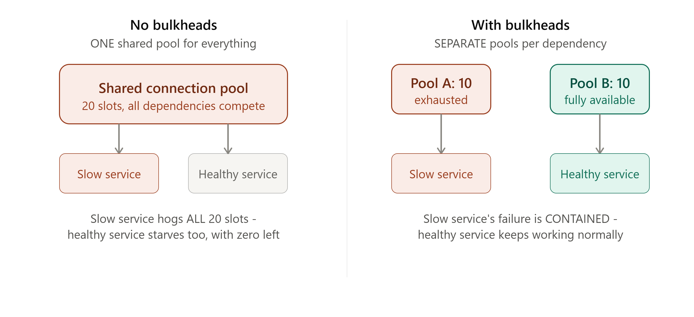

# DAY 20 — Resilience Patterns

### (Sync vs Async Communication, Circuit Breaker, Retry, Bulkhead)

> **Why this day matters:** Day 19 ended with a cliffhanger: in a microservices world, what happens when ONE service starts failing, and everything calling it keeps trying anyway? Today answers that completely. These three patterns — Circuit Breaker, Retry, and Bulkhead — are what stop a single failing service from taking down your ENTIRE system, which is one of the most realistic, most damaging failure modes in any distributed architecture, and a near-guaranteed topic in senior-level system design interviews.

> Two diagrams were rendered above — refer to them throughout **Section 2** (the Circuit Breaker state machine) and **Section 4** (the Bulkhead pattern's resource isolation).

---

## TABLE OF CONTENTS — DAY 20

1. Synchronous vs Asynchronous Inter-Service Communication
2. The Circuit Breaker Pattern
3. The Retry Pattern (and Why It's Dangerous Without the Others)
4. The Bulkhead Pattern
5. Implementation — All Three Patterns Combined in Node.js
6. Day 20 Cheat Sheet

---

## 1. SYNCHRONOUS vs ASYNCHRONOUS INTER-SERVICE COMMUNICATION

### What

**Synchronous communication**: Service A calls Service B (typically via REST or gRPC, Day 3) and WAITS for B's response before continuing — the EXACT pattern used in every direct API call example throughout this course. **Asynchronous communication**: Service A sends a message (via a queue, Day 15, or an event, Day 16) and continues IMMEDIATELY, without waiting for whoever eventually processes it.

### Why this choice matters more in microservices than anywhere else

Recall **Day 19's monolith-vs-microservices cost analysis**: once your services are SEPARATE, every synchronous call between them carries full network overhead (Day 2) AND a new failure mode that simply didn't exist in a monolith — Service B being slow or down can now directly stall or break Service A, even though they're "supposed" to be independent. This is PRECISELY the problem Day 15's message queues and Day 16's event-driven architecture were designed to solve — but synchronous calls are sometimes genuinely necessary (e.g., "is this payment valid RIGHT NOW, before I let the checkout proceed" cannot reasonably be made asynchronous) — so real systems use BOTH, deliberately, depending on the specific interaction.

### How — The Decision Framework

- **Need the result immediately to proceed** (e.g., "check inventory before confirming this order") → synchronous.
- **The caller doesn't need to wait for the result at all** (e.g., "log this event for analytics," "send a confirmation email" — Day 15's exact motivating example) → asynchronous.
- **Multiple independent services need to know about the same event** (Day 16's Pub-Sub) → asynchronous, via events.

### The Real Risk of Synchronous Chains

If Service A calls B synchronously, and B calls C synchronously, and C is slow — A is now ALSO slow, even though A never directly talked to C. This is called a **cascading failure**, and it's exactly the problem today's three patterns (Sections 2-4) exist to contain. This directly extends **Day 1's series-availability math** (chained components multiply failure probability) into a LIVE, dynamic failure-propagation problem, not just a static uptime calculation.

### Interview Angle

"Should this service call be synchronous or asynchronous?" → apply the decision framework above, and proactively mention the cascading-failure risk of long synchronous chains — this sets up perfectly for the rest of today's lesson.

---

## 2. THE CIRCUIT BREAKER PATTERN



### What

A Circuit Breaker is a wrapper around a call to another service that monitors for repeated failures, and — once a failure threshold is crossed — STOPS sending requests to that service entirely for a period of time, immediately returning an error (or a fallback) WITHOUT even attempting the call. Refer to the diagram rendered above this lesson throughout this section.

### Why

This directly names and solves the **cascading failure** problem from Section 1. If Service B is down or extremely slow, Service A retrying it (or even just calling it normally) over and over wastes A's own resources (threads, connections, time) waiting for failures that are increasingly certain to keep happening — and can make B's situation WORSE (continuing to send it traffic while it's struggling to recover). A Circuit Breaker "trips" and stops this waste, protecting BOTH services simultaneously.

### Background

The name and concept are borrowed DIRECTLY from electrical engineering: a real circuit breaker in your home trips and cuts power the instant it detects a dangerous current surge, specifically to prevent damage to the rest of the electrical system — Michael Nygard's influential 2007 book _Release It!_ popularized this exact analogy for software, and it's since become one of the most widely-implemented resilience patterns in microservices architectures.

### How — The Three States (refer to the diagram rendered above this lesson)

**1. Closed**: Normal operation — requests pass through to the actual service. The breaker counts recent failures.

**2. Open**: Triggered once failures cross a configured threshold (e.g., "5 consecutive failures," or "50% failure rate over the last 10 calls"). While open, EVERY request is REJECTED IMMEDIATELY, without even attempting to call the actual service — this is the critical detail: the breaker doesn't just fail fast, it stops generating ANY load on the already-struggling downstream service at all.

**3. Half-Open**: After a configured timeout, the breaker allows exactly ONE test request through, to check if the downstream service has recovered.

- If that test SUCCEEDS → the breaker closes again, resuming normal operation.
- If that test FAILS → the breaker returns to Open, waiting another full timeout period before trying again.

### Implementation — Using the `opossum` Library (the standard Node.js Circuit Breaker)

```js
const CircuitBreaker = require("opossum");

async function callInventoryService(productId) {
  const response = await fetch(`http://inventory-service/check/${productId}`);
  if (!response.ok) throw new Error("Inventory service error");
  return response.json();
}

const breakerOptions = {
  timeout: 3000, // if the call takes longer than 3s, treat it as a failure
  errorThresholdPercentage: 50, // trip OPEN if 50% of recent requests fail
  resetTimeout: 10000, // after 10s in OPEN, move to HALF-OPEN and test again
};

const breaker = new CircuitBreaker(callInventoryService, breakerOptions);

// A FALLBACK - what to do instead, while the breaker is open (Day 1's
// graceful degradation concept, made concrete)
breaker.fallback(() => ({
  available: true,
  note: "inventory check unavailable, assuming in stock",
}));

breaker.on("open", () =>
  console.log("Circuit OPEN - inventory service calls suspended"),
);
breaker.on("halfOpen", () =>
  console.log("Circuit HALF-OPEN - testing recovery"),
);
breaker.on("close", () =>
  console.log("Circuit CLOSED - inventory service healthy again"),
);

// Using it - identical calling code regardless of the breaker's current state
app.get("/api/products/:id/availability", async (req, res) => {
  const result = await breaker.fire(req.params.id);
  res.json(result);
});
```

Notice the **fallback** — directly reusing **Day 1's graceful degradation principle**: rather than the entire product page failing because the Inventory Service is struggling, the checkout flow degrades gracefully (assumes availability, or shows "checking stock..." instead of a hard error) — this is exactly the kind of resilience-minded design Day 1 introduced in the abstract, now made concrete with real, runnable code.

### Real-world example

Netflix's Hystrix library (now succeeded by `resilience4j` in the Java ecosystem, with `opossum` as the closely analogous Node.js equivalent used above) was one of the most influential, widely-adopted Circuit Breaker implementations, built specifically because Netflix's microservices architecture (hundreds of services calling each other) made cascading failures a frequent, very real operational problem.

### Interview Angle

"How would you prevent one failing service from taking down everything that calls it?" → Circuit Breaker, with all three states named and explained, PLUS the fallback concept — this is one of the highest-value, most expected answers in any senior-level microservices discussion.

---

## 3. THE RETRY PATTERN (AND WHY IT'S DANGEROUS WITHOUT THE OTHERS)

### What

The Retry pattern automatically re-attempts a failed request, typically with some delay between attempts, on the assumption that many failures are transient (a brief network blip, a momentary overload) rather than permanent.

### Why — And Why This Is the Pattern Most Likely to Make Things WORSE if Used Carelessly

Retrying makes sense for genuinely transient failures. But here's the critical danger, directly connecting to Section 2: **if a downstream service is failing because it's OVERLOADED, blindly retrying failed requests adds EVEN MORE load to an already-struggling service** — potentially turning a recoverable slowdown into a complete outage. This is a well-documented, real phenomenon called a **retry storm**.

### How — Doing Retries Safely

**1. Exponential Backoff**: Instead of retrying immediately (or at a fixed interval), wait progressively LONGER between each attempt (e.g., 1s, then 2s, then 4s, then 8s) — giving the struggling service real breathing room to recover, rather than being hit with retries at the same punishing rate that may have caused the problem in the first place.

**2. Jitter**: Add a small amount of RANDOMNESS to the backoff delay. Without jitter, if MANY clients all failed at the same moment (e.g., all calling a service that just had a brief outage) and all retry using the EXACT same backoff schedule, they'll all retry again at the EXACT same moment too — recreating a synchronized spike of load (directly echoing **Day 17's Thundering Herd problem**, just in a retry context instead of a cache-expiry context). Jitter spreads these retries out randomly, avoiding that synchronized spike.

**3. Combine with the Circuit Breaker (Section 2)**: Retries should STOP entirely once the circuit breaker has tripped open — there's no point retrying a call the breaker has already determined is very likely to fail. This is why these patterns are almost always used TOGETHER, not as alternatives to each other.

**4. Only Retry Idempotent Operations**: This is a direct, critical callback to **Day 1's idempotency-key lesson** and **Day 15's at-least-once delivery discussion** — retrying a non-idempotent operation (like "charge this credit card") without an idempotency safeguard can cause the SAME dangerous duplicate-action problem covered repeatedly throughout this course.

### Implementation — Retry with Exponential Backoff and Jitter

```js
async function retryWithBackoff(fn, maxRetries = 4, baseDelayMs = 1000) {
  for (let attempt = 0; attempt <= maxRetries; attempt++) {
    try {
      return await fn();
    } catch (err) {
      if (attempt === maxRetries) throw err; // out of retries, propagate the failure

      const exponentialDelay = baseDelayMs * Math.pow(2, attempt); // 1s, 2s, 4s, 8s...
      const jitter = Math.random() * exponentialDelay * 0.5; // up to 50% random jitter
      const delay = exponentialDelay + jitter;

      console.log(
        `Attempt ${attempt + 1} failed, retrying in ${Math.round(delay)}ms`,
      );
      await new Promise((resolve) => setTimeout(resolve, delay));
    }
  }
}

// Usage - combined with the idempotency-key pattern from Day 1/15
async function chargeCustomerSafely(orderId, amount) {
  return retryWithBackoff(() =>
    paymentGatewayClient.post("/charge", {
      amount,
      idempotencyKey: `charge_${orderId}`,
    }),
  );
}
```

### Interview Angle

"Would you add automatic retries to this service call?" → yes, but ONLY with exponential backoff + jitter, ONLY for idempotent operations, and ONLY in combination with a circuit breaker to stop retrying once it's clear the downstream service is genuinely down rather than just transiently slow — naming all three safeguards together is what separates a careful answer from a dangerous one.

### How to teach this

> "Imagine knocking on a friend's door, and they don't answer. Retrying immediately, over and over, as fast as possible, is like frantically banging on the door non-stop — if they're asleep or busy, this doesn't help, and might actually make things worse (annoying them, or in the software case, overloading a struggling server). Exponential backoff is knocking once, waiting a bit longer each time before knocking again, giving them a real chance to get to the door. Jitter is making sure you and 50 other people aren't ALL knocking at the EXACT same synchronized intervals, which would still sound like one continuous, overwhelming bang."

---

## 4. THE BULKHEAD PATTERN



### What

The Bulkhead pattern ISOLATES resources (most commonly, connection pools — directly reusing **Day 13's connection pooling lesson**) ALLOCATED to different downstream dependencies, so that one dependency consuming ALL of ITS allocated resources cannot starve resources needed for calls to OTHER, unrelated dependencies. Refer to the diagram rendered above this lesson.

### Why

This is genuinely the EXACT same "don't let one failure starve everything else" principle as the Circuit Breaker, but applied to a DIFFERENT resource: instead of protecting against repeated FAILED CALLS, it protects against one dependency consuming ALL of a SHARED resource pool (like Day 13's connection pool) — even if every individual call to that struggling dependency hasn't technically "failed" yet, it might just be very SLOW, tying up connections for a long time and starving everyone else who needs a connection from that same shared pool.

### Background

The name comes DIRECTLY from ship design: a ship's hull is divided into separate watertight compartments (bulkheads) specifically so that if ONE compartment floods (due to a hull breach), the damage is CONTAINED to that one section — the ship doesn't sink as a whole, because the flooding can't spread into the other compartments. This is a deliberate, literal physical-engineering analogy, applied directly to software resource allocation.

### How

1. Instead of ONE shared connection pool (Day 13) used for calls to EVERY downstream service, allocate SEPARATE, smaller pools — one specifically for calls to the Inventory Service, another specifically for calls to the Payment Service, another for the Shipping Service, and so on.
2. If the Inventory Service becomes slow and ties up ALL the connections in ITS dedicated pool, calls to Payment and Shipping are COMPLETELY UNAFFECTED — they're drawing from their OWN, separate pools, which still have plenty of available capacity.
3. Without this isolation (the left side of the diagram rendered above this lesson), a single shared pool means the slow Inventory Service can consume EVERY available connection, leaving ZERO available for Payment or Shipping calls — even though THOSE services are perfectly healthy, they appear to fail too, purely due to resource starvation, not any actual problem of their own.

### Implementation — Separate Connection Pools as Bulkheads

```js
const { Pool } = require("pg"); // reusing Day 13's connection pool concept directly

// WITHOUT bulkheads (the problematic version) - ONE shared pool for everything:
// const sharedPool = new Pool({ max: 20 });
// If Inventory queries are slow, they can consume all 20 slots, starving
// Payment and Shipping queries too - exactly the left side of the diagram

// WITH bulkheads - separate, isolated pools per dependency:
const inventoryPool = new Pool({
  connectionString: process.env.INVENTORY_DB_URL,
  max: 10,
});
const paymentPool = new Pool({
  connectionString: process.env.PAYMENT_DB_URL,
  max: 10,
});
const shippingPool = new Pool({
  connectionString: process.env.SHIPPING_DB_URL,
  max: 10,
});

// Even if inventoryPool is COMPLETELY exhausted by a slow dependency,
// paymentPool and shippingPool remain fully available - exactly the
// right side of the diagram rendered above this lesson
async function checkInventory(productId) {
  return inventoryPool.query("SELECT * FROM stock WHERE product_id = $1", [
    productId,
  ]);
}
async function processPayment(orderId, amount) {
  return paymentPool.query("INSERT INTO payments (...) VALUES (...)", [
    orderId,
    amount,
  ]);
}
```

This same isolation principle also applies beyond database connections — to thread pools, to HTTP client connection limits per downstream host, and even to entirely separate service INSTANCES dedicated to handling traffic from specific, isolated client segments (e.g., giving your highest-tier paying customers their own dedicated server pool, so a free-tier traffic spike can never degrade paid customers' experience).

### Interview Angle

"How would you stop one slow dependency from affecting calls to OTHER, unrelated dependencies?" → Bulkhead pattern, with the ship-compartment analogy and the separate-connection-pools implementation — and explicitly distinguishing this from the Circuit Breaker (which reacts to FAILURES; Bulkhead prevents RESOURCE STARVATION even without outright failure) shows you understand these as complementary, not redundant, patterns.

---

## 5. IMPLEMENTATION — ALL THREE PATTERNS COMBINED

A realistic Order Service calling an Inventory Service, with Circuit Breaker, Retry, and Bulkhead all working together:

```js
const CircuitBreaker = require("opossum");
const { Pool } = require("pg");

// BULKHEAD: dedicated, isolated pool for inventory-related database calls
const inventoryPool = new Pool({
  connectionString: process.env.INVENTORY_DB_URL,
  max: 10,
});

async function checkInventoryRaw(productId) {
  const result = await inventoryPool.query(
    "SELECT quantity FROM stock WHERE product_id = $1",
    [productId],
  );
  if (result.rows.length === 0) throw new Error("Product not found");
  return result.rows[0];
}

// RETRY: with exponential backoff + jitter, wrapping the raw call
async function checkInventoryWithRetry(productId) {
  return retryWithBackoff(() => checkInventoryRaw(productId), 2, 500); // fewer retries here -
  // this is a USER-FACING request path, so we don't want to make someone
  // wait through a long retry sequence; 2 quick retries, not 4 slow ones
}

// CIRCUIT BREAKER: wrapping the retry-enabled call, with a graceful fallback
const inventoryBreaker = new CircuitBreaker(checkInventoryWithRetry, {
  timeout: 2000,
  errorThresholdPercentage: 50,
  resetTimeout: 15000,
});
inventoryBreaker.fallback(() => ({ quantity: null, degraded: true }));

// The actual route - combines all three patterns transparently
app.get("/api/products/:id/stock", async (req, res) => {
  const stock = await inventoryBreaker.fire(req.params.id);
  if (stock.degraded) {
    // Day 1's graceful degradation in action - the page still loads,
    // just without a precise stock count, rather than failing outright
    return res.json({
      message: "Stock info temporarily unavailable",
      quantity: "unknown",
    });
  }
  res.json(stock);
});
```

**Walking through how these three layers protect each other**: a single transient blip gets handled by RETRY (Section 3) without anyone even noticing. If the Inventory Service is genuinely struggling, RETRY's repeated attempts eventually push the failure rate past the CIRCUIT BREAKER's threshold (Section 2), which then stops sending it ANY more traffic for a cooldown period — protecting the struggling service from being retried into the ground. And throughout all of this, the dedicated `inventoryPool` (Section 4) ensures that even while all this is happening, calls to completely unrelated services (Payment, Shipping) are drawing from their OWN separate pools, completely unaffected by whatever is happening to Inventory.

---

## 6. DAY 20 CHEAT SHEET

```
SYNC vs ASYNC INTER-SERVICE COMMUNICATION
  Sync (REST/gRPC, Day 3): caller waits - needed when the result is required
  immediately to proceed
  Async (queues Day 15, events Day 16): caller moves on - needed for
  decoupled side-effects, multiple independent consumers
  RISK of long sync chains: CASCADING FAILURE (Day 1's series-availability
  math, now a dynamic/live failure-propagation problem)

CIRCUIT BREAKER
  3 states: CLOSED (normal) -> OPEN (rejects instantly, no call attempted,
  after failure threshold) -> HALF-OPEN (one test request after timeout)
  -> closes on success, reopens on failure
  Protects BOTH the caller (fails fast) AND the struggling downstream
  service (stops sending it more load)
  Pair with a FALLBACK (Day 1's graceful degradation) instead of a hard error
  Node.js: the `opossum` library

RETRY
  Safe ONLY with: exponential backoff (1s,2s,4s,8s...) + jitter (randomness,
  avoids Day 17's Thundering-Herd-style synchronized retry spikes)
  ONLY retry IDEMPOTENT operations (Day 1/15's idempotency-key lesson)
  ALWAYS combine with a Circuit Breaker - stop retrying once it's open
  DANGER if used carelessly: "retry storm" - adds MORE load to an
  already-overloaded service, making things worse

BULKHEAD
  Isolate resources (connection pools, Day 13) PER DEPENDENCY, not shared
  Ship-compartment analogy: one flooded compartment doesn't sink the ship
  Protects against RESOURCE STARVATION even without outright failures -
  different problem than Circuit Breaker (which reacts to failures)
  These three patterns are used TOGETHER, not as alternatives to each other
```

---

### What's next (Day 21 preview)

Tomorrow is your Week 3 capstone: designing a complete **Notification System** — applying message queues (Day 15), pub-sub (Day 16), rate limiting (Day 18), and ALL THREE resilience patterns from today, together, into one full, end-to-end system with working Node.js code, exactly the way Day 7 and Day 14 brought their respective weeks together.

**Say "Day 21" whenever you're ready.**
