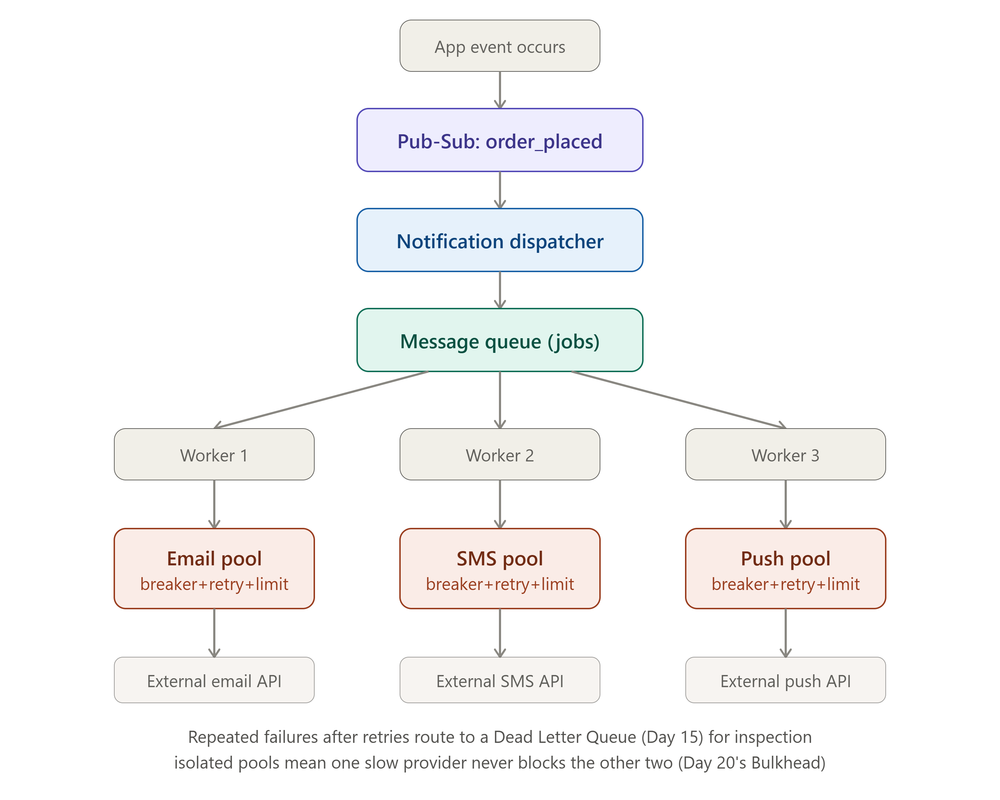

# DAY 21 — WEEK 3 CAPSTONE

### Design a Notification System (Email, SMS, Push — End to End)

> **Why this day matters:** Today brings together every distributed-systems component from Week 3 into one complete, real system — the way Day 7 did for Week 1 and Day 14 did for Week 2. "Design a notification system" is a genuinely common system design interview question on its own, and it's also EXACTLY the kind of system every backend you'll ever build eventually needs (order confirmations, password resets, alerts, marketing messages) — so this lesson is both interview practice and a directly reusable real-world blueprint.

> The diagram rendered above this lesson is the full end-to-end architecture — refer back to it throughout this entire lesson, since every section builds toward one specific piece of it.

---

## TABLE OF CONTENTS — DAY 21

1. Step 1: Requirements
2. Step 2: Estimation
3. Step 3: High-Level Architecture (Mapping the Diagram)
4. Step 4: Deep Dive — Why Pub-Sub THEN a Queue (Not Just One)
5. Step 5: Deep Dive — Per-Provider Resilience (Circuit Breaker + Retry + Rate Limit + Bulkhead, All Together)
6. Step 6: Deep Dive — User Preferences and Deduplication
7. Step 7: Bottlenecks and Trade-offs
8. Full Implementation — Node.js End to End
9. Day 21 / Week 3 Cheat Sheet

---

## STEP 1: REQUIREMENTS

### Functional Requirements (FR)

1. The system sends notifications via multiple channels: Email, SMS, Push notification.
2. Notifications are triggered by events elsewhere in the platform (an order placed, a password reset requested, a comment received).
3. Users can configure which channels they want for which types of notifications (e.g., "email me for order updates, but don't SMS me").
4. The system must not send the SAME notification multiple times for the same triggering event (deduplication).
5. If a notification fails to send, the system should retry, but eventually give up and log the failure rather than retrying forever.

### Non-Functional Requirements (NFR) — Reusing Day 1's 4 Pillars and Day 12's Consistency Models

- **Availability**: The triggering application flow (e.g., placing an order) must NEVER be blocked or slowed down by notification sending — directly reusing **Day 15's entire motivating example**.
- **Reliability**: A notification should not be silently lost — if it fails, that failure should be visible (Dead Letter Queue, Day 15), not invisible.
- **Consistency**: Eventually consistent by nature — it's completely fine if a notification arrives a few seconds (even a minute, for non-urgent ones) after the triggering event, directly reusing the "different data, different tolerance" reasoning from Days 7, 12, and 14.
- **Isolation between channels**: A problem with the SMS provider should never delay or block Email or Push notifications — this is explicitly Day 20's Bulkhead pattern, stated as a requirement upfront.
- **Protection of external providers**: Email/SMS/Push providers (Twilio, SendGrid, etc.) have THEIR OWN rate limits — the system must respect these, directly requiring Day 18's rate limiting.

---

## STEP 2: ESTIMATION

Using **Day 6's framework**, with stated assumptions:

```
Assume: 50 million Daily Active Users (DAU)
Average notifications triggered per user per day: 3 (order updates, social
notifications, marketing) - each potentially fanning out to multiple channels
Assume 1.5 channels per notification on average (some users have only email
configured, others have email + push)

Total notification-channel-sends/day = 50,000,000 x 3 x 1.5 = 225,000,000/day

Average send RPS = 225,000,000 / 86,400 ≈ 2,604 RPS
Peak send RPS (3x factor, Day 6) ≈ 7,800 RPS
```

**What this number tells us immediately**: ~7,800 peak RPS of OUTBOUND sends is far beyond what any single external provider (Email/SMS/Push APIs) would allow without hitting THEIR rate limits — this single number is what justifies needing a QUEUE (Day 15) to smooth this out into a sustainable, controlled send rate, rather than trying to fire all of these synchronously the instant each triggering event occurs.

---

## STEP 3: HIGH-LEVEL ARCHITECTURE (MAPPING THE DIAGRAM)



Refer to the full diagram rendered above this lesson — here is the reasoning behind every single box, each one a DIRECT reuse of a specific Week 3 concept:

1. **App event occurs**: somewhere else in the platform (e.g., the Order Service), something happens that should trigger a notification.
2. **Pub-Sub channel** (Day 16): the triggering service PUBLISHES an event (`order_placed`) — it has ZERO knowledge of the notification system at all, directly reusing Day 16's decoupling benefit. If a Fraud Detection service ALSO needs to react to `order_placed`, it can subscribe too, completely independently, without the Order Service ever changing.
3. **Notification Dispatcher** (a service that SUBSCRIBES to relevant events): receives the event, looks up the user's channel preferences (Step 6), and determines WHICH channels need a notification sent.
4. **Message Queue** (Day 15): the dispatcher pushes one JOB per channel-send onto a durable queue, rather than sending immediately — this is precisely what allows the system to absorb our calculated 7,800 peak RPS smoothly, rather than slamming external providers all at once.
5. **Multiple Worker processes** (horizontally scaled, Day 4): consume jobs from the queue at a sustainable, controlled rate.
6. **Per-provider isolated pools** (Day 20's Bulkhead): each channel (Email/SMS/Push) gets its OWN dedicated resources — wrapped in its OWN Circuit Breaker (Day 20) and Retry logic (Day 20) with backoff/jitter, and protected by its OWN Rate Limiter (Day 18) matched to that specific provider's actual allowed rate.
7. **Dead Letter Queue** (Day 15): notifications that fail repeatedly, even after retries, land here for visibility and manual investigation, rather than being silently dropped or retried forever.

---

## STEP 4: DEEP DIVE — WHY PUB-SUB THEN A QUEUE (NOT JUST ONE)

This is the first signature design decision worth deep-diving, exactly the way Day 7 deep-dived ID generation and Day 14 deep-dived fan-out strategy.

### The Question

Day 16 taught Pub-Sub (one message → every subscriber) and Day 15 taught Queues (one message → one consumer). A notification system clearly needs BOTH, but WHY, specifically, in THIS order?

### The Answer

- **Pub-Sub comes first** because MULTIPLE, unrelated systems might care about the SAME triggering event (`order_placed`) — not just the Notification System, but also Analytics, Fraud Detection, Inventory. Pub-Sub is the right tool for this fan-out-to-many-independent-subscribers need (Day 16's exact lesson).
- **A Queue comes second, INSIDE the Notification System specifically**, because once the Notification Dispatcher decides "this needs an Email AND a Push notification," each of those is now ONE UNIT OF WORK that should be processed by exactly ONE worker, exactly once (ideally) — this is precisely the Queue pattern's job (Day 15), not Pub-Sub's.
- **Why not skip Pub-Sub and have the Order Service push directly onto the notification queue?** Because that would COUPLE the Order Service directly to the Notification System's existence (recalling Day 16's entire decoupling argument) — if a brand-new system needs to ALSO react to `order_placed` tomorrow, the Order Service's code would need to change again. Pub-Sub avoids this entirely.

This is genuinely the most important conceptual takeaway from this entire capstone: **Pub-Sub and Queues are not competing choices — they solve different problems and are routinely used TOGETHER, at different points in the SAME pipeline**, exactly as the diagram shows.

---

## STEP 5: DEEP DIVE — PER-PROVIDER RESILIENCE (ALL OF DAY 20, APPLIED TOGETHER)

This is the second, and most code-heavy, signature deep-dive — directly answering Step 1's "isolation between channels" and "protect external providers" requirements.

### Why Each Channel Needs Its OWN Everything

Email, SMS, and Push notifications go to COMPLETELY DIFFERENT external providers (e.g., SendGrid, Twilio, Firebase), each with their OWN performance characteristics, OWN rate limits, and OWN failure patterns. If SMS provider Twilio starts having an outage, that must NEVER affect Email sends — this is **Day 20's Bulkhead pattern**, applied at the EXACT granularity this system needs: one isolated pool, one isolated Circuit Breaker, one isolated Rate Limiter, PER CHANNEL.

### How All Four Day 18/20 Patterns Combine Here

1. **Bulkhead** (Day 20): separate worker pool / connection allocation per channel — a slow SMS provider can never starve Email's resources.
2. **Rate Limiter** (Day 18): each channel's rate limiter is configured to match THAT SPECIFIC provider's actual allowed rate (e.g., Twilio might allow 100 SMS/sec, SendGrid might allow 500 emails/sec) — directly using **Day 18's Token Bucket** algorithm, since notification sending naturally has bursty patterns (a sudden wave of order confirmations) that benefit from Token Bucket's burst tolerance.
3. **Circuit Breaker** (Day 20): if the Email provider starts failing repeatedly, the breaker trips OPEN, stopping further calls to it temporarily — preventing the same "hammering a struggling provider" problem Day 20 warned about, while Push and SMS continue completely normally.
4. **Retry with backoff + jitter** (Day 20): handles the common case of a transient failure (a momentary network blip to the provider) without needing the breaker to trip at all.

---

## STEP 6: DEEP DIVE — USER PREFERENCES AND DEDUPLICATION

### User Preferences (Functional Requirement #3)

A simple key-value lookup (Day 8) — `preferences:{userId}` → `{ orderUpdates: ['email', 'push'], marketing: ['email'] }` — checked by the Dispatcher (Step 3) BEFORE deciding which queue jobs to create. This is intentionally simple; the interesting complexity in this system is in the resilience layer (Step 5), not the preference storage.

### Deduplication (Functional Requirement #4)

This is **Day 1's idempotency concept, and Day 15's at-least-once-delivery problem, reapplied yet again** — if the queue (Day 15) delivers the SAME job twice (a real, expected possibility under at-least-once delivery), the system must not send the SAME email twice. The fix is the EXACT pattern from Day 15's Section 5: generate a deterministic idempotency key per notification (e.g., `notif_{eventId}_{userId}_{channel}`), check a fast store (Redis) before sending, and record it as sent immediately after — directly reusing code you've already seen twice this course.

---

## STEP 7: BOTTLENECKS AND TRADE-OFFS

1. **The Notification Dispatcher itself could become a bottleneck** if it does expensive preference lookups synchronously for every event — mitigated by caching user preferences (Day 5/17's cache-aside pattern) rather than querying a database on every single event.
2. **The Queue (Day 15) is a critical dependency** — if it's down, NO notifications can be dispatched at all. This is mitigated by the queue technology's OWN replication (Day 10's concepts, applied to whatever underlying message broker is chosen).
3. **Trade-off: Pub-Sub's lack of persistence (Day 16)** — if the Notification Dispatcher is briefly down when an event is published via Pub-Sub, that event could be lost BEFORE it even reaches the queue. A more robust real implementation might use Kafka (Day 15) instead of basic Redis Pub-Sub for this specific hop, specifically because Kafka's retained log (Day 15) would let the Dispatcher catch up on missed events after recovering — a deliberate, explicit trade-off between Day 16's simplicity and Day 15's durability, worth raising explicitly in an interview.
4. **Trade-off: how many retries before giving up?** Too few retries means failing on transient blips unnecessarily; too many retries means notifications could arrive embarrassingly late (e.g., a password reset email arriving 10 minutes after multiple backoff delays) — this NFR (Step 1) should explicitly state an acceptable maximum delay, and the retry count/backoff schedule (Day 20) should be tuned to fit within it.

---

## FULL IMPLEMENTATION — NODE.JS END TO END

```js
const redisClient = require("redis").createClient();
const CircuitBreaker = require("opossum");
const amqp = require("amqplib");

// --- STEP 3, box 2: Subscribe to the pub-sub event (Day 16) ---
async function startNotificationDispatcher() {
  const subscriber = redisClient.duplicate();
  await subscriber.connect();
  await subscriber.subscribe("order_placed", async (message) => {
    const event = JSON.parse(message);
    await dispatchNotifications(event);
  });
}

// --- STEP 3, box 3: Dispatcher - check preferences, push jobs to queue ---
async function dispatchNotifications(event) {
  const prefsRaw = await redisClient.get(`preferences:${event.userId}`); // Step 6, cached
  const prefs = prefsRaw ? JSON.parse(prefsRaw) : { orderUpdates: ["email"] };
  const channels = prefs.orderUpdates || ["email"];

  const connection = await amqp.connect("amqp://localhost");
  const channel = await connection.createChannel();

  for (const channelType of channels) {
    // Step 6: deterministic idempotency key, directly reusing Day 1/15's pattern
    const job = {
      idempotencyKey: `notif_${event.orderId}_${event.userId}_${channelType}`,
      channelType,
      userId: event.userId,
      message: `Your order ${event.orderId} has been placed!`,
    };
    await channel.assertQueue("notification_jobs", { durable: true });
    channel.sendToQueue("notification_jobs", Buffer.from(JSON.stringify(job)), {
      persistent: true,
    });
  }
  await channel.close();
  await connection.close();
}

// --- STEP 5: Per-channel resilience setup (Day 18 + Day 20, all combined) ---
function createChannelSender(channelType, sendFn, rateLimit) {
  // BULKHEAD (Day 20): isolated rate limiter state per channel
  const limiter = createRateLimiter({
    // Day 18's implementation, reused directly
    limit: rateLimit,
    windowSeconds: 1,
    keyGenerator: () => channelType, // one shared bucket per CHANNEL, not per user
  });

  // RETRY (Day 20): exponential backoff + jitter
  async function sendWithRetry(job) {
    return retryWithBackoff(() => sendFn(job), 2, 500);
  }

  // CIRCUIT BREAKER (Day 20): isolated breaker per channel
  const breaker = new CircuitBreaker(sendWithRetry, {
    timeout: 5000,
    errorThresholdPercentage: 50,
    resetTimeout: 20000,
  });
  breaker.fallback((job) => {
    console.log(
      `${channelType} circuit OPEN - job ${job.idempotencyKey} will be retried later via DLQ`,
    );
    return { sent: false, reason: "circuit_open" };
  });

  return { breaker, limiter };
}

const emailSender = createChannelSender("email", sendEmailRaw, 500); // matches SendGrid-style limit
const smsSender = createChannelSender("sms", sendSmsRaw, 100); // matches Twilio-style limit
const pushSender = createChannelSender("push", sendPushRaw, 1000);

const senders = { email: emailSender, sms: smsSender, push: pushSender };

// --- STEP 3, box 5: Worker consuming from the queue ---
async function startWorker() {
  const connection = await amqp.connect("amqp://localhost");
  const channel = await connection.createChannel();
  await channel.assertQueue("notification_jobs", { durable: true });
  await channel.assertQueue("notification_dlq", { durable: true }); // Dead Letter Queue, Day 15

  channel.consume("notification_jobs", async (msg) => {
    const job = JSON.parse(msg.content.toString());

    // Step 6: deduplication check, before doing any real work
    const alreadySent = await redisClient.get(job.idempotencyKey);
    if (alreadySent) {
      console.log(`Skipping duplicate job ${job.idempotencyKey}`);
      return channel.ack(msg);
    }

    const { breaker } = senders[job.channelType];
    const result = await breaker.fire(job);

    if (result.sent === false) {
      // Failed even after retries - Day 15's Dead Letter Queue pattern
      channel.sendToQueue("notification_dlq", msg.content, {
        persistent: true,
      });
      console.log(`Job ${job.idempotencyKey} moved to DLQ`);
    } else {
      await redisClient.set(job.idempotencyKey, "1", { EX: 86400 }); // mark as sent
    }
    channel.ack(msg); // either way, this attempt is done - DLQ handles the failure path
  });
}

// Simplified provider call stubs
async function sendEmailRaw(job) {
  /* call SendGrid API */ return { sent: true };
}
async function sendSmsRaw(job) {
  /* call Twilio API */ return { sent: true };
}
async function sendPushRaw(job) {
  /* call Firebase API */ return { sent: true };
}

startNotificationDispatcher();
startWorker();
```

Notice how almost every function here is a DIRECT, traceable reuse of code patterns you've already built in Days 1, 15, 16, 18, and 20 — this capstone isn't introducing new mechanisms, it's demonstrating that the SAME small set of well-understood patterns recombine to solve a genuinely complete, real-world problem.

---

## DAY 21 / WEEK 3 CHEAT SHEET

```
THE SIGNATURE INSIGHT: PUB-SUB THEN QUEUE, NOT EITHER/OR
  Pub-Sub (Day 16) for the TRIGGERING event - many independent subscribers,
  fully decoupled from the Notification System's existence
  Queue (Day 15) INSIDE the Notification System - one job, one worker,
  durable, controls the actual send rate to external providers

PER-CHANNEL RESILIENCE (Day 18 + Day 20, ALL FOUR PATTERNS TOGETHER)
  Bulkhead: separate pool/resources per channel (email/SMS/push)
  Rate Limiter: per-channel limit matched to that specific provider's
  real allowed rate (Token Bucket, Day 18, for bursty notification waves)
  Circuit Breaker: per-channel breaker - one provider's outage never
  affects the others
  Retry: backoff + jitter for transient failures, stops once breaker opens

DEDUPLICATION (Day 1 + Day 15, reapplied)
  Deterministic idempotency key per notification: notif_{event}_{user}_{channel}
  Check Redis before sending, record after - handles at-least-once
  delivery's duplicate risk safely

ESTIMATION -> ARCHITECTURE JUSTIFICATION (Day 6's lesson, reapplied)
  ~7,800 peak send RPS -> directly justifies needing a QUEUE to smooth
  bursts into a sustainable rate external providers can actually handle

DEAD LETTER QUEUE (Day 15)
  Jobs failing even after retries -> DLQ for visibility, not silent loss
  or infinite retry
```

---

# WEEK 3 COMPLETE

Across Days 15-21, you've learned every major distributed-systems COMMUNICATION and RESILIENCE pattern: message queues, pub-sub, event-driven architecture, caching at scale, rate limiting, microservices/service discovery/API gateways, and the three core resilience patterns — and today proved you can combine ALL of them into one coherent, real, interview-ready system design.

**Week 4 starts tomorrow** with **Day 22**: Consistent Hashing revisited specifically for distributed caching/load balancing contexts, and **Bloom Filters** — a genuinely clever probabilistic data structure you'll implement from scratch, answering "is this definitely NOT in the set" extremely efficiently, used everywhere from databases to web crawlers to spell-checkers.

**Say "Day 22" whenever you're ready.**
