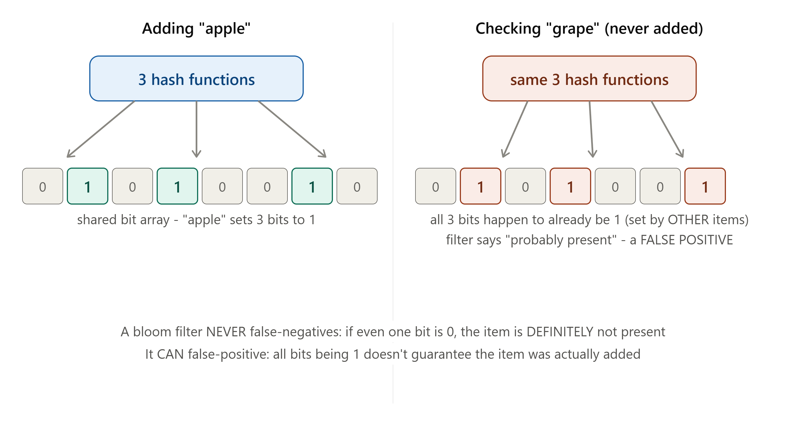

# DAY 22 — Consistent Hashing Revisited and Bloom Filters

### (Consistent Hashing for Distributed Caching/Load Balancing, Bloom Filters Built From Scratch)

> **Why this day matters:** Welcome to Week 4 — the final stretch, where you'll combine everything into full system designs and pick up the remaining infrastructure patterns every senior engineer is expected to know. Today does two things: revisits Day 11's consistent hashing through a NEW lens (distributed caching, not just database sharding), and introduces Bloom Filters — a genuinely elegant, widely-used data structure that answers "have I seen this before?" using a tiny fraction of the memory a normal set would need.

> The diagram rendered above this lesson shows the Bloom Filter mechanism, including a false positive — refer back to it throughout Section 2.

---

## TABLE OF CONTENTS — DAY 22

1. Consistent Hashing Revisited — Distributed Caching and Load Balancing
2. Bloom Filters — What, Why, Background, How
3. Implementation — A Bloom Filter From Scratch in Node.js
4. Where Bloom Filters Actually Get Used in Real Systems
5. Day 22 Cheat Sheet

---

## 1. CONSISTENT HASHING REVISITED — DISTRIBUTED CACHING AND LOAD BALANCING

### Quick Recap (What You Already Know From Day 11)

You built consistent hashing from scratch on Day 11, specifically to solve database SHARDING's "adding/removing a server reshuffles almost everything" problem. Today's goal isn't to re-teach the mechanism — it's to show you the OTHER major place this exact algorithm shows up, since interviewers will absolutely test whether you recognize it as ONE general-purpose tool, not a database-specific trick.

### Why It Reappears for Distributed Caching

Recall **Day 17's entire caching lesson** — Redis, cache-aside, all of it. Now imagine you have a CLUSTER of Redis instances (not just one), specifically to hold MORE cached data than a single instance's RAM could fit, or to spread cache READ/WRITE load across multiple machines (directly extending Day 4's horizontal scaling to the cache layer). The exact same question Day 11 asked about database shards now applies to cache nodes: **"given this cache key, which specific cache server holds it?"** — and the exact same problem applies if you naively use `hash(key) % numberOfCacheServers`: adding or removing a cache server would suddenly make almost EVERY key "look up" the wrong server, causing a MASSIVE, sudden wave of cache misses across the entire cluster, hitting your database all at once (directly recalling **Day 17's Thundering Herd problem**, but at cluster-wide scale, not just one key).

### Why It Reappears for Load Balancing

You actually already saw a PREVIEW of this exact connection back on **Day 4**, when the IP Hash load balancing algorithm was explicitly flagged as having the SAME "naive hashing" weakness Day 11 later explained in full, and consistent hashing was named as the proper fix. The use case: if you want **session affinity** (the same client consistently routed to the same backend server, useful for in-memory session data or WebSocket connections, Day 3/16) WITHOUT the disruption of naive hashing when servers scale up/down, consistent hashing is the answer — used exactly the same way as Day 11's database-sharding ring, just with "backend server" in place of "database shard."

### How — The Same Algorithm, Confirmed Once More

The mechanism is IDENTICAL to Day 11: a ring, servers (now cache nodes or backend instances) placed on it via hashing, keys placed on it via hashing, "next clockwise" determines ownership, virtual nodes smooth out load distribution. **If you can explain Day 11's ring and clockwise-lookup rule fluently, you already know this — the only new thing today is recognizing WHERE ELSE it applies.**

### Real-world example

**Memcached** (mentioned briefly on Day 11) is the textbook example for distributed caching specifically — most Memcached CLIENT libraries implement consistent hashing themselves (client-side, directly connecting to **Day 19's client-side service discovery pattern**) to decide which cache server a given key belongs to, without the Memcached servers themselves needing to coordinate or even be aware of each other at all.

### Interview Angle

"You have a cluster of cache servers — how do you decide which one holds a given key, and what happens when you scale the cluster?" → consistent hashing, EXPLICITLY naming that this is the SAME algorithm used for database sharding (Day 11), just applied to a different resource — this kind of cross-referencing is precisely what signals you understand consistent hashing as a general TOOL, not a one-off trick tied to one specific problem.

### How to teach this

> "We already learned the ring — the seating chart at the round table, with waiters covering scattered sections. Today's lesson is just: that exact same seating chart works whether the 'waiters' are database shards holding customer records, cache servers holding hot data, or backend application servers holding session info. The chart doesn't care what kind of 'service' each chair represents — it solves the SAME underlying problem (spread items evenly, survive adding/removing chairs gracefully) no matter what's sitting in those chairs."

---

## 2. BLOOM FILTERS



### What

A Bloom Filter is a space-efficient, **probabilistic** data structure that answers the question "have I seen this item before?" with one of two answers: **"definitely no"** or **"probably yes"** — it can NEVER incorrectly say "definitely no" for something that WAS actually added (no false negatives), but it CAN occasionally, incorrectly say "probably yes" for something that was NEVER actually added (a **false positive**) — refer to the diagram rendered above this lesson, which shows exactly this scenario happening with "grape."

### Why

Storing every single item you've ever seen in a normal Set or HashMap, to later check "have I seen this before," uses memory PROPORTIONAL to the number of items — for billions of items (e.g., every URL ever crawled by a search engine, every username ever registered), this becomes an enormous amount of memory. A Bloom Filter uses a TINY, FIXED-SIZE bit array (not growing proportionally with the number of items in the same way), trading PERFECT accuracy for a MASSIVE memory savings — and accepting a small, configurable, KNOWN probability of false positives in exchange.

### Background

Bloom Filters were invented by **Burton Howard Bloom in 1970**, originally to solve a then-genuinely-hard hardware-memory-constrained problem: checking whether a word was a misspelling against a dictionary, when storing the entire dictionary in available memory wasn't feasible. The structure resurfaced as enormously relevant decades later, once internet-scale systems needed to answer "have I seen this URL/key/item before?" against datasets with BILLIONS of entries — exactly the kind of scale where a normal Set's linear memory growth becomes genuinely prohibitive, but a Bloom Filter's small, fixed-size footprint remains entirely practical.

### How — The Mechanism (refer to the diagram rendered above this lesson)

**Setup**: A Bloom Filter consists of a bit array of size `m` (all initially 0), and `k` independent hash functions.

**Adding an item** ("apple," in the diagram):

1. Run the item through ALL `k` hash functions, each producing a position in the bit array.
2. Set the bit at EACH of those `k` positions to 1.

**Checking if an item might be present** ("grape," in the diagram):

1. Run the SAME `k` hash functions on the item being checked.
2. Check the bit at EACH resulting position.
3. **If ANY of those bits is 0** → the item is **DEFINITELY NOT** in the set (it's mathematically impossible for it to have been added — adding it would have set ALL `k` of its bits to 1, and they're still partially 0).
4. **If ALL of those bits are 1** → the item is **PROBABLY** in the set — but this could ALSO happen by pure coincidence, if OTHER, different items happened to ALREADY set every one of those exact same bit positions through their own insertions, exactly as shown in the diagram with "grape," whose 3 hash positions all happened to already be set to 1 by "apple" and other previously-added items, despite "grape" itself never being added.

### Why False Positives Happen, But False Negatives Never Do (the key asymmetry to understand)

- A **false negative** would mean: an item WAS added, but the filter says "definitely not present." This is IMPOSSIBLE, because adding an item GUARANTEES all `k` of its bit positions get set to 1 — checking that same item later will always find all `k` bits still set to 1 (bits are never unset/cleared in a standard Bloom Filter), so it will always correctly report "probably present."
- A **false positive** CAN happen because bit positions are SHARED across many different items — there's no way to know, just by looking at a `1` bit, WHICH item(s) set it. Enough different items being added can eventually cause ANY given combination of `k` positions to all coincidentally be `1`, even for an item that was never actually inserted.

### The Tunable Trade-off: Size, Hash Count, and False Positive Rate

- A LARGER bit array (`m`) → fewer collisions → lower false positive rate, but more memory used.
- MORE hash functions (`k`) → more bits set per item, which initially seems like it'd cause MORE collisions, but in practice, the optimal `k` (mathematically derivable from `m` and the expected number of items) actually MINIMIZES the false positive rate for a given memory budget — too few or too many hash functions both increase the false positive rate.
- This is a genuinely tunable, predictable trade-off: for a desired false positive rate (e.g., "I'm willing to accept a 1% chance of a false positive") and an expected number of items, you can MATHEMATICALLY calculate the optimal `m` and `k` — this isn't guesswork, it's a well-understood formula.

### Implementation — A Bloom Filter From Scratch in Node.js

```js
const crypto = require("crypto");

class BloomFilter {
  constructor(size, numHashFunctions) {
    this.size = size;
    this.numHashFunctions = numHashFunctions;
    this.bitArray = new Uint8Array(size); // our bit array (using 1 byte per
    // bit here for simplicity - a real
    // production implementation would
    // pack 8 bits per byte for true
    // memory efficiency)
  }

  // Generate k DIFFERENT hash positions for a given item, using a single
  // underlying hash function with different "seeds" - a common, practical
  // technique to simulate multiple independent hash functions cheaply
  _getHashPositions(item) {
    const positions = [];
    for (let i = 0; i < this.numHashFunctions; i++) {
      const hash = crypto
        .createHash("md5")
        .update(`${item}-${i}`)
        .digest("hex");
      const position = parseInt(hash.substring(0, 8), 16) % this.size;
      positions.push(position);
    }
    return positions;
  }

  add(item) {
    const positions = this._getHashPositions(item);
    positions.forEach((pos) => {
      this.bitArray[pos] = 1;
    });
  }

  mightContain(item) {
    const positions = this._getHashPositions(item);
    // If EVEN ONE bit is 0, this is a guaranteed, definite "no"
    return positions.every((pos) => this.bitArray[pos] === 1);
  }
}

// --- Demonstration matching the diagram rendered above this lesson ---
const filter = new BloomFilter(1000, 3); // m=1000 bits, k=3 hash functions

filter.add("apple");
filter.add("banana");
filter.add("cherry");

console.log(filter.mightContain("apple")); // true - definitely added, always correct
console.log(filter.mightContain("mango")); // false (most likely) - correctly identifies as absent
console.log(filter.mightContain("grape")); // could be TRUE even though never added -
// exactly the false-positive scenario
// illustrated in the diagram, IF grape's
// 3 hash positions happen to collide with
// bits already set by other items
```

**Calculating the optimal parameters** (the formulas mentioned above, made concrete):

```js
function calculateOptimalBloomFilterParams(
  expectedItems,
  desiredFalsePositiveRate,
) {
  // m = optimal bit array size
  const m = Math.ceil(
    -(expectedItems * Math.log(desiredFalsePositiveRate)) / Math.log(2) ** 2,
  );
  // k = optimal number of hash functions
  const k = Math.round((m / expectedItems) * Math.log(2));
  return { size: m, numHashFunctions: k };
}

const params = calculateOptimalBloomFilterParams(1000000, 0.01); // 1M items, 1% false positive rate
console.log(params); // tells you exactly how big to make the bit array, and how many hash functions to use
```

This is precisely how you'd size a real Bloom Filter for production use — not by guessing, but by plugging your expected scale and acceptable error rate directly into this well-established formula.

### Interview Angle

"Implement a Bloom Filter" or "How would you efficiently check if a username has already been taken, across a billion existing usernames, without storing all of them in memory?" → Bloom Filter, and being ready to explain BOTH the mechanism AND the asymmetry (never false negative, sometimes false positive) is the expected complete answer — many candidates can describe the rough idea but fumble explaining WHY false negatives are impossible while false positives aren't, which is precisely the detail that proves real understanding rather than surface familiarity.

---

## 3. WHERE BLOOM FILTERS ACTUALLY GET USED IN REAL SYSTEMS

### Databases — Avoiding Unnecessary Disk Reads

This is genuinely one of the most important real-world uses, and connects directly back to **Day 9's indexing lesson**: many databases (Cassandra, mentioned repeatedly since Day 8, is a prominent example) use a Bloom Filter PER DATA FILE on disk to quickly check "could this key possibly be in THIS particular file?" before actually performing an expensive disk read. If the Bloom Filter says "definitely not," the database SKIPS reading that file entirely — saving a real, costly disk I/O operation (recalling Day 9's entire "disk reads are expensive, minimize them" theme). If it says "probably yes," the database still has to actually check (since it could be a false positive), but this is now the EXCEPTION rather than the rule, dramatically reducing wasted disk reads overall.

### Web Crawlers — Avoiding Re-Crawling the Same URL

A web crawler (like the systems powering search engines) needs to track BILLIONS of already-visited URLs, to avoid wasting resources re-crawling the same page repeatedly. Storing every full URL in memory would be enormous; a Bloom Filter lets the crawler check "have I likely already visited this URL?" using a tiny fraction of that memory — occasionally, due to a false positive, the crawler might SKIP a URL it hasn't actually visited yet (a real, accepted trade-off, since occasionally missing one obscure page is a far smaller cost than the memory/performance burden of perfect tracking at this scale).

### CDNs and Caches — Avoiding Cache Lookups for Known-Absent Keys

Directly extending **Day 5 and Day 17's caching lessons**: a CDN or cache layer can use a Bloom Filter to quickly check "has this content EVER been requested before?" — if not, it can SKIP even checking the cache (since it's definitely not there) and go straight to the origin, slightly speeding up the "definitely a cache miss" case by avoiding an unnecessary cache lookup.

### Malicious URL / Password Checking

Browsers and security tools use Bloom Filters to check URLs against KNOWN-malicious lists without needing to download/store the entire enormous blocklist, or to check passwords against known-breached-password lists efficiently.

### Interview Angle

Being able to name 2-3 of these REAL uses (especially the database disk-read optimization, since it ties so directly back to Day 9's indexing lesson) demonstrates that you understand Bloom Filters as a genuinely PRACTICAL, widely-deployed tool, not just an academic curiosity — this is exactly the kind of breadth that separates strong system design answers.

---

## 4. DAY 22 CHEAT SHEET

```
CONSISTENT HASHING - SAME ALGORITHM, NEW CONTEXTS (Day 11 recap + extension)
  Database sharding (Day 11): which shard holds this row?
  Distributed caching (today): which cache node holds this key? -
  avoids cluster-wide Thundering Herd (Day 17) when scaling the cache cluster
  Load balancing session affinity (Day 4's IP Hash weakness, properly fixed):
  which backend server should this client consistently reach?
  SAME ring, SAME clockwise-lookup rule, SAME virtual-nodes refinement -
  recognize this as ONE general tool, not three separate tricks

BLOOM FILTER
  What: "definitely no" or "probably yes" membership test
  Tiny, FIXED-size bit array + k hash functions (NOT proportional to item count
  the way a normal Set/HashMap would be)
  Add: hash item k ways, set k bits to 1
  Check: hash item k ways, check k bits
    - any bit is 0  -> DEFINITELY NOT present (impossible to be wrong)
    - all bits are 1 -> PROBABLY present (could be a false positive)
  NEVER false negatives, CAN false positives - this asymmetry is the
  entire concept, and the detail interviewers check for
  Tunable: bigger array + right number of hash functions = lower false
  positive rate, calculable via a known formula for a given scale/error budget

REAL-WORLD USES
  Databases (Cassandra): skip disk reads for keys definitely not in a file
  (directly extends Day 9's "minimize disk I/O" indexing theme)
  Web crawlers: avoid re-crawling billions of already-seen URLs cheaply
  CDNs/caches: skip cache lookups for keys that were definitely never seen
  Security: malicious URL / breached password checking without huge downloads
```

---

### What's next (Day 23 preview)

Tomorrow covers three more practical, frequently-tested building blocks: **Distributed Locks** (using Redis Redlock — how do you ensure only ONE process does something at a time, across multiple servers?), **Idempotency Keys** in full depth (you've used the CONCEPT repeatedly since Day 1 — tomorrow formalizes it completely), and **Distributed ID Generation** — UUIDs versus the **Snowflake algorithm** (which was explicitly deferred back on Day 7's URL shortener capstone) — and you'll implement a Snowflake ID generator from scratch in Node.js.

**Say "Day 23" whenever you're ready.**
