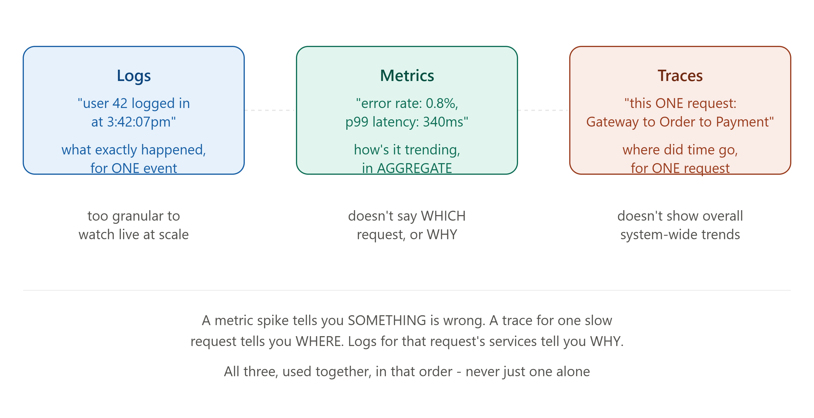
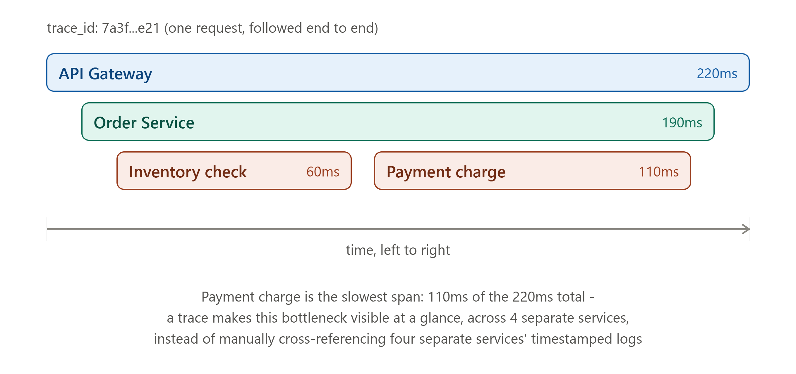

# DAY 24 — Observability

### (Logging, Metrics, Monitoring, Distributed Tracing, Prometheus/Grafana, OpenTelemetry, Health Checks Revisited)

> **Why this day matters:** Every lesson since Day 11 has quietly assumed you can SEE what's happening inside your system — "find the bottleneck" (Day 11), "tune the rate limit" (Day 18), "watch the circuit breaker trip" (Day 20). Today makes that assumption explicit: observability is the discipline of actually being ABLE to answer "what is my system doing right now, and why is it doing that?" Without it, every resilience pattern you've built this month is operating blind.

> _(Note: the diagram tool remains intermittently unresponsive, so today's lesson is text/code only. The distributed tracing section describes, in words, exactly the kind of "waterfall" visualization tools like Jaeger/Zipkin render — picture a horizontal timeline with nested bars, one per service, each showing its own duration within the larger request.)_

---

## TABLE OF CONTENTS — DAY 24

1. The Three Pillars of Observability — Logs, Metrics, Traces
2. Logging Done Properly
3. Metrics and Monitoring (Prometheus/Grafana Basics)
4. Distributed Tracing (OpenTelemetry Basics)
5. Health Checks Revisited — From the Operator's Side
6. Day 24 Cheat Sheet

---

## 1. THE THREE PILLARS OF OBSERVABILITY — LOGS, METRICS, TRACES



### What

Observability is the ability to understand the INTERNAL state of a system based purely on its EXTERNAL outputs — without needing to attach a debugger or guess. It's built from three complementary signal types:

- **Logs**: Discrete, timestamped records of specific events ("user 42 logged in," "payment failed: insufficient funds").
- **Metrics**: Numeric measurements aggregated over time ("requests per second," "p99 latency," "error rate").
- **Traces**: The complete path of a SINGLE request as it travels through multiple services, with timing for each step.

### Why all three, and not just one

Each answers a genuinely DIFFERENT question, and none of them substitutes for the others:

- **Logs** answer "what exactly happened, in detail, for this specific event?" — but are too granular and numerous to "watch live" across millions of requests.
- **Metrics** answer "how is the system behaving OVERALL, right now, and how is that trending?" — but a metric like "error rate increased to 5%" doesn't tell you WHICH requests failed or WHY.
- **Traces** answer "for THIS one specific slow/failed request, where exactly did the time go, or what exactly broke, across the multiple services it touched?" — directly solving the "debugging spans multiple services' separate logs" pain point flagged back on **Day 13's choreography weakness** and **Day 19's monolith-vs-microservices cost analysis**.

### Background

This "three pillars" framing became the industry-standard vocabulary through the 2010s as companies built increasingly distributed systems (Day 19) where traditional single-process debugging tools simply stopped working — you can't attach a debugger to "the request," because "the request" is now spread across a dozen separate processes, possibly on a dozen separate machines. Distributed tracing specifically (covered in depth in Section 4) emerged directly from Google's internal "Dapper" paper (2010), describing exactly this problem and their internal solution to it.

### How to teach this

> "Imagine investigating a single late delivery for a package company. Logs are the individual scan records at every checkpoint ('package scanned at Warehouse B, 3:42 PM'). Metrics are the company's overall daily dashboard ('average delivery time today: 2.3 days, up from 2.1 yesterday'). A trace is the COMPLETE, end-to-end journey of THIS ONE specific package, showing exactly how long it sat at each checkpoint — which is precisely what you'd pull up to answer 'why was THIS package late,' as opposed to logs (too granular, you'd have to manually piece together scattered records) or metrics (too aggregated, tells you the average is up, not why THIS package specifically was late)."

---

## 2. LOGGING DONE PROPERLY



### What

Structured logging means recording log entries as machine-parseable data (typically JSON) with consistent fields, rather than unstructured free-text strings — directly enabling the log AGGREGATION and SEARCH capability that makes logs actually useful at scale.

### Why Unstructured Logging Breaks Down at Scale

```js
// BAD - unstructured, hard to search/filter/aggregate at scale
console.log(`User ${userId} placed order ${orderId} for $${total}`);
```

This works fine reading ONE server's console output during local development. But across **Day 4's horizontally-scaled fleet** of, say, 50 server instances, each producing millions of lines like this per day, you cannot realistically grep through 50 separate consoles to answer "show me all failed orders over $1000 in the last hour" — you need the logs to be SEARCHABLE, FILTERABLE data, not just printed text.

### How — Structured Logging

```js
const logger = require("pino")(); // a popular structured logging library for Node.js

logger.info(
  {
    event: "order_placed",
    userId: 42,
    orderId: "order_8847",
    total: 49.99,
    // CRITICAL: include the trace ID (Section 4) so this log entry can be
    // correlated with the distributed trace for the SAME request
    traceId: req.traceId,
  },
  "Order placed successfully",
);

// On failure, structured logging makes the failure genuinely queryable:
logger.error(
  {
    event: "payment_failed",
    userId: 42,
    orderId: "order_8847",
    reason: "insufficient_funds",
    traceId: req.traceId,
  },
  "Payment processing failed",
);
```

With structured fields like `event`, `userId`, `reason`, a log aggregation platform (the real-world tools for this: the ELK stack — Elasticsearch/Logstash/Kibana, or Datadog, or Splunk) can answer queries like "show me every `payment_failed` event with `reason: insufficient_funds` in the last 24 hours, grouped by user" — completely impossible to do efficiently against raw, unstructured text strings spread across dozens of servers.

### Log Levels — A Practical Discipline

- **DEBUG**: Detailed diagnostic information, useful during development, typically DISABLED in production (too noisy/expensive to store at scale).
- **INFO**: Normal, expected events ("order placed," "user logged in") — the backbone of understanding normal operation.
- **WARN**: Something unexpected but not yet broken ("retry attempt 2 of 3," directly connecting to **Day 20's retry pattern**) — worth knowing about, not yet an emergency.
- **ERROR**: Something failed and needs attention ("payment processing failed," "circuit breaker tripped open" — Day 20).

### Interview Angle

"How would you debug an issue affecting users across your horizontally-scaled fleet?" → structured logging, aggregated centrally (not scattered per-server), with consistent fields enabling filtering/search — and naming the trace ID correlation (Section 4) shows you understand logs and traces work TOGETHER, not as separate, unrelated tools.

---

## 3. METRICS AND MONITORING (PROMETHEUS/GRAFANA BASICS)

### What

A metric is a numeric measurement, typically collected at regular intervals, that describes some aspect of system behavior over time — request count, latency, error rate, CPU usage, queue depth. **Prometheus** is the dominant open-source tool for COLLECTING and STORING these metrics; **Grafana** is the dominant tool for VISUALIZING them as dashboards/graphs.

### Why

Recall **Day 6's percentile-based latency discussion** (p50/p95/p99) and **Day 18's rate-limit tuning** — both of these REQUIRE having actual, ongoing numeric data about your system's behavior to make informed decisions. Without metrics, you're tuning blind, guessing at values rather than observing real, current system behavior and adjusting based on evidence.

### How — The Four Key Metric Types (a Prometheus-specific vocabulary, but the concepts are universal)

- **Counter**: A value that only ever increases (e.g., "total requests served") — useful for calculating RATES (requests per second = the counter's rate of change over time).
- **Gauge**: A value that can go up or down (e.g., "current number of active connections," "current queue depth" — directly connecting to **Day 15's queue lesson**).
- **Histogram**: Tracks the DISTRIBUTION of values (e.g., request latencies) across configurable "buckets," enabling exactly the percentile calculations (p50/p95/p99) introduced on **Day 6**.
- **Summary**: Similar to a histogram, but calculates percentiles directly on the client side rather than via bucketed approximation.

### Implementation — Exposing Metrics From a Node.js App

```js
const promClient = require("prom-client");

// Counter - directly answers "how many requests have we served, total?"
const requestCounter = new promClient.Counter({
  name: "http_requests_total",
  help: "Total number of HTTP requests",
  labelNames: ["method", "route", "status_code"],
});

// Histogram - directly enables Day 6's percentile-based latency analysis
const requestDuration = new promClient.Histogram({
  name: "http_request_duration_seconds",
  help: "HTTP request duration in seconds",
  labelNames: ["method", "route"],
  buckets: [0.01, 0.05, 0.1, 0.5, 1, 2, 5], // bucket boundaries, in seconds
});

// Gauge - directly mirrors Day 13's connection pool concept
const activeConnectionsGauge = new promClient.Gauge({
  name: "db_pool_active_connections",
  help: "Currently active database connections",
});

app.use((req, res, next) => {
  const start = Date.now();
  res.on("finish", () => {
    const durationSeconds = (Date.now() - start) / 1000;
    requestCounter.inc({
      method: req.method,
      route: req.route?.path,
      status_code: res.statusCode,
    });
    requestDuration.observe(
      { method: req.method, route: req.route?.path },
      durationSeconds,
    );
  });
  next();
});

// The endpoint Prometheus itself "scrapes" (polls) periodically to collect these metrics
app.get("/metrics", async (req, res) => {
  res.set("Content-Type", promClient.register.contentType);
  res.end(await promClient.register.metrics());
});
```

Prometheus periodically calls this `/metrics` endpoint (a "pull" model, directly contrasting with a "push" model where the app sends metrics out itself), parses the returned data, and stores it as a time series — Grafana then queries Prometheus's stored data to render dashboards and graphs.

### Alerting — Acting on Metrics, Not Just Displaying Them

The real operational value comes from ALERTING — automatically notifying engineers when a metric crosses a concerning threshold:

```
# A Prometheus alerting rule (conceptual, not Node.js code)
alert: HighErrorRate
expr: rate(http_requests_total{status_code=~"5.."}[5m]) > 0.05
for: 10m
annotations:
  summary: "Error rate above 5% for the last 10 minutes"
```

This directly operationalizes **Day 1's Availability pillar** — rather than a human noticing "the site seems slow" hours later, the system itself detects the degradation and proactively alerts the team the moment it crosses a defined threshold.

### Interview Angle

"How would you know if your system is unhealthy in production, before users start complaining?" → metrics + alerting (Prometheus/Grafana being the standard, expected names to drop), and being ready to name SPECIFIC metrics worth tracking (request rate, error rate, p99 latency, queue depth) shows practical, hands-on familiarity rather than just textbook awareness.

---

## 4. DISTRIBUTED TRACING (OPENTELEMETRY BASICS)

### What

Distributed tracing tracks a SINGLE request's complete journey as it passes through multiple services (directly extending **Day 19/20's microservices discussion**), recording a **span** for each individual step (e.g., "API Gateway processing," "Order Service processing," "Inventory Service call," "Payment Service call"), all tied together by one shared **trace ID** — letting you reconstruct and visualize the ENTIRE request's path and timing as a single, unified timeline, even though it physically crossed many separate processes and possibly machines.

### Why

This is the DIRECT solution to the exact pain point named back on **Day 13's choreography weakness** and **Day 19's monolith-vs-microservices cost analysis**: "a stack trace for a bug spans your entire request in a monolith; in microservices, you need to trace across multiple services' separate logs." Distributed tracing makes that cross-service trace into ONE coherent, visualizable thing, rather than something you manually piece together by cross-referencing timestamps across separate log files.

### Background

Google's 2010 "Dapper" paper described their internal, large-scale distributed tracing system, built specifically because debugging performance problems across their enormous number of internal microservices had become genuinely intractable without it. This directly inspired open-source successors — Zipkin, Jaeger — and eventually **OpenTelemetry**, which has become the modern, vendor-neutral STANDARD for instrumenting code to produce traces (and metrics, and logs) that can be sent to ANY compatible backend (Jaeger, Datadog, and others), rather than locking you into one specific vendor's proprietary instrumentation format.

### How — Trace Structure (Picture the Waterfall Description Below)

A trace is composed of nested **spans**, forming a tree: a top-level span for the API Gateway's total handling of the request, containing a child span for the Order Service's work, which itself contains child spans for its calls to the Inventory Service and the Payment Service. Each span records its OWN start time and duration. When visualized (in a tool like Jaeger), this renders as a horizontal "waterfall" — picture a timeline running left to right, with the Gateway's bar spanning the FULL width (e.g., 220ms total), the Order Service's bar nested slightly inside it and slightly narrower (190ms), and the Inventory and Payment spans nested even further inside THAT, side by side, each showing its own individual duration (e.g., Inventory: 60ms, Payment: 110ms) — visually making it immediately obvious, at a glance, that Payment is the slowest single step and the dominant contributor to the overall 220ms request time, without needing to manually cross-reference separate timestamped log lines across four different services' logs.

### Implementation — Basic OpenTelemetry Instrumentation in Node.js

```js
const { trace } = require("@opentelemetry/api");
const tracer = trace.getTracer("order-service");

async function processOrder(orderId) {
  // Start a span for this specific unit of work - this becomes one
  // "bar" in the waterfall visualization described above
  return tracer.startActiveSpan("process_order", async (span) => {
    span.setAttribute("order.id", orderId);

    try {
      // Each downstream call gets its OWN nested span automatically,
      // when the relevant library is instrumented (most HTTP/database
      // client libraries have OpenTelemetry auto-instrumentation available)
      await checkInventory(orderId); // becomes a child span
      await chargePayment(orderId); // becomes another child span

      span.setStatus({ code: 0 }); // OK
    } catch (err) {
      span.setStatus({ code: 2, message: err.message }); // ERROR -
      // this failure will be visibly highlighted in the trace visualization,
      // pinpointing EXACTLY which span/service failed
      span.recordException(err);
      throw err;
    } finally {
      span.end(); // records the final duration for this span
    }
  });
}
```

The crucial piece that makes this work ACROSS services: the **trace context** (the trace ID, plus the current span's ID) must be PROPAGATED in the headers of every network call between services — when Order Service calls Payment Service over HTTP, it includes headers identifying "this call is part of trace X, span Y," letting Payment Service's own span nest correctly under Order Service's span in the final, reconstructed trace tree, even though they're two completely separate processes that never directly share memory.

### Interview Angle

"How would you debug a request that's slow, when it passes through 4 different microservices?" → Distributed tracing (OpenTelemetry, Jaeger/Zipkin as the visualization tool), explicitly describing the nested-span waterfall and how it immediately surfaces WHICH specific service/step is the bottleneck — directly answering the exact kind of question Day 19/20's microservices cost discussion was building toward.

---

## 5. HEALTH CHECKS REVISITED — FROM THE OPERATOR'S SIDE

### What

You met health checks on **Day 4** (from the load balancer's perspective — deciding whether to route traffic to a server) and briefly on **Day 19** (service discovery removing unhealthy instances). Today's addition: health checks ALSO serve a distinct OPERATIONAL purpose — giving a human (or automated alerting system, Section 3) immediate, on-demand insight into a SPECIFIC instance's internal state, beyond the simple binary "healthy/unhealthy" a load balancer needs.

### Why a Richer Health Check Matters for Operations

A load balancer just needs "yes" or "no." An ENGINEER debugging a production issue at 2 AM needs MORE: "is the database connection pool healthy? Is the cache reachable? Is the message queue connection active? What's our current memory usage?" — a single richer health endpoint can surface ALL of this at once.

### Implementation — A Detailed Operational Health Check

```js
app.get("/health/detailed", async (req, res) => {
  const checks = {
    database: await checkDatabaseHealth(), // Day 8/13's connection pool
    redis: await checkRedisHealth(), // Day 17's cache layer
    messageQueue: await checkQueueHealth(), // Day 15's queue connection
    memoryUsageMB: Math.round(process.memoryUsage().heapUsed / 1024 / 1024),
    uptime: process.uptime(),
  };

  const allHealthy = Object.values(checks).every(
    (v) => typeof v !== "object" || v.healthy !== false,
  );

  res.status(allHealthy ? 200 : 503).json(checks);
});

async function checkDatabaseHealth() {
  try {
    const start = Date.now();
    await db.query("SELECT 1");
    return { healthy: true, latencyMs: Date.now() - start };
  } catch (err) {
    return { healthy: false, error: err.message };
  }
}
```

**The distinction worth keeping clear**: the SIMPLE health check (Day 4's `/health`, returning just 200 or 503) is what the load balancer polls frequently and cheaply. This RICHER `/health/detailed` endpoint is for humans/dashboards, checked less frequently (since it does real work — pinging the database, Redis, etc.) and provides genuinely diagnostic detail beyond a binary signal.

### Interview Angle

"What would you put in a health check endpoint?" — a strong answer distinguishes the LIGHTWEIGHT version (for load balancers, Day 4 — must be fast, cheap, frequent) from a RICHER version (for human operators/dashboards — can do more work, less frequently) — most candidates only know the first one.

---

## 6. DAY 24 CHEAT SHEET

```
THREE PILLARS OF OBSERVABILITY
  Logs    - "what exactly happened, for this one event" (detailed, granular)
  Metrics - "how is the system doing overall, right now" (aggregated, trended)
  Traces  - "where did time go for THIS one request, across multiple services"
  (each answers a different question - none substitutes for the others)

LOGGING
  Structured (JSON, consistent fields) >> unstructured free text, at scale
  Include trace ID in every log line - correlates logs with traces (Section 4)
  Levels: DEBUG (dev only) -> INFO (normal events) -> WARN (Day 20's retries) ->
  ERROR (failures needing attention)

METRICS / MONITORING (Prometheus + Grafana)
  Counter (only increases) | Gauge (up/down) | Histogram (distribution,
  enables Day 6's p50/p95/p99) | Summary (client-calculated percentiles)
  Prometheus PULLS metrics from a /metrics endpoint periodically
  Grafana VISUALIZES what Prometheus stores
  ALERTING operationalizes Day 1's Availability pillar - detect degradation
  automatically, before a human notices

DISTRIBUTED TRACING (OpenTelemetry, visualized via Jaeger/Zipkin)
  One trace ID ties together nested SPANS across multiple services
  Visualized as a waterfall: each service's span nested inside its caller's,
  showing individual + cumulative duration - instantly surfaces the bottleneck
  Directly solves Day 13/19's "debugging spans multiple services" pain point
  Trace context MUST be propagated via headers on every inter-service call

HEALTH CHECKS, TWO VERSIONS
  Simple (Day 4): fast, cheap, frequent, binary - for load balancers
  Detailed (today): checks DB/cache/queue health + resource usage - for
  human operators and dashboards, checked less frequently since it does
  real work
```

---

### What's next (Day 25 preview)

Tomorrow covers **Security in System Design** — Authentication vs Authorization (the precise distinction, building on Day 2's 401-vs-403 lesson), OAuth2 and JWT in full depth, and API security fundamentals (CORS, CSRF, and a recap of Day 18's rate limiting from a security angle). You'll implement a complete, working JWT authentication middleware in Node.js.

**Say "Day 25" whenever you're ready.**
