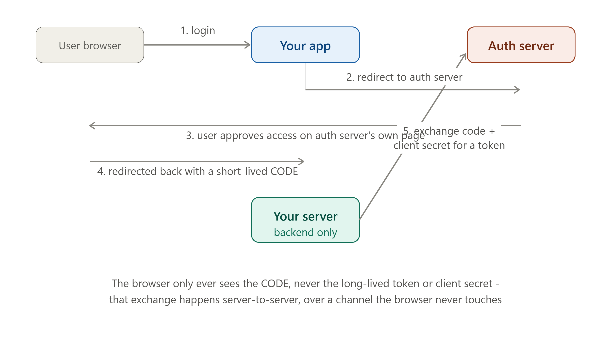

# DAY 25 — Security in System Design

### (Authentication vs Authorization, OAuth2 and JWT Deep Dive, API Security — CORS, CSRF, Rate Limiting Recap)

> **Why this day matters:** Every system you've designed this month assumed "the user is who they say they are" without explaining HOW you actually verify that, safely, at scale. Today fills that gap completely — the precise vocabulary distinction interviewers test constantly (building directly on Day 2's 401-vs-403), the OAuth2/JWT mechanics powering "Login with Google" buttons everywhere, and the API-level attack surfaces (CORS, CSRF) every public API must defend against.

> The diagram rendered above this lesson shows the full OAuth2 Authorization Code flow — refer back to it throughout Section 2.

---

## TABLE OF CONTENTS — DAY 25

1. Authentication vs Authorization — The Precise Distinction
2. OAuth2 Deep Dive
3. JWT (JSON Web Tokens) Deep Dive
4. API Security — CORS and CSRF
5. Rate Limiting Recap From a Security Angle
6. Implementation — Complete JWT Authentication Middleware
7. Day 25 Cheat Sheet

---

## 1. AUTHENTICATION vs AUTHORIZATION — THE PRECISE DISTINCTION

### What

**Authentication** answers "WHO are you?" — verifying an identity claim (typically via a password, token, or biometric). **Authorization** answers "what are you ALLOWED to do?" — determining whether an already-authenticated identity has permission for a specific action.

### Why This Distinction Matters (Directly Extending Day 2)

You met this exact distinction on **Day 2**, expressed through HTTP status codes: **401 Unauthorized** means "I don't know who you are" (an authentication failure), and **403 Forbidden** means "I know who you are, but you can't do this" (an authorization failure). Today formalizes the FULL systems built around each side of this distinction — authentication systems (this lesson's OAuth2/JWT sections) prove identity; authorization systems (covered briefly here, more fully in dedicated access-control frameworks) decide permissions ONCE identity is established.

### How — The Two-Step Sequence in Every Real Request

1. **Authenticate**: Verify the request includes valid proof of identity (a password was correct, a token is valid and unexpired).
2. **Authorize**: Given that confirmed identity, check whether THIS SPECIFIC identity has permission for THIS SPECIFIC action on THIS SPECIFIC resource.

```js
function authenticate(req, res, next) {
  const token = req.headers.authorization;
  if (!token || !isValidToken(token)) {
    return res.status(401).json({ error: "Not authenticated" }); // WHO are you? - unknown
  }
  req.user = decodeToken(token); // identity now established
  next();
}

function authorize(requiredRole) {
  return (req, res, next) => {
    if (req.user.role !== requiredRole) {
      return res.status(403).json({ error: "Forbidden" }); // known, but not ALLOWED
    }
    next();
  };
}

app.delete(
  "/api/admin/users/:id",
  authenticate,
  authorize("admin"),
  deleteUserHandler,
);
```

### Interview Angle

"Explain the difference between authentication and authorization" — give the precise WHO-vs-WHAT-ALLOWED definitions, and immediately anchor it to the 401-vs-403 distinction from Day 2 — this single connection signals you retain and connect material across the course rather than learning topics in isolation.

---

## 2. OAUTH2 DEEP DIVE



### What

OAuth2 is an AUTHORIZATION framework (notice: not primarily an authentication protocol, despite common confusion) that lets a user grant a THIRD-PARTY application limited access to their data on ANOTHER service, WITHOUT sharing their actual password with that third party. The canonical example: clicking "Login with Google" on some app, and Google handles the actual credential check — the app never sees your Google password at all.

### Why

Before OAuth2, the only way for App X to access your Gmail contacts (for example) was for you to literally TYPE your Gmail password into App X — meaning App X now PERMANENTLY holds your real Google credentials, with full access to everything, forever, with no way to revoke JUST that one app's access without changing your password everywhere. OAuth2 solves this by introducing a delegated, SCOPED, REVOCABLE token-based handoff: you approve a SPECIFIC, LIMITED set of permissions (e.g., "read my contacts" but NOT "send email as me"), App X receives a TOKEN representing exactly that limited grant, and you can revoke App X's access at any time WITHOUT changing your actual Google password.

### Background

OAuth2 was finalized in 2012 (RFC 6749), evolving from OAuth1 (2010) specifically to address growing real-world needs as the "social login" and third-party-integration ecosystem (think: apps connecting to Twitter, Facebook, Google services) exploded through the early 2010s — it's now the near-universal standard underlying virtually every "Sign in with X" button across the modern web.

### How — The Authorization Code Flow (the most common, most secure flow; refer to the diagram rendered above this lesson)

1. **User clicks "Login with Google"** on Your App.
2. **Your App redirects** the user's browser to Google's Authorization Server, specifying what access ("scopes") it's requesting.
3. **User logs in and approves** the requested access directly on GOOGLE's own page — critically, the user's password is typed into GOOGLE's page, NEVER into Your App's page, meaning Your App never sees or handles the actual password at all.
4. **Google redirects back** to Your App with a short-lived, single-use **authorization code** in the URL.
5. **Your App's SERVER (backend, never the browser)** exchanges this code, together with a confidential **client secret** only your server knows, directly with Google's server, for an actual **access token**.

### Why Step 5 Happens Server-to-Server (the Critical Security Detail)

This is precisely the detail the diagram rendered above this lesson is built to make visible: the BROWSER only ever sees the short-lived, single-use CODE — never the long-lived access token, and never the client secret. If the access token were handed directly to the browser during the redirect (instead of requiring a separate, backend-only exchange step), it would be exposed in browser history, server logs, and potentially intercepted — the code-for-token exchange, happening entirely server-side, keeps the actual sensitive credential off the browser's exposed surface entirely.

### Interview Angle

"Explain how 'Login with Google' actually works" → the Authorization Code flow, with the critical emphasis on WHY the code-to-token exchange happens server-side rather than directly returning a token to the browser — this exact detail is what separates "I've used OAuth2 buttons" from "I understand OAuth2's security model."

---

## 3. JWT (JSON WEB TOKENS) DEEP DIVE

### What

A JWT is a compact, self-contained, digitally SIGNED token format used to represent claims about an identity (e.g., "this is user 42, with role admin, issued at time X, expiring at time Y") — structured as three Base64-encoded segments separated by dots: `header.payload.signature`.

### Why

Recall **Day 4's stateless services lesson** — a server shouldn't need to remember anything about a specific client between requests. A traditional session-based approach requires the SERVER to store session data (who's logged in, with what permissions) typically in a shared store (Redis, exactly Day 4's pattern). A JWT flips this: the TOKEN ITSELF carries all the necessary identity/claim information, cryptographically signed so the server can VERIFY it hasn't been tampered with, WITHOUT needing to look anything up in a shared session store at all — the server simply checks the signature, and if valid, trusts the claims embedded directly in the token.

### How — The Three Parts

1. **Header**: Specifies the signing algorithm used (e.g., `HS256` or `RS256`).
2. **Payload**: The actual claims — `{ "userId": 42, "role": "admin", "iat": 1719500000, "exp": 1719503600 }` (`iat` = issued-at, `exp` = expiration — standard claim names).
3. **Signature**: A cryptographic signature over the header and payload, computed using a SECRET KEY (for `HS256`, symmetric — same key signs and verifies) or a PRIVATE/PUBLIC key pair (for `RS256`, asymmetric — the server signs with a private key, and ANY party holding the public key can verify, without being able to forge new tokens themselves).

### Critical Security Detail: JWTs Are SIGNED, Not ENCRYPTED

This is a genuinely common, genuinely dangerous misconception: a standard JWT's payload is merely Base64-ENCODED (trivially readable by anyone, including the end user themselves — try pasting any JWT into a JWT decoder online) — it is NOT encrypted. The signature only PROVES the payload hasn't been TAMPERED with since signing; it does NOT hide the payload's contents from anyone who intercepts or simply inspects the token. **Never put sensitive data (passwords, full credit card numbers, sensitive PII) directly in a JWT payload** — anyone holding the token can read it.

### Implementation — Issuing and Verifying JWTs in Node.js

```js
const jwt = require("jsonwebtoken");

function issueToken(user) {
  return jwt.sign(
    { userId: user.id, role: user.role }, // payload claims
    process.env.JWT_SECRET, // signing secret (HS256, symmetric)
    { expiresIn: "1h" }, // sets the 'exp' claim automatically
  );
}

function verifyToken(token) {
  try {
    return jwt.verify(token, process.env.JWT_SECRET); // throws if invalid/expired/tampered
  } catch (err) {
    return null;
  }
}
```

### The Refresh Token Pattern (Balancing Security and User Experience)

Short-lived access tokens (e.g., 15 minutes) limit the damage if one is stolen, but forcing a user to re-login every 15 minutes is a poor experience. The standard fix: issue a SHORT-LIVED **access token** (used for actual API requests) ALONGSIDE a LONGER-LIVED **refresh token** (stored more securely, used ONLY to obtain a new access token when the old one expires, without requiring the user to fully log in again).

```js
function issueTokenPair(user) {
  const accessToken = jwt.sign(
    { userId: user.id, role: user.role },
    process.env.JWT_SECRET,
    { expiresIn: "15m" },
  );
  const refreshToken = jwt.sign(
    { userId: user.id, tokenType: "refresh" },
    process.env.REFRESH_SECRET,
    { expiresIn: "7d" },
  );
  return { accessToken, refreshToken };
}

app.post("/api/token/refresh", (req, res) => {
  const decoded = verifyRefreshToken(req.body.refreshToken);
  if (!decoded) return res.status(401).json({ error: "Invalid refresh token" });
  const newAccessToken = jwt.sign(
    { userId: decoded.userId },
    process.env.JWT_SECRET,
    { expiresIn: "15m" },
  );
  res.json({ accessToken: newAccessToken });
});
```

### Interview Angle

"Why use JWT instead of server-side sessions?" → statelessness (Day 4, directly reused — no shared session store lookup needed on every request), at the cost of being unable to instantly revoke a single token before its natural expiry (a real, known trade-off — server-side sessions can be revoked instantly by deleting the session record; a signed JWT remains valid until it expires, unless you build additional revocation infrastructure, like a blocklist, on top).

---

## 4. API SECURITY — CORS AND CSRF

### What — CORS (Cross-Origin Resource Sharing)

CORS is a BROWSER-enforced security mechanism that restricts whether JavaScript running on one website (origin) can make requests to a DIFFERENT origin (a different domain, port, or protocol) — by default, browsers BLOCK cross-origin requests unless the target server explicitly opts in via specific response headers.

### Why CORS Exists

Without it, malicious JavaScript on `evil-site.com` could silently make requests to `your-bank.com` USING the victim's own already-logged-in browser session/cookies, potentially reading or modifying their data — CORS exists specifically to prevent this exact class of cross-origin abuse, by requiring the TARGET server to explicitly state which origins it trusts.

### How

```js
const cors = require("cors");

app.use(
  cors({
    origin: ["https://my-frontend.com"], // ONLY this origin may make cross-origin requests
    credentials: true, // allow cookies to be included in cross-origin requests
  }),
);
```

The server includes an `Access-Control-Allow-Origin` header in its response; the BROWSER (not the server) enforces the restriction — if the header doesn't list the requesting page's origin, the browser blocks the response from being readable by that page's JavaScript, even though the server technically already processed and returned it.

### What — CSRF (Cross-Site Request Forgery)

CSRF is an attack where a malicious site tricks a victim's browser into making an UNWANTED request to a site the victim is ALREADY authenticated with (exploiting the fact that browsers automatically attach cookies to requests, REGARDLESS of which page initiated the request) — e.g., a hidden form on `evil-site.com` that auto-submits a "transfer money" request to `your-bank.com`, using the victim's own already-logged-in session cookie.

### How to Defend Against It

**CSRF tokens**: the server includes a unique, unpredictable token in legitimate forms/pages it serves; any STATE-CHANGING request (POST/PUT/DELETE) must include this SAME token back, and the server REJECTS requests missing it or presenting an incorrect one — since `evil-site.com` has no way to know or guess this server-issued token, it cannot forge a valid request, even though the victim's cookies would otherwise be automatically attached.

```js
const csrf = require("csurf");
app.use(csrf());

app.get("/form", (req, res) => {
  res.render("form", { csrfToken: req.csrfToken() }); // embedded in the form
});

app.post("/api/transfer", (req, res) => {
  // The csrf middleware automatically validates req.body._csrf against the
  // expected token, rejecting the request with an error if it's missing/wrong
  processTransfer(req.body);
});
```

**SameSite cookies**: setting a cookie's `SameSite` attribute to `Strict` or `Lax` tells the BROWSER itself not to send that cookie along with cross-site requests at all — a simpler, increasingly-preferred modern defense that addresses much of the same problem at the browser level, without needing application-level CSRF tokens for many common cases.

### Interview Angle

"What's the difference between CORS and CSRF?" — a commonly confused pair purely because of the similar acronyms: CORS is a BROWSER-enforced restriction on which origins CAN make cross-origin requests at all (a permission system); CSRF is an ATTACK that exploits automatically-attached cookies to forge requests from an already-trusted session, defended against via tokens or SameSite cookies (a forgery-prevention problem). Being able to state this precise distinction cleanly is exactly what's being tested.

---

## 5. RATE LIMITING RECAP FROM A SECURITY ANGLE

You learned rate limiting's full mechanics on **Day 18** — worth explicitly revisiting here through a SECURITY lens, since it's also a genuine defensive tool, not purely a performance/availability one:

- **Brute-force login protection**: Day 18's example of a STRICTER rate limit specifically on `/api/login` (by IP) directly slows down an attacker attempting to guess passwords via repeated attempts.
- **Credential stuffing defense**: rate limiting combined with monitoring (Day 24) for unusual patterns (many failed logins across many DIFFERENT accounts from the same IP) helps detect and slow large-scale automated attacks using leaked password lists.
- **API abuse/scraping prevention**: protects against a malicious or careless client extracting large amounts of data via rapid, repeated requests.

### Interview Angle

A strong answer to "how would you protect a login endpoint" PROACTIVELY mentions rate limiting (Day 18) ALONGSIDE proper authentication mechanics (this lesson) — security is rarely one single mechanism; it's layered defenses working together.

---

## 6. IMPLEMENTATION — COMPLETE JWT AUTHENTICATION MIDDLEWARE

Bringing Sections 1, 3, and 5 together into one realistic, production-shaped Express setup:

```js
const jwt = require("jsonwebtoken");
const bcrypt = require("bcrypt");

// --- AUTHENTICATION: verifying identity ---
async function login(req, res) {
  const { email, password } = req.body;
  const user = await db.users.findByEmail(email);

  // Always compare against a hash, never store/compare plain passwords
  const validPassword =
    user && (await bcrypt.compare(password, user.passwordHash));
  if (!validPassword) {
    return res.status(401).json({ error: "Invalid email or password" }); // Section 1: WHO, unverified
  }

  const accessToken = jwt.sign(
    { userId: user.id, role: user.role },
    process.env.JWT_SECRET,
    { expiresIn: "15m" },
  );
  res.json({ accessToken });
}

// --- AUTHENTICATION MIDDLEWARE: applied to protected routes ---
function authenticate(req, res, next) {
  const authHeader = req.headers.authorization;
  if (!authHeader?.startsWith("Bearer ")) {
    return res.status(401).json({ error: "No token provided" });
  }
  const token = authHeader.split(" ")[1];
  try {
    req.user = jwt.verify(token, process.env.JWT_SECRET); // Section 3
    next();
  } catch (err) {
    return res.status(401).json({ error: "Invalid or expired token" });
  }
}

// --- AUTHORIZATION MIDDLEWARE: applied AFTER authentication ---
function requireRole(role) {
  return (req, res, next) => {
    if (req.user.role !== role) {
      return res.status(403).json({ error: "Insufficient permissions" }); // Section 1: WHAT, denied
    }
    next();
  };
}

app.post("/api/login", loginRateLimiter, login); // Day 18's stricter limiter, Section 5
app.get("/api/profile", authenticate, getProfileHandler);
app.delete(
  "/api/admin/users/:id",
  authenticate,
  requireRole("admin"),
  deleteUserHandler,
);
```

---

## 7. DAY 25 CHEAT SHEET

```
AUTHENTICATION vs AUTHORIZATION
  Authentication = WHO are you? (401, Day 2, if it fails)
  Authorization  = WHAT are you allowed to do? (403, Day 2, if it fails)
  Sequence: authenticate FIRST, then authorize the specific action

OAUTH2 (delegated authorization, not primarily authentication)
  Lets a third-party app get LIMITED, REVOCABLE access without your password
  Authorization Code flow: redirect to auth server -> user approves on
  THEIR page -> short-lived CODE returned to browser -> your SERVER
  exchanges code + client secret for a token, server-to-server
  Critical detail: browser only ever sees the code, never the token/secret

JWT
  header.payload.signature - SIGNED (tamper-proof), NOT encrypted (readable
  by anyone) - never put sensitive data directly in the payload
  Enables Day 4's statelessness: server verifies signature, no session-store lookup
  Access token (short-lived) + refresh token (longer-lived) pattern balances
  security (short exposure window) with UX (no constant re-login)
  Trade-off vs server sessions: can't instantly revoke a single JWT before
  its natural expiry without extra infrastructure (a blocklist)

CORS vs CSRF (commonly confused due to similar acronyms)
  CORS = browser-enforced restriction on cross-origin requests (permission)
  CSRF = attack exploiting auto-attached cookies to forge requests from
  an already-trusted session (forgery) - defended via CSRF tokens or
  SameSite cookie attributes

RATE LIMITING AS SECURITY (Day 18, revisited)
  Stricter limits on login endpoints -> slows brute-force attacks
  Combined with monitoring (Day 24) -> detects credential stuffing patterns
```

---

### What's next (Day 26 preview)

Tomorrow covers **High Availability patterns** — Failover, Redundancy, Disaster Recovery, Multi-region architecture, and Blue-Green vs Canary deployments. This is where Day 1's Availability pillar, discussed abstractly all month, becomes concrete operational practice: exactly how you keep a system running through hardware failures, regional outages, and even your OWN deployments.

**Say "Day 26" whenever you're ready.**
