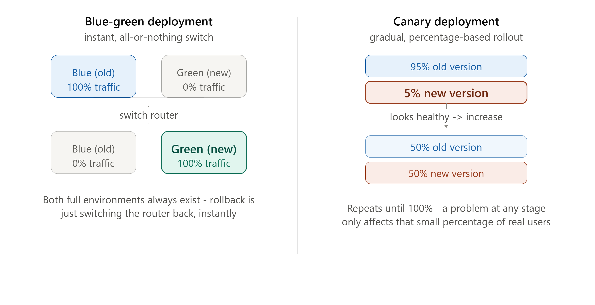

# DAY 26 — High Availability Patterns

### (Failover, Redundancy, Disaster Recovery, Multi-Region Architecture, Blue-Green and Canary Deployments)

> **Why this day matters:** Day 1 introduced Availability as one of the four pillars, with the series-vs-parallel math. Every week since has added redundancy at a specific layer — load balancers (Day 4), database replicas (Day 10), isolated resource pools (Day 20). Today is where this becomes a complete, operational discipline: what happens when an entire SERVER fails, what happens when an entire REGION fails, and — a genuinely underappreciated point — what happens when YOUR OWN deployment is the thing that breaks production.

> The diagram rendered above this lesson compares Blue-Green and Canary deployments side by side — refer back to it throughout Section 4.

---

## TABLE OF CONTENTS — DAY 26

1. Failover and Redundancy — The Foundation, Revisited
2. Disaster Recovery — RTO and RPO
3. Multi-Region Architecture
4. Blue-Green vs Canary Deployments
5. Day 26 Cheat Sheet

---

## 1. FAILOVER AND REDUNDANCY — THE FOUNDATION, REVISITED

### What

**Redundancy** means having more than one instance of a critical component, so a single failure doesn't cause total loss of service. **Failover** is the ACTUAL PROCESS of switching from a failed component to a redundant, healthy one — automatically, ideally without any human intervention.

### Why — Tying Together Everything This Course Has Already Built

This is genuinely the unifying thread behind an enormous fraction of this entire 30-day course, viewed retrospectively:

- **Day 4's load balancer** with multiple app server instances IS redundancy at the application layer; its health checks ARE the failover mechanism (automatically routing around a failed server).
- **Day 10's database replication** with Followers ready to be promoted to Leader IS redundancy at the data layer; the promotion process IS failover.
- **Day 20's Circuit Breaker** is a form of failover at the SERVICE-CALL level — failing fast to a fallback rather than waiting on a dead dependency.
- **Day 23's Redlock quorum** survives individual Redis instances failing — redundancy applied to coordination itself.

Today's contribution: making EXPLICIT the vocabulary (failover, redundancy, RTO/RPO) that names this pattern as ONE discipline, and extending it to the layers above individual servers — entire DATA CENTERS and REGIONS.

### How — Active-Passive vs Active-Active Failover

- **Active-Passive**: One instance (or region) actively handles ALL traffic; a redundant standby sits idle, ready to take over ONLY if the active one fails. Simpler, but the standby's capacity is "wasted" during normal operation, and failover takes some time (detecting the failure, then activating the standby).
- **Active-Active**: MULTIPLE instances simultaneously handle traffic (exactly Day 4's horizontally-scaled servers, or Day 10's read replicas serving reads) — failure of any ONE simply means the others absorb its share of load, with no distinct "activation" step needed at all. Directly echoes Day 12's CAP discussion: active-active setups across regions raise the same consistency-vs-availability questions multi-leader replication (Day 10) introduced.

### Interview Angle

"How would you make sure your system survives a server crashing?" → this is now a question you can answer by literally summarizing the relevant pieces of Days 4, 10, and 20 under one unifying vocabulary — redundancy at every layer, automatic failover via health checks/promotion/circuit breakers — demonstrating the course's cumulative design.

---

## 2. DISASTER RECOVERY — RTO AND RPO

### What

Disaster Recovery (DR) is the planning and infrastructure for recovering an ENTIRE system after a major, catastrophic failure — not just one server, but potentially an entire data center or region becoming unavailable (fire, natural disaster, major cloud provider outage). Two metrics define DR requirements precisely:

- **RTO (Recovery Time Objective)**: How long can the system be DOWN before recovery, before the impact becomes unacceptable? ("We must be back online within 1 hour.")
- **RPO (Recovery Point Objective)**: How much DATA can we afford to LOSE, measured in time? ("We can tolerate losing up to 5 minutes of the most recent writes.")

### Why These Two Specific Metrics

RTO and RPO force a precise, QUANTIFIED conversation about disaster tolerance, directly extending **Day 1's "state your NFRs explicitly" lesson** — "we need high availability" is vague; "RTO of 1 hour, RPO of 5 minutes" is a concrete, testable, BUDGETABLE requirement that directly determines which DR strategy (below) you actually need, and how much it will cost.

### How — DR Strategies, Ordered by Cost and Recovery Speed

- **Backup and Restore**: Periodic backups (Day 17's RDB-style snapshotting, applied at the whole-system level) stored separately; recovery means restoring from the most recent backup onto new infrastructure. Cheapest, but SLOWEST (high RTO) and loses everything since the last backup (high RPO, in line with Day 17's RDB weakness, generalized).
- **Pilot Light**: A minimal version of critical infrastructure runs continuously in a secondary region (e.g., the database is replicated there, Day 10's exact mechanism, but no application servers are running) — recovery means rapidly scaling UP the application layer in that region when needed. Faster than backup-restore, cheaper than full duplication.
- **Warm Standby**: A scaled-down, but FULLY FUNCTIONAL, copy of the entire system runs continuously in a secondary region — recovery means scaling IT up to full capacity. Faster RTO than Pilot Light, at a higher continuous cost.
- **Hot Standby / Multi-Region Active-Active**: A FULL-SCALE, fully active copy runs continuously (Section 1's active-active pattern, applied at the region level) — failover is nearly instantaneous (lowest RTO), at the HIGHEST continuous infrastructure cost (you're paying for full capacity in multiple regions, all the time).

### Interview Angle

"What's your disaster recovery plan?" — state RTO/RPO requirements EXPLICITLY first (directly mirroring Day 1's framework), then select a strategy that fits those numbers — a strong answer never jumps straight to "we'll have a backup region" without first quantifying how much downtime/data-loss is actually acceptable, since that number is what determines whether Backup-Restore or Hot Standby (wildly different costs) is the right choice.

---

## 3. MULTI-REGION ARCHITECTURE

### What

Running your system's infrastructure across MULTIPLE geographically distinct regions (not just multiple servers within one data center) — directly extending Section 1 and 2's redundancy concept to survive a failure at the scale of an ENTIRE region (a major cloud provider outage, a natural disaster affecting one geographic area).

### Why — Connecting Back to Day 2 and Day 5

Beyond pure disaster recovery, multi-region architecture ALSO directly serves Day 2 and Day 5's latency lessons — placing infrastructure physically closer to users in different parts of the world reduces round-trip latency, exactly the same motivation behind Day 5's CDN discussion, just applied to your actual application/database infrastructure rather than just static content.

### How — The Hard Part Is Data, Not Compute

Replicating STATELESS application servers (Day 4) across regions is comparatively easy — they hold no important local state. The genuinely hard part is the DATABASE layer, and this is where Day 10 and Day 12 become directly, unavoidably relevant:

- **Single-region database, multi-region app servers**: simplest, but app servers in a FAR region experience high latency on every database call — defeats much of the latency benefit.
- **Multi-leader replication (Day 10) across regions**: each region writes locally (low latency), but you inherit Day 10's write-conflict resolution problem in full.
- **Leaderless replication (Day 10) with cross-region quorum**: directly extends Day 23's Redlock-style quorum concept geographically — but cross-region network latency (Day 2) makes achieving quorum slower than a single-region setup.
- **Geo-sharded data (Day 11)**: each region owns ITS users' data exclusively (no cross-region replication needed for that data at all) — simplest from a consistency standpoint, but as Day 11 noted, this complicates any query needing to span users from different regions.

**The unavoidable conclusion, directly invoking Day 12's CAP theorem**: there is no multi-region database strategy that avoids the Consistency-vs-Availability trade-off — multi-region architecture is, fundamentally, CAP's trade-off made physically real and unavoidable, since the speed of light itself guarantees meaningful latency between regions, which is precisely what makes "wait for global consensus before every write" (strong consistency) expensive enough that most multi-region systems lean toward AP-style designs for at least SOME of their data.

### Interview Angle

"How would you design this system to survive an entire AWS region going down?" → multi-region architecture, and IMMEDIATELY flagging that the real complexity is the DATABASE layer (not application servers), with the specific replication strategy chosen based on the SAME CAP trade-off reasoning from Day 12 — this question is essentially asking you to synthesize Days 10, 11, and 12 under real operational stakes.

---

## 4. BLUE-GREEN vs CANARY DEPLOYMENTS



### What

These are two strategies for SAFELY deploying new code to production — directly addressing a genuinely underappreciated point: your OWN deployments are one of the most common causes of production incidents, and these patterns exist specifically to make rolling out new code itself a controlled, reversible, LOW-RISK operation. Refer to the diagram rendered above this lesson.

### Why

Without a careful deployment strategy, pushing new code means: stop the old version, start the new version, hope it works — and if it DOESN'T work, you're now actively debugging a broken production system under pressure, with users actively affected the entire time. Both patterns below exist to eliminate that "hope it works" gamble.

### How — Blue-Green Deployment

1. TWO complete, identical production environments exist simultaneously: "Blue" (currently serving 100% of live traffic) and "Green" (the NEW version, fully deployed but receiving 0% of traffic).
2. Once Green is verified healthy (automated tests, smoke tests), a router/load balancer (directly reusing Day 4's reverse-proxy concept) switches ALL traffic from Blue to Green, essentially instantly.
3. If a problem is discovered after the switch, ROLLBACK is just as instant — switch the router back to Blue, which never stopped running and still holds the previous, known-good version.

**Why this is valuable**: Rollback is the SAME speed as roll-forward — there's no "redeploying the old version" step, since Blue never went anywhere; this directly minimizes RTO (Section 2) for the specific failure mode of "this new deployment is broken."

### How — Canary Deployment

1. The new version is deployed alongside the old one, but initially receives only a SMALL PERCENTAGE of real traffic (e.g., 5%) — directly reusing Day 4's load-balancing infrastructure, just with WEIGHTED routing (Day 4's weighted algorithm) instead of even distribution.
2. The team watches METRICS (Day 24's entire observability lesson, directly applied) for that small percentage — error rates, latency, any anomalies.
3. If healthy, the percentage is gradually increased (5% to 25% to 50% to 100%); if a problem appears at ANY stage, traffic is routed back to the old version, having only affected that small percentage of real users.

**Why this is valuable, and how it differs from Blue-Green**: Canary catches problems that ONLY show up under REAL, varied production traffic patterns (something a pre-switch health check in Blue-Green might miss), at the cost of a SLOWER overall rollout (it takes time to gradually increase the percentage) — Blue-Green is fast and binary; Canary is slower but limits the BLAST RADIUS of a bad deployment to a small fraction of real users for as long as the gradual rollout takes.

### Comparison

|                               | Blue-Green                           | Canary                                     |
| ----------------------------- | ------------------------------------ | ------------------------------------------ |
| Rollout speed                 | Instant, all-or-nothing              | Gradual, percentage-based                  |
| Resource cost                 | Two full environments simultaneously | One environment, traffic-weighted          |
| Catches "real traffic" issues | Less effectively (binary switch)     | More effectively (real users, small %)     |
| Rollback speed                | Instant (switch back)                | Instant (route back), but less was exposed |

### Interview Angle

"How would you safely deploy a risky change to a high-traffic production system?" → Canary, specifically because it limits blast radius using real traffic patterns, combined with the Day 24 monitoring needed to actually OBSERVE the canary's health at each stage — and being ready to contrast it with Blue-Green (when instant full rollout/rollback matters more than gradual exposure) shows you understand these as different tools for different risk profiles, not interchangeable synonyms for "safe deployment."

---

## 5. DAY 26 CHEAT SHEET

```
FAILOVER AND REDUNDANCY (the unifying thread of this entire course)
  Redundancy = more than one of a critical thing
  Failover = the PROCESS of switching to a healthy redundant one
  Already built this month: Day 4 (LB+health checks), Day 10 (replica
  promotion), Day 20 (circuit breaker fallback), Day 23 (Redlock quorum)
  Active-Passive: standby idle until needed (simpler, slower failover)
  Active-Active: all instances live simultaneously (Day 4/10's pattern,
  no "activation" step, raises Day 12's consistency questions at scale)

DISASTER RECOVERY
  RTO = max acceptable DOWNTIME | RPO = max acceptable DATA LOSS (in time)
  State these NUMBERS explicitly first (Day 1's framework) - they determine
  which strategy you actually need
  Backup & Restore (cheapest, slowest) -> Pilot Light -> Warm Standby ->
  Hot Standby/Active-Active (most expensive, near-instant RTO)

MULTI-REGION ARCHITECTURE
  Extends redundancy to REGION-level failure + reduces latency (Day 2/5)
  App servers: easy (stateless, Day 4) | Database: HARD - this is Day 10's
  replication topologies + Day 12's CAP theorem, made physically unavoidable
  by the speed of light between regions
  No multi-region database design escapes the Consistency-vs-Availability
  trade-off - it's CAP made real, not a separate new problem

BLUE-GREEN vs CANARY DEPLOYMENT
  Blue-Green: two full environments, INSTANT all-or-nothing traffic switch,
  rollback = switch back instantly (best for: fast, clean binary rollback)
  Canary: gradual % rollout (Day 4's weighted routing), watched via Day 24's
  metrics at each stage, limits blast radius using REAL traffic
  (best for: catching issues only real traffic patterns reveal)
  Your OWN deployments are a top real-world cause of incidents - these
  patterns exist specifically to make THAT risk controlled and reversible
```

---

### What's next (Day 27 preview)

Tomorrow is your first full Week 4 case study: **Design WhatsApp/a Chat Application**, end-to-end — applying WebSockets (Day 3), the Redis Pub-Sub backplane (Day 16), message delivery guarantees (Day 15), and group chat fan-out (echoing Day 14's fan-out strategies) into one complete, interview-ready system design with a full architecture diagram and working Node.js implementation.

**Say "Day 27" whenever you're ready.**
