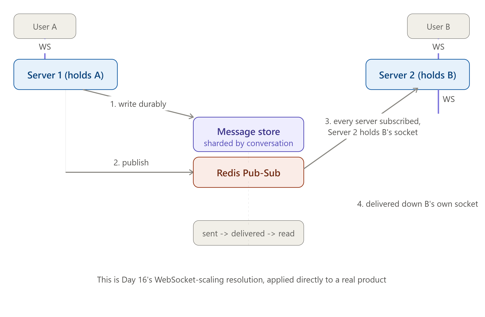

# DAY 27 — FULL SYSTEM DESIGN CASE STUDY #1

### Design WhatsApp / a Chat Application (End-to-End)

> **Why this day matters:** This is the first of three full case studies closing out the course — and chat applications are one of the single most commonly asked system design interview questions, specifically because they require synthesizing real-time communication (Day 3), cross-server message routing (Day 16), delivery guarantees (Day 15), and group fan-out strategy (Day 14) all at once. If you can answer this question completely, you've proven you can actually USE this entire course's material together under interview pressure, not just recite individual days.

> The diagram rendered above this lesson is the full end-to-end architecture — it IS Day 16's WebSocket-scaling resolution, now applied to a complete, real product. Refer back to it throughout this lesson.

---

## TABLE OF CONTENTS — DAY 27

1. Step 1: Requirements
2. Step 2: Estimation
3. Step 3: High-Level Architecture (Mapping the Diagram)
4. Step 4: Deep Dive — Message Delivery and Read Receipts
5. Step 5: Deep Dive — Group Chat Fan-Out
6. Step 6: Deep Dive — Offline Users and Message Storage
7. Step 7: Bottlenecks and Trade-offs
8. Full Implementation — Node.js End to End
9. Day 27 Cheat Sheet

---

## STEP 1: REQUIREMENTS

### Functional Requirements (FR)

1. Users can send and receive text messages in real time, one-on-one.
2. Users can create group chats with multiple participants.
3. Messages show delivery status: sent, then delivered, then read.
4. Messages sent while a recipient is offline are delivered once they reconnect.
5. Message history is persisted and retrievable.

### Non-Functional Requirements (NFR)

- **Latency**: Messages should arrive in near real time, well under a second, directly requiring **Day 3's WebSockets**, not polling.
- **Availability**: Connection infrastructure must survive individual server failures without dropping unrelated users' connections (Day 4/26).
- **Consistency**: Message ORDER within a single conversation must be preserved (strong, within that scope); read-receipt status can be slightly eventually consistent, since a few hundred milliseconds of lag on "read" status is imperceptible and acceptable.
- **Durability**: A sent message must never be silently lost, even if the recipient is offline for days.

---

## STEP 2: ESTIMATION

Using **Day 6's framework**:

```
Assume: 200 million Daily Active Users (DAU)
Average messages sent per user per day: 40

Total messages/day = 200,000,000 x 40 = 8,000,000,000 (8 billion)
Average write RPS = 8,000,000,000 / 86,400 ≈ 92,600 RPS
Peak write RPS (3x factor) ≈ 277,800 RPS

Average message size (text): ~100 bytes
Storage/day = 8,000,000,000 x 100 bytes ≈ 800 GB/day
```

**What this tells us immediately**: ~278,000 peak writes/sec is an enormous number — far beyond a single database (even sharded modestly), and far beyond what a single Redis Pub-Sub instance could reasonably fan out alone. This single number justifies, before we've drawn anything: heavy horizontal scaling of connection-handling servers (Day 4), sharding the message store aggressively (Day 11), and treating the Pub-Sub/messaging backbone itself as something that may need its own internal scaling (previewing Step 7's bottleneck discussion).

---

## STEP 3: HIGH-LEVEL ARCHITECTURE (MAPPING THE DIAGRAM)


Refer to the diagram rendered above this lesson — every box is a direct, named reuse of a specific prior lesson:

1. **WebSocket connections** (Day 3): each user maintains a persistent, full-duplex connection to WHICHEVER server instance they're currently connected to.
2. **Connection servers, horizontally scaled** (Day 4): many server instances, each holding a subset of all currently-connected users' sockets in local memory.
3. **Message store, sharded by conversation ID** (Day 11): the durable source of truth for every message ever sent — sharding by conversation (not by user) ensures all messages within ONE conversation land on the same shard, making "fetch this conversation's history" a single-shard operation.
4. **Redis Pub-Sub backplane** (Day 16, applied directly): exactly the mechanism that resolved the "Server 1 can't reach a user connected to Server 2" problem — every connection server subscribes to the same channel(s), and publishes outgoing messages to it rather than trying to deliver directly.
5. **Delivery status tracking**: a separate, fast-updating piece of state (sent, then delivered, then read) layered on top of the durably-stored message itself.

### Why Write to the Message Store BEFORE Publishing (the Order Matters)

This is the first genuinely important design decision, deliberately shown as step 1 (not step 3) in the diagram: the message is written DURABLY to the message store BEFORE being published to Pub-Sub for real-time delivery. **Why this order specifically**: recall **Day 16's explicit warning** that classic Pub-Sub has NO persistence — if the message were published FIRST and the durable write happened (or failed) afterward, a crash between those two steps could mean the message was real-time-delivered but never durably saved (or vice versa, lost in transit before being saved at all). Writing durably FIRST guarantees the message is never lost, even if the real-time delivery step fails for any reason — the recipient will still get it whenever they next sync, exactly satisfying Functional Requirement #4.

---

## STEP 4: DEEP DIVE — MESSAGE DELIVERY AND READ RECEIPTS

This is the first signature deep dive, directly answering Functional Requirement #3.

### The Three States, and Why They're Tracked Separately From the Message Itself

- **Sent**: The message left the sender's device and reached the server (the durable write in Step 3 succeeded).
- **Delivered**: The message reached the RECIPIENT's device (their WebSocket connection received it, via the Pub-Sub backplane).
- **Read**: The recipient's client has confirmed the user actually VIEWED the message (typically sent back as a small, separate event from the recipient's device once the chat is opened/scrolled into view).

**Why this is genuinely a three-step state machine, not just a boolean "delivered: true/false"**: each transition is triggered by a DIFFERENT event, happening on a DIFFERENT device, at a DIFFERENT time — directly echoing the **state-machine thinking from Day 20's Circuit Breaker** (Closed, Open, Half-Open), just applied to message status instead of failure handling.

### How — Implementing the State Transitions

```js
// Sender's message arrives - STEP 3's durable write, status starts as 'sent'
async function sendMessage(senderId, conversationId, text) {
  const message = await messageStore.insert({
    conversationId,
    senderId,
    text,
    status: "sent",
    createdAt: Date.now(),
  });
  await publishToBackplane(conversationId, message); // Day 16's exact mechanism
  return message;
}

// Recipient's connection server, upon successfully delivering via WebSocket
async function onMessageDeliveredToSocket(messageId) {
  await messageStore.updateStatus(messageId, "delivered");
  // Notify the SENDER of this status change - also via the Pub-Sub backplane,
  // since the sender might be connected to a DIFFERENT server entirely
  await publishStatusUpdate(messageId, "delivered");
}

// Recipient's CLIENT explicitly confirms the message was viewed
app.post("/api/messages/:id/read", async (req, res) => {
  await messageStore.updateStatus(req.params.id, "read");
  await publishStatusUpdate(req.params.id, "read");
  res.status(204).send();
});
```

Notice the status UPDATE itself ALSO travels through the Pub-Sub backplane (Day 16) — the sender needs to learn their message was delivered or read, and the sender could be connected to ANY server instance, exactly the same cross-server delivery problem the backplane already solves for the original message.

### Interview Angle

"How would you implement read receipts?" → a three-state status field, updated by different triggers at different points in the message's lifecycle, with EACH status change ALSO routed through the same Pub-Sub backplane used for original delivery — explicitly recognizing that status updates have the exact same cross-server delivery problem as the message itself is the key insight.

---

## STEP 5: DEEP DIVE — GROUP CHAT FAN-OUT

This deep dive directly reuses **Day 14's entire fan-out-on-write vs fan-out-on-read framework**, now applied to group messaging instead of a social feed.

### The Question, Reframed From Day 14

When a user sends a message to a group of, say, 50 people, does the system push that ONE message out to all 50 recipients' connections immediately (fan-out on write), or store it once and let each recipient pull it when they next sync (fan-out on read)?

### The Answer — Why Chat Groups Lean Differently Than Day 14's Social Feed

Recall Day 14's social feed used a HYBRID approach specifically because of the celebrity-follower-count problem, since some accounts have millions of followers. Chat groups are STRUCTURALLY different: WhatsApp-style groups are capped at a modest size, a few hundred members at most — there is NO "celebrity" case to worry about. This means **fan-out on write is simply the correct, sufficient choice here, with no hybrid needed** — directly demonstrating Day 14's deeper lesson: the right strategy depends on the SPECIFIC system's actual access patterns and scale limits, not a one-size-fits-all rule.

```js
async function sendGroupMessage(senderId, groupId, text) {
  const message = await messageStore.insert({
    groupId,
    senderId,
    text,
    status: "sent",
    createdAt: Date.now(),
  });

  const members = await groupStore.getMembers(groupId); // bounded, small list - no celebrity problem
  await Promise.all(
    members
      .filter((memberId) => memberId !== senderId)
      .map((memberId) => publishToBackplane(memberId, message)), // fan-out on write, directly
  );

  return message;
}
```

### Interview Angle

"How would group chat fan-out differ from a social media feed's fan-out?" → directly citing Day 14's framework, and explaining that group size CAPS, unlike unbounded follower counts, remove the need for Day 14's hybrid approach — this is exactly the kind of "I know when NOT to apply the more complex solution" judgment that distinguishes a senior answer.

---

## STEP 6: DEEP DIVE — OFFLINE USERS AND MESSAGE STORAGE

### The Problem (Functional Requirement #4)

If a recipient is offline, meaning no active WebSocket connection on ANY server, when a message is published to the Pub-Sub backplane, recall **Day 16's explicit warning**: classic Pub-Sub has NO persistence — that published message is simply LOST the instant it's published, if nobody is subscribed and listening for that specific recipient at that exact moment.

### Why This ISN'T Actually a Problem, Given Step 3's Design

This is precisely why Step 3 deliberately wrote the message DURABLY to the message store FIRST. The Pub-Sub publish step is ONLY responsible for REAL-TIME delivery to an ALREADY-connected user — it is explicitly not the mechanism responsible for guaranteed eventual delivery. When an offline user reconnects:

```js
// On reconnection, the client (or server, on the client's behalf) fetches
// any messages that arrived while offline, directly from the durable
// message store - completely independent of whatever happened on Pub-Sub
async function onUserReconnect(userId, lastSyncTimestamp) {
  const missedMessages = await messageStore.getMessagesSince(
    userId,
    lastSyncTimestamp,
  );
  return missedMessages; // delivered via a normal API response, not Pub-Sub at all
}
```

This is the THIRD time this course has shown the SAME underlying pattern: a fast, ephemeral mechanism (Pub-Sub) handles the common, happy-path case where both parties are online right now, while a SEPARATE, durable mechanism (the message store) provides the guarantee that the fast path's limitations don't actually cause data loss — directly echoing **Day 17's cache-aside pattern** (fast cache, durable database fallback) and **Day 21's notification capstone** (fast dispatch, durable queue with a DLQ fallback).

### Interview Angle

"What happens to a message sent to an offline user?" → explicitly distinguish the REAL-TIME delivery path, which is Pub-Sub, best-effort, only working if both parties are online right now, from the DURABLE delivery guarantee, the message store, always written first, synced on reconnect — this is the single most important conceptual answer for this entire case study.

---

## STEP 7: BOTTLENECKS AND TRADE-OFFS

1. **Redis Pub-Sub itself can become a bottleneck at our calculated ~278,000 peak writes/sec** if every single message fans out through ONE Redis Pub-Sub instance. A more robust real implementation might shard the Pub-Sub layer itself, for example multiple Redis Pub-Sub channels/instances, partitioned by conversation ID, directly reusing **Day 11's consistent hashing** applied to the messaging backplane rather than a database, or use Kafka (Day 15) instead, trading Day 16's simplicity for Day 15's higher sustained throughput and built-in partitioning.
2. **The message store, sharded by conversation, could develop hot shards** if a small number of extremely active group chats land on the same shard, directly recalling **Day 11's hotspot warning**, now applied to chat instead of database rows generally.
3. **Trade-off: message ordering within a conversation vs horizontal scale.** Strict ordering (Step 1's NFR) is easiest to guarantee if all of one conversation's messages flow through a single point, which is exactly why sharding BY CONVERSATION, not by sender or recipient, was chosen in Step 3, deliberately preserving per-conversation ordering while still scaling horizontally ACROSS different conversations.

---

## FULL IMPLEMENTATION — NODE.JS END TO END

```js
const WebSocket = require("ws");
const redis = require("redis");

const wss = new WebSocket.Server({ port: 8080 });
const localConnections = new Map(); // userId -> socket, THIS server instance only

const redisPublisher = redis.createClient();
const redisSubscriber = redis.createClient();

async function setup() {
  await redisPublisher.connect();
  await redisSubscriber.connect();

  // Day 16's exact backplane pattern, now carrying real chat messages
  await redisSubscriber.subscribe("chat_delivery", async (raw) => {
    const { recipientId, message } = JSON.parse(raw);
    const socket = localConnections.get(recipientId);
    if (socket && socket.readyState === WebSocket.OPEN) {
      socket.send(JSON.stringify(message));
      await messageStore.updateStatus(message.id, "delivered"); // Step 4
      await redisPublisher.publish(
        "chat_status",
        JSON.stringify({
          messageId: message.id,
          status: "delivered",
        }),
      );
    }
    // If not held locally, some OTHER server instance will handle it -
    // and if NO instance handles it (recipient fully offline), the message
    // remains safely in the durable store from Step 3/6, synced on reconnect
  });
}

wss.on("connection", (socket, req) => {
  const userId = getUserIdFromAuth(req);
  localConnections.set(userId, socket);

  socket.on("message", async (data) => {
    const { conversationId, recipientIds, text } = JSON.parse(data);

    // STEP 3: durable write FIRST, always - this is the guarantee, regardless
    // of whether real-time delivery below succeeds
    const message = await messageStore.insert({
      conversationId,
      senderId: userId,
      text,
      status: "sent",
      createdAt: Date.now(),
    });

    // STEP 5: fan-out on write, bounded group size, no celebrity problem
    for (const recipientId of recipientIds) {
      await redisPublisher.publish(
        "chat_delivery",
        JSON.stringify({ recipientId, message }),
      );
    }
  });

  socket.on("close", () => localConnections.delete(userId));
});

// STEP 6: offline sync endpoint - completely independent of the Pub-Sub path
app.get("/api/messages/sync", async (req, res) => {
  const missed = await messageStore.getMessagesSince(
    req.user.id,
    req.query.since,
  );
  res.json(missed);
});

setup();
```

---

## DAY 27 CHEAT SHEET

```
THE CORE ARCHITECTURE = DAY 16'S WEBSOCKET RESOLUTION, APPLIED DIRECTLY
  WebSockets (Day 3) for the connection + Redis Pub-Sub backplane (Day 16)
  for cross-server delivery + sticky sessions (Day 4) for initial connection

THE SIGNATURE INSIGHT: DURABLE WRITE FIRST, PUBLISH SECOND
  Message store write (Day 11's sharding, BY CONVERSATION for ordering)
  happens BEFORE Pub-Sub publish - guarantees no message loss even though
  Pub-Sub itself (Day 16) has zero persistence
  Same pattern as Day 17 (cache + durable DB) and Day 21 (queue + DLQ) -
  fast/ephemeral path for the happy case, durable path for the guarantee

DELIVERY STATUS AS A STATE MACHINE (Day 20's state-machine thinking, reused)
  sent -> delivered -> read, each triggered by a DIFFERENT event/device
  Status updates ALSO travel through the Pub-Sub backplane - same
  cross-server problem as the original message itself

GROUP FAN-OUT (Day 14's framework, correctly NOT needing the hybrid)
  Fan-out on write is sufficient here because group size is CAPPED -
  no celebrity-follower-count problem the way a social feed has
  Knowing WHEN the simpler strategy is correct is the senior-level judgment

OFFLINE USERS
  Pub-Sub handles ONLY the real-time, both-online-right-now case
  Reconnection syncs from the DURABLE store directly, bypassing Pub-Sub
  entirely - this is WHY Functional Requirement #4 is satisfied

BOTTLENECKS
  Single Pub-Sub instance at ~278k peak writes/sec -> shard the backplane
  itself (Day 11's consistent hashing) or move to Kafka (Day 15)
  Sharding BY CONVERSATION (not sender/recipient) deliberately preserves
  per-conversation ordering while still scaling across conversations
```

---

### What's next (Day 28 preview)

Tomorrow is Case Study #2: choose between designing a **Ride-Sharing app (Uber)** or **YouTube** — both genuinely common, genuinely different interview questions. Uber centers on geospatial matching and real-time location; YouTube centers on video storage, transcoding, and CDN-driven delivery at massive scale. We'll cover whichever is most relevant to you, applying this course's full toolkit end-to-end exactly as today's chat system did.

**Say "Day 28" whenever you're ready** (and let me know if you'd prefer Uber or YouTube, or want both).
