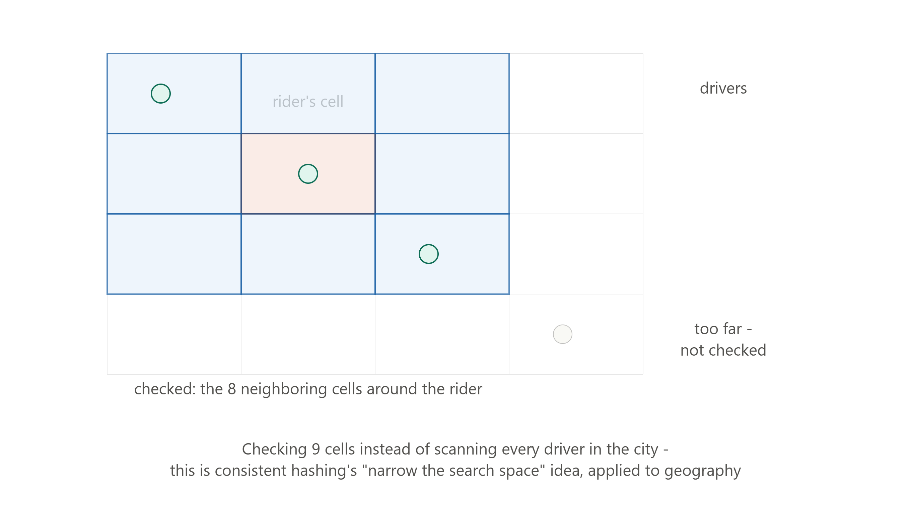
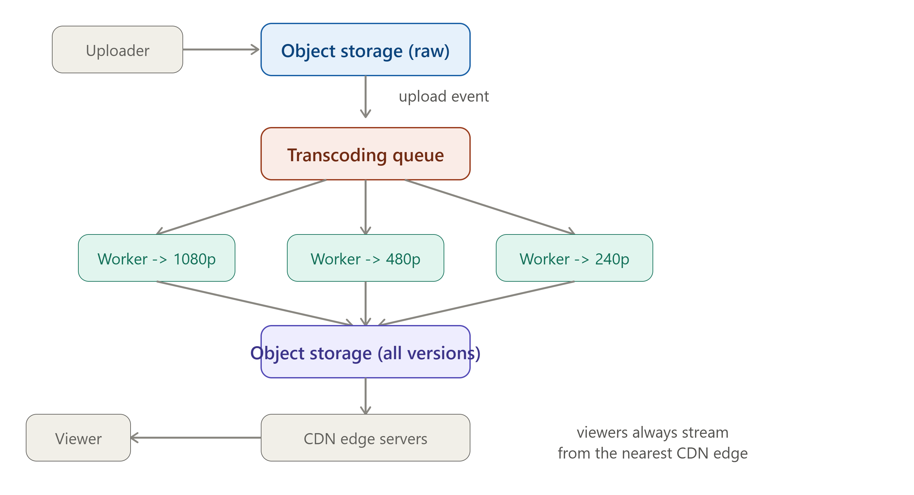

# DAY 28 — FULL SYSTEM DESIGN CASE STUDY #2

### Design a Ride-Sharing App (Uber) AND Design YouTube (Both Covered)

> **Why this day matters:** Uber and YouTube are two of the other most commonly asked system design interview questions, and they're genuinely different from Day 27's chat system in a way worth experiencing directly: Uber's hard problem is GEOSPATIAL (finding nearby things fast, fairly), and YouTube's hard problem is MEDIA PROCESSING AT SCALE (transforming and delivering enormous binary files efficiently). Covering both today gives you complete range — proof that this course's toolkit adapts to genuinely different problem shapes, not just one repeated template.

> Two diagrams were rendered above — refer to them throughout **Part A, Section 3** (the geohashing grid) and **Part B, Section 3** (the full video pipeline).

---

# PART A — DESIGN UBER (RIDE-SHARING)

## TABLE OF CONTENTS — PART A

A1. Requirements
A2. Estimation
A3. Deep Dive — Geospatial Indexing (Geohashing)
A4. Deep Dive — The Matching Algorithm
A5. High-Level Architecture
A6. Implementation Note

---

## A1. REQUIREMENTS

### Functional Requirements

1. Riders can request a ride, specifying pickup and destination.
2. The system matches the rider with a NEARBY available driver.
3. Both rider and driver see each other's live location during the trip.
4. The system calculates pricing and processes payment on completion.

### Non-Functional Requirements

- **Latency**: Matching must happen within a few seconds — this is the single most user-experience-critical number in the entire system.
- **Consistency**: A driver must NEVER be matched to two riders simultaneously — this is a genuine, strict consistency requirement, directly recalling **Day 12's lesson on choosing strong consistency where it actually matters**, unlike most of this course's examples that lean eventual.
- **Availability**: Driver location updates are extremely frequent and loss-tolerant — a missed single GPS ping is harmless since the next one arrives in seconds — eventual consistency here is completely fine, a deliberate CONTRAST to the matching requirement above, exactly the kind of "different consistency needs within one system" reasoning from Day 7/12/14.

---

## A2. ESTIMATION

```
Assume: 5 million concurrent active drivers (broadcasting location) globally
Each driver sends a location update every 4 seconds

Location update RPS = 5,000,000 / 4 ≈ 1,250,000 RPS (1.25 million/sec)
```

**What this number tells us immediately**: this is an EXTREME write volume, far beyond what any single database could handle directly, recalling **Day 11's sharding necessity** at an extreme scale — this single calculation justifies why driver location is held in a fast, in-memory, geospatially-indexed structure (Section 3) rather than a traditional database table queried directly for every match request.

---

## A3. DEEP DIVE — GEOSPATIAL INDEXING (GEOHASHING)



Refer to the diagram rendered above this lesson throughout this section.

### The Problem

Given a rider's location, find available drivers WITHIN a few kilometers, FAST, without scanning every single one of 5 million drivers' coordinates and calculating distance to each one, an absurdly expensive O(n) operation, recalling **Day 9's entire "don't scan everything" indexing lesson**, now applied to 2D space instead of a sorted column.

### What — Geohashing

Geohashing converts a 2D latitude/longitude coordinate into a single STRING, where geographically NEARBY locations tend to share LONGER common prefixes — two strings that share most of their characters represent two small areas that sit right next to each other; a shorter shared prefix represents a larger area containing both.

### How This Solves the Problem

1. The map is divided into a GRID of cells, each with its own geohash.
2. Each driver's current location is mapped to a specific cell, recomputed as they move.
3. To find nearby drivers for a rider, compute the RIDER's cell, then check ONLY that cell plus its immediate neighboring cells, typically a 3x3 grid of 9 cells, as shown in the diagram — drivers in those 9 cells are "near enough" candidates; everything outside is simply never even examined.
4. This is functionally identical, in spirit, to **Day 9's B-Tree lesson**: instead of scanning everything, you jump directly to the relevant, narrow slice of the search space — here, geography itself plays the role indexing plays for sorted data.

### Implementation

```js
const geohash = require("ngeohash");

// Driver location updates: store in Redis, keyed by geohash cell (Day 8's
// key-value pattern, reused for geospatial data instead of simple lookups)
async function updateDriverLocation(driverId, lat, lng) {
  const cell = geohash.encode(lat, lng, 6); // 6-character precision, roughly 1.2km cells
  await redisClient.geoAdd("driver_locations", {
    longitude: lng,
    latitude: lat,
    member: driverId,
  });
  // Redis has BUILT-IN geospatial commands (GEOADD/GEOSEARCH) that
  // internally implement exactly this geohashing strategy
}

async function findNearbyDrivers(riderLat, riderLng, radiusKm) {
  return redisClient.geoSearch(
    "driver_locations",
    {
      longitude: riderLng,
      latitude: riderLat,
    },
    { radius: radiusKm, unit: "km" },
  );
  // Internally, Redis checks only the relevant cells - exactly the
  // 9-cell pattern shown in the diagram rendered above this lesson
}
```

**Real-world example**: Uber actually developed and open-sourced their OWN geospatial indexing system, **H3**, a hexagonal grid system, an evolution of the same core geohashing idea using hexagons instead of squares for more uniform neighbor relationships, directly because this exact problem was central enough to their business to justify building custom infrastructure for it.

### Interview Angle

"How would you find nearby drivers efficiently?" → geohashing or H3, explicitly explained as avoiding an O(n) full scan by narrowing the search to a small number of relevant grid cells — directly citing this as the SAME underlying principle as Day 9's indexing, narrow the search space rather than scan everything, is exactly the cross-day synthesis that separates a strong answer.

---

## A4. DEEP DIVE — THE MATCHING ALGORITHM

### The Hard Part: Avoiding Double-Booking a Driver

Recall the strict consistency NFR from A1 — once candidate drivers are found (Section 3), the system must ATOMICALLY claim ONE of them for this rider, ensuring no other simultaneous request can ALSO claim the same driver. This is precisely **Day 23's distributed locking problem**, applied directly:

```js
async function matchRiderToDriver(riderId, riderLat, riderLng) {
  const candidates = await findNearbyDrivers(riderLat, riderLng, 3); // Section 3

  for (const driverId of candidates) {
    // Day 23's exact lock pattern: SET ... NX - atomically claims this
    // driver ONLY if no other request has already claimed them
    const claimed = await redisClient.set(`driver_claim:${driverId}`, riderId, {
      NX: true,
      PX: 10000,
    });
    if (claimed === "OK") {
      await notifyDriver(driverId, riderId); // Day 16's Pub-Sub backplane, reused
      return { driverId, riderId };
    }
    // Already claimed by someone else - try the next candidate
  }
  throw new Error("No available drivers nearby");
}
```

This is genuinely the SAME SET-with-NX primitive from Day 23's distributed lock lesson, just applied to "claiming a driver" instead of "claiming the right to run a scheduled job" — yet another demonstration of one small set of tools recombining across very different problems.

### Interview Angle

"How do you prevent two riders from being matched to the same driver simultaneously?" → Day 23's atomic claim pattern using SET with NX, explicitly named as a distributed locking problem — this is the single most important correctness requirement in the entire system, and naming the EXACT mechanism, not just "we'd handle concurrency somehow," is what's being tested.

---

## A5. HIGH-LEVEL ARCHITECTURE

```
Driver app --(location updates, ~1.25M peak RPS)--> Location Service (Redis Geo, Section 3)
Rider app --(ride request)--> Matching Service --(query nearby + claim lock, Section 4)--> Location Service
Matching Service --(notify)--> Pub-Sub backplane (Day 16) --> Driver's connected server --> Driver app
Trip data, pricing, payment --> sharded database (Day 11, sharded by region/city)
```

---

## A6. IMPLEMENTATION NOTE

The two code blocks in Sections 3 and 4 ARE the complete, signature implementation for this system — exactly as Day 7's ID generation and Day 14's fan-out strategy were the signature deep dives for their respective capstones, Uber's signature pieces are geospatial search (Section 3) and atomic driver-claiming (Section 4). Everything else, like trip records and payment processing, reuses standard patterns from Weeks 1-2 directly.

---

# PART B — DESIGN YOUTUBE (VIDEO PLATFORM)

## TABLE OF CONTENTS — PART B

B1. Requirements
B2. Estimation
B3. Deep Dive — The Upload-to-Playback Pipeline
B4. Deep Dive — Adaptive Bitrate Streaming
B5. High-Level Architecture
B6. Implementation Note

---

## B1. REQUIREMENTS

### Functional Requirements

1. Users can upload videos.
2. Uploaded videos become available for streaming, in multiple quality levels.
3. Users can watch videos with smooth playback, adapting to their network conditions.

### Non-Functional Requirements

- **Consistency**: Eventually consistent — a video doesn't need to be playable the INSTANT it finishes uploading; some processing delay is expected and acceptable, directly reusing Day 12's exact reasoning.
- **Availability**: Extremely high for PLAYBACK, since viewers must always be able to watch; slightly more tolerant for UPLOAD processing, since a brief delay before a video is ready is acceptable.
- **Scale**: Storage and bandwidth needs are MASSIVE — video is, by far, the largest data type covered anywhere in this course.

---

## B2. ESTIMATION

```
Assume: 500 hours of video uploaded per minute (a real, often-cited YouTube-scale figure)
Average raw file size: ~1GB per hour of footage (varies hugely, used as an estimate)

Storage need (RAW uploads) = 500 hours/min x 60 min/hour x 1GB/hour
                            = 30,000 GB/hour = 30 TB/hour of NEW raw footage

Multiply by needing to ALSO store multiple transcoded versions (Section 4) of
each video - e.g., 5 different quality levels - roughly MULTIPLIES total
storage needs several times over, beyond just the raw original file
```

**What this number tells us immediately**: this is storage and bandwidth at a scale that makes Day 5's CDN lesson and object storage, mentioned since Day 6's photo-app estimation example, not just "useful" but ABSOLUTELY MANDATORY — there is no version of this system that works without them.

---

## B3. DEEP DIVE — THE UPLOAD-TO-PLAYBACK PIPELINE


Refer to the diagram rendered above this lesson throughout this section — this pipeline directly reuses **Day 21's entire event-driven plus queue architecture pattern**, just for video instead of notifications.

### Why Processing Can't Happen Synchronously at Upload Time

Transcoding a video, converting it into multiple resolutions and bitrates, is a CPU-intensive operation that can take minutes for a long video — directly recalling **Day 15's original motivation for message queues**: the upload request itself must NOT wait for this slow processing to complete, exactly Day 15's "don't make the user wait for the slow part" lesson.

### How — Event-Driven Transcoding (Direct Reuse of Day 15/16/21)

1. User uploads the raw video file directly to OBJECT STORAGE, not a regular database, directly reusing **Day 7's "large binary blobs belong in object storage, not a relational database" lesson**.
2. The object storage system fires an EVENT the moment the upload completes, most cloud object storage services support this natively, directly reusing **Day 16's event-driven philosophy**.
3. This event triggers a job pushed onto a TRANSCODING QUEUE, Day 15's exact pattern.
4. Multiple WORKER processes, horizontally scaled per Day 4, consume jobs from this queue, each one transcoding the SAME source video into a DIFFERENT resolution and bitrate, such as 1080p, 720p, 480p, or 240p — this is naturally, embarrassingly parallel work, perfectly suited to Day 15's queue-based work distribution.
5. Each finished version is stored back in object storage, and the video's metadata record is updated to reflect "ready to stream" once all required versions are complete.
6. Finished versions are pushed out to CDN edge servers, Day 5 directly reused — viewers ALWAYS stream from a nearby CDN edge, never from origin object storage directly.

### Implementation

```js
const amqp = require("amqplib"); // Day 15's queue, reused directly

// Triggered by the object storage "upload complete" event (Day 16's
// event-driven pattern - this service has ZERO knowledge of the uploader)
async function onUploadComplete(videoId, rawFileUrl) {
  const channel = await getQueueChannel();
  const resolutions = ["1080p", "720p", "480p", "240p"];

  for (const resolution of resolutions) {
    // One job per resolution - embarrassingly parallel (Day 15's queue,
    // Day 4's horizontally-scaled workers consuming it)
    channel.sendToQueue(
      "transcoding_jobs",
      Buffer.from(
        JSON.stringify({
          videoId,
          rawFileUrl,
          resolution,
        }),
      ),
      { persistent: true },
    );
  }
}

// A transcoding worker
async function processTranscodingJob(job) {
  const transcodedFile = await transcodeVideo(job.rawFileUrl, job.resolution); // FFmpeg, e.g.
  const storedUrl = await objectStorage.upload(
    transcodedFile,
    `${job.videoId}/${job.resolution}.mp4`,
  );
  await videoMetadataStore.markResolutionReady(
    job.videoId,
    job.resolution,
    storedUrl,
  );

  const allReady = await videoMetadataStore.areAllResolutionsReady(job.videoId);
  if (allReady) {
    await videoMetadataStore.markVideoReady(job.videoId); // now visible to viewers
    await cdnClient.distribute(job.videoId); // Day 5's CDN, push to edge servers
  }
}
```

### Interview Angle

"How would you handle video uploads without making users wait for processing?" → directly cite Day 15's message queue motivation, don't make the user wait for the slow part, and Day 16's event-driven trigger, where object storage fires the event decoupled from the uploader — this question is essentially testing whether you recognize video transcoding as the SAME shape of problem as Day 21's notification dispatch, just with a CPU-bound job instead of an API call.

---

## B4. DEEP DIVE — ADAPTIVE BITRATE STREAMING

### What

Rather than a viewer downloading ONE fixed-quality file, the video is split into short segments of a few seconds each, available at EACH resolution and bitrate produced in Section 3 — the viewer's player continuously monitors network conditions and requests whichever segment quality currently fits their available bandwidth, SWITCHING smoothly between qualities as conditions change, for example dropping from 1080p to 480p if the viewer's connection degrades mid-playback.

### Why

Recall **Day 6's latency and throughput distinction** — network conditions vary enormously between viewers and even change moment to moment for a single viewer, such as walking from WiFi coverage to cellular, or a congested network briefly slowing down. A single fixed-quality file forces a bad trade-off: encode for the WORST expected connection, which is wasteful and lower quality for everyone with good connections, or the BEST, which causes constant buffering and stalling for anyone with worse conditions. Adaptive streaming lets EACH viewer get the best quality THEIR current connection can sustain, continuously.

### How

This is exactly WHY Section 3's pipeline produces MULTIPLE resolution versions in the first place — adaptive streaming protocols such as HLS and DASH work by providing the player a "manifest" file listing all available quality levels and their segment URLs; the player's own logic decides, segment by segment, which quality to request next, based on a continuously-measured download speed for recent segments.

### Interview Angle

"Why does YouTube need multiple versions of the same video?" → adaptive bitrate streaming, directly connected to Day 6's latency and throughput variability across different viewers and network conditions — many candidates know YouTube has "multiple qualities" without being able to explain that this is SPECIFICALLY in service of CONTINUOUS, per-segment adaptation, not just a fixed setting the viewer manually picks once.

---

## B5. HIGH-LEVEL ARCHITECTURE

```
Uploader --> Object storage (raw) --(event)--> Transcoding queue (Day 15)
          --> Worker pool (Day 4), one job per resolution
          --> Object storage (all versions) --> CDN (Day 5)
Viewer --(adaptive bitrate requests, per segment)--> nearest CDN edge
Video metadata (title, description, view count) --> standard sharded
  database (Day 11), separate from the actual binary video data entirely
```

---

## B6. IMPLEMENTATION NOTE

Section 3's code IS the signature implementation for this system, exactly the way Day 21's notification dispatch code was that capstone's centerpiece — video transcoding is, structurally, an event-driven-queue problem wearing different clothes.

---

# DAY 28 CHEAT SHEET (BOTH CASE STUDIES)

```
UBER - the signature problems
  Geospatial search: geohashing/H3 - narrows search to nearby grid cells,
  same underlying principle as Day 9's "don't scan everything" indexing
  Driver matching: Day 23's atomic SET-with-NX lock pattern, reused
  directly, to prevent double-booking a single driver (the system's
  hard consistency requirement, deliberately contrasted with location
  updates' eventual consistency tolerance)

YOUTUBE - the signature problems
  Upload pipeline = Day 15 (queue) + Day 16 (event trigger) + Day 4
  (parallel workers) + Day 5 (CDN distribution) + Day 7 (object storage
  for binary blobs) - structurally identical to Day 21's notification
  capstone, just with CPU-bound transcoding instead of API calls
  Adaptive bitrate streaming: multiple resolutions exist specifically to
  let EACH viewer's player continuously adapt per-segment, directly
  serving Day 6's "network conditions vary" latency/throughput lesson

BOTH CASE STUDIES PROVE THE SAME META-LESSON
  This course's toolkit (queues, pub-sub, sharding, caching, CDN, locks,
  consistency trade-offs) is genuinely general-purpose - the SAME small
  set of patterns recombines to solve genuinely different-shaped problems,
  whether the hard part is geography, real-time messaging, or media files
```

---

### What's next (Day 29 preview)

Tomorrow is Case Study #3, with a deliberately different flavor: designing a **Payment System** — a domain where STRONG consistency (Day 8's ACID, Day 12's CP-leaning choices) genuinely dominates over the AP-leaning, eventually-consistent defaults this course has favored for most other examples. You'll see exactly where and why the trade-offs flip.

**Say "Day 29" whenever you're ready.**
