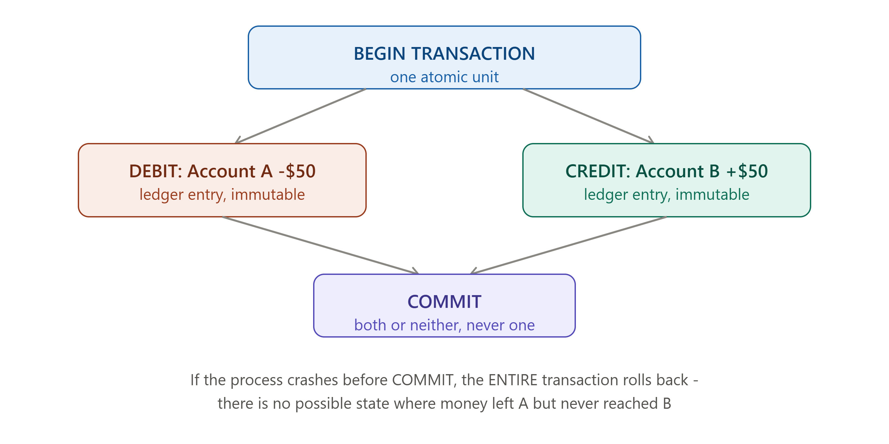

# DAY 29 — FULL SYSTEM DESIGN CASE STUDY #3

### Design a Payment System (Strong Consistency Focus)



> **Why this day matters:** Every case study so far has leaned toward eventual consistency and availability — Day 27's chat (read receipts can lag), Day 28's Uber (location updates can be stale) and YouTube (processing can be delayed). A payment system is the deliberate counter-example: this is where Day 8's ACID, Day 12's CP-leaning choices, and Day 13's distributed transaction patterns genuinely dominate, because the cost of being WRONG (losing money, double-charging, corrupting a balance) vastly outweighs the cost of being slightly slower. Today shows you exactly where and why the trade-offs flip.

> The diagram rendered above this lesson shows the atomic double-entry ledger transfer — refer back to it throughout Section 3.

---

## TABLE OF CONTENTS — DAY 29

1. Requirements — Why This Domain Is Different
2. The Double-Entry Ledger Model
3. Deep Dive — Atomicity and the Transfer Transaction
4. Deep Dive — Idempotency for Payment Retries (Full Circle Back to Day 1)
5. Deep Dive — Handling the Distributed Case (Payments Across Services)
6. Where Eventual Consistency STILL Applies (Even Here)
7. High-Level Architecture
8. Full Implementation
9. Day 29 Cheat Sheet

---

## 1. REQUIREMENTS — WHY THIS DOMAIN IS DIFFERENT

### Functional Requirements

1. Transfer money from one account to another.
2. Process a payment from a customer to a merchant.
3. Support refunds.
4. Provide an auditable, complete history of every transaction.

### Non-Functional Requirements — Explicitly Contrasted With Every Prior Case Study

- **Consistency**: STRONG, non-negotiable, for the actual balance/transfer logic. Recall **Day 12's lesson**: this is a textbook case for choosing CP over AP. A "probably correct" balance is unacceptable in a way a "probably up to date" like-count (Day 7) or driver location (Day 28) simply isn't.
- **Durability**: Absolute. A confirmed transaction must NEVER be lost — directly the highest-stakes version of **Day 1's Reliability pillar** covered anywhere in this course.
- **Auditability**: Every change must be traceable, attributable, and — critically — historical records must be IMMUTABLE, never edited or deleted after the fact, only ever appended to or corrected via a NEW, offsetting entry — this single requirement shapes the entire data model (Section 2).
- **Availability**: Still matters, but explicitly SUBORDINATE to consistency here — if forced to choose, exactly Day 12's framing, this system chooses to REJECT a transaction rather than risk an incorrect one going through.

### Why State This Contrast Explicitly (the Meta-Lesson of Today)

A genuinely senior system design answer doesn't apply the SAME default trade-offs to every system — recall **Day 7's URL mapping (strong) vs click count (eventual)**, **Day 14's post durability vs like count**, **Day 27's message durability vs read-receipt timing**. Payment systems are simply the domain where almost EVERYTHING leans strong/CP, rather than just one specific field within an otherwise eventually-consistent system — explicitly naming this as the EXCEPTION to this course's general pattern, rather than presenting it as "yet another system," is exactly the kind of self-aware framing that signals real understanding.

---

## 2. THE DOUBLE-ENTRY LEDGER MODEL

### What

Rather than storing a single mutable "balance" number per account and incrementing/decrementing it directly, a proper payment system records EVERY transaction as a pair of IMMUTABLE ledger entries: a DEBIT from one account and a CREDIT to another, for the SAME amount — the account's "balance" is then always CALCULATED as the sum of its ledger entries, never stored and directly mutated as a single number.

### Why

This is a centuries-old accounting principle, double-entry bookkeeping predates computing by hundreds of years, adopted directly into system design because it provides exactly the Auditability requirement from Section 1: since entries are NEVER edited or deleted, you can always reconstruct the EXACT history of how any balance arrived at its current value — directly contrasting with a single mutable balance column, where a bug or malicious edit could silently corrupt history with zero trace of what happened.

### How

```sql
CREATE TABLE ledger_entries (
  id SERIAL PRIMARY KEY,
  transaction_id UUID NOT NULL,   -- groups the debit+credit pair together
  account_id INTEGER NOT NULL,
  amount DECIMAL(12,2) NOT NULL,  -- negative for debit, positive for credit
  created_at TIMESTAMP DEFAULT NOW(),
  description TEXT
);

-- A transfer of $50 from Account A to Account B creates TWO rows,
-- sharing the SAME transaction_id, summing to exactly zero
-- (a debit of -50 and a credit of +50)

-- Computing a balance is always a SUM, never a stored, directly-mutated field:
SELECT SUM(amount) AS balance FROM ledger_entries WHERE account_id = 42;
```

### Interview Angle

"How would you model account balances for a payment system?" → double-entry ledger, NOT a single mutable balance field — explicitly naming the auditability/immutability benefit is the expected depth; many candidates default to a simple balance column without realizing why financial systems specifically avoid that pattern.

---

## 3. DEEP DIVE — ATOMICITY AND THE TRANSFER TRANSACTION

Refer to the diagram rendered above this lesson throughout this section — this is the single most important mechanical detail in this entire case study.

### Why This Is THE Canonical ACID Example

Recall **Day 8's bank-transfer example**, used as the canonical illustration of Atomicity from the very first time ACID was introduced in this course. Today is where that example becomes the actual centerpiece of a real design, rather than a teaching analogy.

### How

```js
async function transferFunds(
  fromAccountId,
  toAccountId,
  amount,
  transactionId,
) {
  const client = await db.connect();
  try {
    await client.query("BEGIN"); // Day 8's exact Atomicity guarantee begins here

    // Check sufficient balance, computed via the ledger sum (Section 2)
    const balanceResult = await client.query(
      "SELECT COALESCE(SUM(amount), 0) AS balance FROM ledger_entries WHERE account_id = $1",
      [fromAccountId],
    );
    if (balanceResult.rows[0].balance < amount) {
      throw new Error("Insufficient funds");
    }

    // Both ledger entries, as ONE atomic unit (the diagram rendered above)
    await client.query(
      "INSERT INTO ledger_entries (transaction_id, account_id, amount, description) VALUES ($1, $2, $3, $4)",
      [transactionId, fromAccountId, -amount, "Transfer out"],
    );
    await client.query(
      "INSERT INTO ledger_entries (transaction_id, account_id, amount, description) VALUES ($1, $2, $3, $4)",
      [transactionId, toAccountId, amount, "Transfer in"],
    );

    await client.query("COMMIT"); // both entries now permanently, durably exist together
  } catch (err) {
    await client.query("ROLLBACK"); // Day 8: undo EVERYTHING - no partial transfer ever exists
    throw err;
  } finally {
    client.release(); // Day 13's connection pool discipline
  }
}
```

### The Concurrency Problem This Alone Doesn't Solve

Notice: checking the balance and inserting the debit are TWO separate statements. Between them, could a CONCURRENT transfer also read the same, still sufficient, balance and ALSO proceed, together overdrawing the account? This is exactly why real production systems use database-level row locking, SELECT FOR UPDATE, or rely on the database's transaction ISOLATION level, Day 8's "I" in ACID, to guarantee concurrent transfers against the SAME account are processed safely, one at a time, rather than racing each other — a direct, practical application of Day 8's Isolation guarantee, not just Atomicity.

```sql
-- FOR UPDATE locks the relevant rows for the duration of this transaction,
-- ensuring no concurrent transfer can read a stale balance and act on it
SELECT COALESCE(SUM(amount), 0) AS balance FROM ledger_entries
WHERE account_id = $1 FOR UPDATE;
```

### Interview Angle

"Walk me through exactly how you'd implement a safe money transfer" → the full transaction (BEGIN, check, two inserts, COMMIT, ROLLBACK on error), PLUS proactively raising the concurrent-transfer race condition and naming FOR UPDATE row locking as the fix — this concurrency detail is precisely the follow-up question that separates candidates who've memorized the textbook ACID example from those who've actually reasoned through it.

---

## 4. DEEP DIVE — IDEMPOTENCY FOR PAYMENT RETRIES (FULL CIRCLE BACK TO DAY 1)

### Why This Closes the Loop on the Entire Course

Recall: **Day 1** introduced idempotency keys using THIS EXACT payment-charging example, before any other system design concept had even been taught. **Day 23** gave it the full, formal three-state treatment. Today is the payoff — the actual, complete, production-shaped implementation, in the EXACT domain that motivated the concept from day one of this entire course.

```js
app.post("/api/payments/transfer", async (req, res) => {
  const { fromAccountId, toAccountId, amount, idempotencyKey } = req.body;

  // Day 23's complete three-state idempotency middleware, applied here
  const existing = await redisClient.get(`idempotency:${idempotencyKey}`);
  if (existing) {
    const stored = JSON.parse(existing);
    if (stored.status === "completed")
      return res.status(stored.statusCode).json(stored.body);
    if (stored.status === "in_progress")
      return res.status(409).json({ error: "Already processing" });
  }
  await redisClient.set(
    `idempotency:${idempotencyKey}`,
    JSON.stringify({ status: "in_progress" }),
    { EX: 86400 },
  );

  try {
    const transactionId = idempotencyKey; // reuse directly as the ledger's transaction_id (Section 2)
    await transferFunds(fromAccountId, toAccountId, amount, transactionId);
    const body = { success: true, transactionId };
    await redisClient.set(
      `idempotency:${idempotencyKey}`,
      JSON.stringify({ status: "completed", statusCode: 200, body }),
      { EX: 86400 },
    );
    res.status(200).json(body);
  } catch (err) {
    await redisClient.del(`idempotency:${idempotencyKey}`); // allow a genuine retry after a real failure
    res.status(400).json({ error: err.message });
  }
});
```

### Interview Angle

"How do you prevent double-charging if a request is retried?" → the complete answer this course has been building toward across THREE separate days — and explicitly stating "this is the exact problem Day 1 opened with" demonstrates the kind of full-circle, cumulative thinking that's hard to fake.

---

## 5. DEEP DIVE — HANDLING THE DISTRIBUTED CASE (PAYMENTS ACROSS SERVICES)

### The Problem

In a microservices architecture (Day 19), a checkout flow often needs: reserve inventory, charge payment, ship the order, across THREE separate services, each owning its own database. Recall **Day 13's exact dilemma**: 2PC or Saga?

### Why Payment Specifically Tends to Favor a Saga Over 2PC, Despite Wanting Strong Consistency

This seems contradictory at first — doesn't "we want strong consistency" argue FOR 2PC? In practice, the answer is usually no, for a reason directly recalling **Day 20's "don't let one service's failure cascade" lesson**: 2PC would require the Payment Service to hold a lock or pending charge open while WAITING on Inventory and Shipping — meaning a slow or down Shipping Service could leave a customer's card in a "pending charge" limbo state. The Saga pattern (Day 13) keeps payment processing itself ATOMIC and immediate, since the transfer transaction in Section 3 is a complete, self-contained, genuinely ACID operation within the Payment Service's OWN database, while inter-service coordination uses compensating transactions, where a REFUND is the compensating action for a successful charge, exactly Day 13's pattern, if a LATER step fails.

```
1. Reserve inventory (Inventory Service) - commits immediately, for real
2. Charge payment (Payment Service) - Section 3's atomic ledger transaction,
   ALSO commits immediately, for real, within Payment's own database
3. Ship order (Shipping Service) - FAILS
-- Compensating transaction: REFUND (Day 13's pattern) - a NEW, offsetting
   ledger entry (Section 2's immutability - we never EDIT the original
   charge, we record a new transaction reversing it)
```

### Interview Angle

"Would you use 2PC or Saga for a payment that depends on other services?" → Saga, even in a strong-consistency domain, specifically because the ATOMICITY that matters most, the ledger transaction itself from Section 3, is fully achievable WITHIN one service's database — the cross-service coordination is a SEPARATE concern, better served by compensating transactions than by 2PC's blocking risk (Day 20).

---

## 6. WHERE EVENTUAL CONSISTENCY STILL APPLIES (EVEN HERE)

In the spirit of Day 7/12/14's "different data, different needs, even within one system" lesson, applied one more time, even within this strong-consistency-dominated domain:

- **Transaction history display**, a user scrolling their past transactions, can tolerate a READ REPLICA (Day 10) that's a few hundred milliseconds behind the Leader — the user isn't making a financial decision based on millisecond-fresh history.
- **Fraud detection and analytics on transaction patterns** can run on eventually-consistent, asynchronously-replicated data, Day 10's async replication, Day 16's event-driven triggers — this work doesn't need to block or slow down the actual transaction.
- **Notification of a completed payment**, Day 21's entire notification capstone directly reusable here, is, exactly as Day 21 established, completely fine to be eventually consistent — a confirmation email arriving a few seconds late has zero financial consequence.

### Interview Angle

A genuinely complete answer to "design a payment system" explicitly carves out these eventually-consistent exceptions, rather than presenting EVERY piece of the system as needing the Section 3 ledger transaction's strict guarantees — over-applying strong consistency everywhere is its own kind of over-engineering, Day 1's lesson, one final time.

---

## 7. HIGH-LEVEL ARCHITECTURE

```
Client --> API Gateway (Day 19, with auth/Day 25 + rate limiting/Day 18)
        --> Payment Service
              --> Ledger DB (strongly consistent, Section 2/3, Leader-Follower
                   replication, Day 10, synchronous for the Leader's own durability)
              --> Idempotency store (Redis, Section 4)
        --(Saga events, Day 13/16)--> Inventory Service, Shipping Service
        --(async event, Day 16)--> Notification Service (Day 21, eventually consistent)
        --(async event)--> Fraud Detection / Analytics (Day 10's read replicas, eventually consistent)
```

---

## 8. FULL IMPLEMENTATION

Sections 3 and 4's code blocks together ARE the complete, signature implementation for this capstone — directly mirroring how Day 7's ID generation, Day 14's fan-out logic, and Day 21's per-channel resilience setup each served as THEIR capstone's centerpiece. The atomic ledger transaction (Section 3) plus the idempotency middleware (Section 4) constitute the entire hard, novel core of a payment system; everything else, like the API gateway, notifications, and fraud detection, is a direct, by-now-familiar reuse of patterns from across this entire course.

---

## 9. DAY 29 CHEAT SHEET

```
WHY THIS DOMAIN FLIPS THE COURSE'S USUAL DEFAULT
  Most systems this course covered lean AP/eventual for MOST data, with
  strong consistency carved out for specific fields (Day 7's URL mapping,
  Day 14's post durability). Payments lean CP/strong for almost everything
  CORE, with eventual consistency carved out only for peripheral concerns
  (Section 6) - explicitly naming this REVERSAL is the meta-lesson

DOUBLE-ENTRY LEDGER (not a single mutable balance column)
  Every transfer = a debit entry + credit entry, same transaction_id,
  summing to zero. Balance = SUM of entries, never directly mutated.
  Gives auditability/immutability "for free" - entries are NEVER edited

ATOMIC TRANSFER (Day 8's ACID, made real)
  BEGIN -> check balance -> insert debit -> insert credit -> COMMIT
  ROLLBACK on any failure - no partial transfer can ever exist
  Concurrency fix: SELECT FOR UPDATE (Day 8's Isolation, in practice,
  not just Atomicity) - prevents two concurrent transfers racing on
  the same account's balance

IDEMPOTENCY (Day 1's opening example, Day 23's full formalization,
  finally implemented completely, in the domain that motivated it)
  Three-state check (never-seen / completed / in_progress) before
  EVERY charge attempt - the idempotency key doubles as the ledger's
  transaction_id for a clean, traceable link

DISTRIBUTED CASE: SAGA, NOT 2PC (even though consistency matters most here)
  The ledger transaction itself is fully atomic WITHIN the Payment
  Service's own database (Section 3) - cross-service coordination
  (inventory, shipping) is a SEPARATE concern, better served by
  compensating transactions (REFUND) than by 2PC's blocking risk (Day 20)

EVENTUAL CONSISTENCY STILL HAS A PLACE
  Transaction history display, fraud analytics, payment notifications -
  all fine to be eventually consistent, even in this domain
  Applying strong consistency to EVERYTHING is itself over-engineering
```

---

# COURSE STATUS: 29 OF 30 DAYS COMPLETE

You have now built four complete, end-to-end system designs (URL Shortener, Social Feed, Notification System, Chat App) plus three additional full case studies (Uber, YouTube, Payment System) — seven total real, interview-grade designs, each one a deliberate demonstration of this course's full toolkit applied to a genuinely different problem shape.

**Day 30 is the final day**: a complete recap of all 29 days organized as a TEACHABLE framework, mock interview practice questions with model answer structures, and a reusable template for explaining ANY system design problem to someone else in 15 minutes — exactly the original goal you set at the very start of this course.

**Say "Day 30" whenever you're ready for the final day.**
