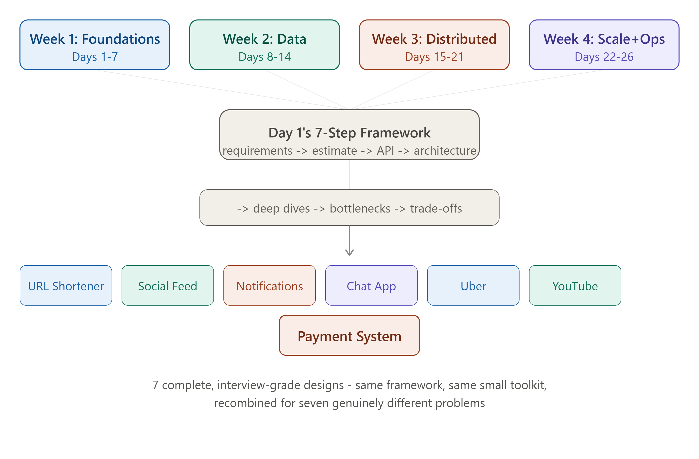

# DAY 30 — FINAL DAY

### Complete Recap, Mock Interview Practice, and Your 15-Minute Teaching Template

> **Welcome to the last day.** Thirty days ago, you asked for a way to master system design and be able to teach it to anyone. The diagram rendered above this lesson shows the shape of what you built: four weeks of foundational knowledge, all funneling into Day 1's 7-step framework, proven out across seven complete, real, interview-grade system designs. Today doesn't teach anything new — it organizes everything you already know into three tools you'll actually use: a full recap by week, mock interview questions with model answer skeletons, and a template for explaining ANY system design problem to someone else in 15 minutes.

---

## TABLE OF CONTENTS — DAY 30

1. The Complete Recap, Week by Week
2. The Master Cheat Sheet (One Page, Everything)
3. Mock Interview Practice — 8 Questions With Model Answer Skeletons
4. Your 15-Minute Teaching Template
5. How to Keep Going From Here

---

## 1. THE COMPLETE RECAP, WEEK BY WEEK



### Week 1 — Foundations (Days 1-7)

You learned the vocabulary and mental models everything else depends on: the 4 pillars (Scalability, Reliability, Availability, Maintainability), client-server architecture and the full URL-to-webpage journey (DNS, TCP, TLS, HTTP), the four API paradigms (REST, GraphQL, gRPC, WebSockets) and when each fits, horizontal scaling and load balancing algorithms, proxies/CDNs/caching with a hand-built LRU cache, and back-of-the-envelope estimation. **Capstone**: a complete URL Shortener, end to end.

### Week 2 — Data and Storage (Days 8-14)

You learned how data is stored, found, and kept safe at scale: SQL vs NoSQL and ACID, how indexes actually work, B-Tree and B+Tree, with a real benchmark you ran yourself, database replication topologies and the sync/async trade-off, sharding and consistent hashing built from scratch, the CAP theorem and PACELC (the theory explaining WHY every prior trade-off existed), and distributed transactions (2PC vs Saga) plus connection pooling and ORMs. **Capstone**: a complete Social Feed storage design, centered on the fan-out-on-write vs fan-out-on-read decision.

### Week 3 — Distributed Systems Components (Days 15-21)

You learned how independent services communicate and survive each other's failures: message queues (Kafka vs RabbitMQ vs SQS) with a working producer-consumer, Pub-Sub vs Queue and event-driven architecture (finally resolving the WebSocket-scaling cliffhanger from Day 3/4), caching at scale with all four strategies and cache invalidation, rate limiting algorithms with a working Redis-backed middleware, microservices vs monolith with service discovery and the API Gateway pattern, and the three resilience patterns (Circuit Breaker, Retry, Bulkhead). **Capstone**: a complete Notification System combining all of it.

### Week 4 — Scale, Reliability, and Real Systems (Days 22-29)

You learned the remaining advanced building blocks and applied everything to real, famous interview questions: consistent hashing revisited for caching, Bloom Filters built from scratch, distributed locks (Redlock) and the full idempotency pattern (closing a loop opened on Day 1) and the Snowflake ID algorithm, observability (logs, metrics, traces, Prometheus/Grafana, OpenTelemetry), security (authentication vs authorization, OAuth2, JWT, CORS/CSRF), and high availability patterns (failover, disaster recovery, multi-region, Blue-Green/Canary deployments). **Three full case studies**: Chat/WhatsApp, Uber AND YouTube, and a Payment System.

---

## 2. THE MASTER CHEAT SHEET (ONE PAGE, EVERYTHING)

```
=== THE FRAMEWORK (Day 1) ===
1. Requirements (FR + NFR, state scope explicitly)
2. Estimation (DAU -> RPS -> peak RPS -> storage -> bandwidth, Day 6)
3. API design (resource-based URLs, correct verbs, Day 3)
4. High-level architecture (boxes -> arrows, justified by step 2's numbers)
5. Deep dive on 1-2 genuinely interesting components
6. Hunt bottlenecks & single points of failure yourself
7. State trade-offs explicitly - there is no one "correct" design

=== THE 4 PILLARS (Day 1) ===
Scalability (vertical/horizontal) | Reliability (correct despite failure)
Availability (responds when asked, "nines" math) | Maintainability (easy
to change later)

=== NETWORKING (Day 2-3) ===
DNS -> TCP handshake -> TLS handshake -> HTTP request -> response
REST (Level 2 Richardson) | GraphQL (flexible shape, N+1 problem)
gRPC (internal, fast, typed) | WebSockets (real-time, STATEFUL)

=== SCALING (Day 4-6) ===
Stateless beats Stateful for horizontal scaling | LB algorithms: Round
Robin, Least Connections, IP Hash, Weighted | L4 (fast, blind) vs L7
(smart, routes on content) | Latency (one request) vs Throughput
(requests/sec) - use PERCENTILES (p99) not averages

=== CACHING (Day 5, 17) ===
Cache-aside (you check) vs Read-through (cache checks) - READ strategies
Write-through (sync, safe) vs Write-back (async, fast, riskier) - WRITE strategies
LRU/LFU/FIFO eviction | TTL vs explicit invalidation | Thundering Herd ->
single-flight lock fix

=== DATABASES (Day 8-13) ===
SQL (ACID, JOINs) vs NoSQL (Document/KV/Column/Graph - 4 different things)
B+Tree indexing (wide+shallow = few disk reads) - speeds reads, slows writes
Replication: Leader-Follower (simple) / Multi-leader (write conflicts) /
Leaderless (quorum, W+R>N)
Sharding: Range (hotspots) / Hash (reshuffle problem) / CONSISTENT HASHING
(the fix - ring + virtual nodes, only ~1/N keys move)
CAP: pick C or A during a partition, P isn't optional | PACELC adds the
latency-vs-consistency trade-off during NORMAL operation too
2PC (blocking, strong) vs Saga (non-blocking, compensating transactions)

=== DISTRIBUTED SYSTEMS (Day 15-21) ===
Queue (1 message to 1 consumer, work distribution) vs Pub-Sub (1 to ALL
subscribers, event notification) | Event-driven architecture = Saga
choreography, generalized
Rate limiting: Token Bucket (bursts OK) / Leaky Bucket (smooth) /
Fixed Window (boundary bug) / Sliding Window (the fix)
Microservices: real trade-offs, not "modern beats old" - org scaling is
the real driver | API Gateway = routing+auth+rate limit+aggregation
Circuit Breaker (Closed/Open/Half-Open) + Retry (backoff+jitter,
idempotent ops only) + Bulkhead (isolated pools) - used TOGETHER

=== ADVANCED + OPS (Day 22-26) ===
Bloom Filter: never false-negative, CAN false-positive, tiny fixed memory
Redlock: quorum across independent Redis instances (W+R>N, reapplied)
Idempotency: client key, server checks 3 states (never/completed/in-progress)
Snowflake ID: timestamp+machineID+sequence = time-sortable, zero coordination
Observability: Logs (what happened) / Metrics (how's it trending) /
Traces (where did THIS request's time go, across services)
Auth: Authentication (WHO, 401) vs Authorization (WHAT, 403) | JWT is
SIGNED not encrypted | CORS (browser permission) vs CSRF (forgery attack)
HA: RTO (max downtime) / RPO (max data loss) | Multi-region = CAP made
physically real | Blue-Green (instant switch) vs Canary (gradual, real traffic)

=== THE RECURRING PATTERNS (show up 3+ times each) ===
Idempotency keys: Day 1, 2, 15, 20, 21, 23, 29 (seven times!)
Cache-aside / fast-ephemeral-plus-durable-fallback: Day 5, 16, 17, 21, 27
Consistent hashing: Day 4 (preview), 11 (built), 22 (caching/LB), 28 (geo)
Quorum (W+R>N): Day 10 (replication), 23 (locks), 26 (multi-region)
"Different data, different consistency needs, same system": Day 7, 12,
14, 27, 29 - the single most repeated judgment call in this whole course
```

---

## 3. MOCK INTERVIEW PRACTICE — 8 QUESTIONS WITH MODEL ANSWER SKELETONS

Practice these out loud, using Day 1's 7-step framework explicitly. For each, the model skeleton tells you WHICH days to draw from — don't read the answer, try it yourself first, then check.

**Q1: "Design a parking lot reservation system."**
Skeleton: FR (reserve a spot, check availability) plus NFR (strong consistency — two cars can't reserve the same spot, directly Day 12/29's reasoning). Estimation (spots per lot, peak reservation RPS). Deep dive: atomic claim using Day 23's SET-with-NX lock pattern, the same one used in Day 28's driver-matching. Trade-off: optimistic locking (check-then-write with a version number) vs the pessimistic lock — both valid, name the difference.

**Q2: "Design a rate limiter as a standalone service, not embedded in your app."**
Skeleton: This is Day 18, but now AS the whole system, not a component. FR (configurable limits per client). Architecture: it becomes its own microservice (Day 19), called via gRPC (Day 3, fast and internal) by every other service. Deep dive: which algorithm, probably Sliding Window Counter from Day 18, for the storage/precision trade-off, and where state lives (Redis, shared across instances, Day 4's stateless lesson).

**Q3: "Design a search autocomplete feature, type-ahead suggestions."**
Skeleton: FR (suggest completions as the user types) plus NFR (very low latency, under 100ms — this is THE critical NFR). Data structure deep dive: a Trie (prefix tree) for fast prefix matching, cached aggressively per Day 5/17 since suggestions for common prefixes barely change. Estimation: read-heavy by an extreme margin (Day 6/7's reasoning).

**Q4: "Design a distributed cron job scheduler."**
Skeleton: FR (run jobs at scheduled times, across a fleet of workers). Deep dive: directly Day 23's distributed lock — only ONE worker should execute a given scheduled job, even with many worker instances (Day 4). Bottleneck: a single scheduler instance deciding "what's due" could be a single point of failure — discuss leader election, a Day 12 Zookeeper-style coordination concept, for the scheduler itself.

**Q5: "Design a leaderboard system, like a gaming leaderboard showing the top 100 players."**
Skeleton: Data structure deep dive: Redis Sorted Sets, Day 17's ZSET, also mentioned for Day 14's feed store — score-ordered, O(log n) updates and range queries, a perfect fit. Estimation: writes (score updates) vs reads (viewing the leaderboard) — likely read-heavy (Day 6). Consistency: eventually consistent is fine, a few seconds of staleness on rank is acceptable, per Day 12's reasoning.

**Q6: "Design an e-commerce inventory system that prevents overselling."**
Skeleton: This is Day 29's territory — strong consistency needed, since you can't sell the same last item twice. Deep dive: Day 29's SELECT-FOR-UPDATE row-locking pattern, or an atomic decrement with a check (an UPDATE that only succeeds if quantity is still above zero). Distributed case: if Inventory is its own microservice in a checkout Saga (Day 13), this atomic operation happens WITHIN Inventory's own database — same reasoning as Day 29's payment ledger.

**Q7: "Design a system to detect and block DDoS-style traffic."**
Skeleton: Directly Day 18 plus Day 25's security lens on rate limiting, but at a MUCH larger scale and earlier in the stack, ideally at the CDN/edge layer (Day 5), before traffic even reaches your origin. Deep dive: combining IP-based rate limiting (Day 18) with anomaly detection (Day 24's monitoring/alerting) to identify patterns beyond simple thresholds.

**Q8: "Design Google Docs, real-time collaborative editing."**
Skeleton: This is the hardest of the eight — WebSockets (Day 3) plus a Pub-Sub backplane (Day 16) for real-time sync, but the GENUINELY hard part is conflict resolution when two users edit the same text simultaneously — directly Day 10's multi-leader write-conflict problem, and Day 10 even named the real solution: CRDTs (Conflict-free Replicated Data Types) or Operational Transformation. Knowing to NAME this as the hard, specialized part, rather than pretending it's simple, is the senior-level answer.

---

## 4. YOUR 15-MINUTE TEACHING TEMPLATE

This is the thing you asked for on Day 1: a way to explain ANY system design problem to someone else, fast. Use this exact structure.

**Minute 0-2 — Frame it as a question, not a lecture.** "Let's design X together. First — what does it actually need to DO?" List 3-4 functional requirements WITH them, out loud.

**Minute 2-4 — One number that matters.** Pick the SINGLE most important scale number, peak RPS, or storage, or concurrent connections, and calculate it together, on a whiteboard, using Day 6's DAU-to-RPS-to-peak-RPS conversion. Say explicitly: "this number is going to justify everything else we do."

**Minute 4-6 — Draw the boxes.** Client, then Load Balancer, then App Servers, then Cache, then Database — adding ONLY the boxes the number from minute 2-4 actually justifies. Don't add a cache "just because"; justify it with the read-heavy ratio, exactly like every capstone in this course did.

**Minute 6-12 — Pick ONE interesting thing and go deep.** Every system in this course had exactly one or two signature deep dives — Day 7's ID generation, Day 14's fan-out strategy, Day 27's durable-write-before-publish ordering. Pick the ONE part of THIS system that's genuinely interesting, and spend most of your remaining time there. Use a concrete example with real, if rounded, numbers.

**Minute 12-14 — Name a bottleneck and a trade-off, unprompted.** "If this got 10x bigger, what breaks first?" Answer it yourself. "We chose X here, which costs us Y — that's the trade-off." This single habit, demonstrated in EVERY capstone this course built, is what separates "knows the words" from "actually understands."

**Minute 14-15 — One sentence summary.** "So: we built X, justified by Y number, with Z as the interesting part, and we know A is the next bottleneck if we grow." If you can say that sentence cleanly, you've taught it.

---

## 5. HOW TO KEEP GOING FROM HERE

- **Re-explain, don't re-read.** The fastest way to find gaps in your understanding is to explain a Day-X topic to someone, or out loud to yourself, WITHOUT looking at the file. Where you stumble is where to re-read.
- **Pick a real, smaller side project and apply ONE pattern for real.** Add a real Redis cache (Day 17) to something you've built. Add real rate limiting (Day 18). The gap between "I read about it" and "I configured it and watched it work" is where retention actually happens.
- **Re-run Day 9's benchmark, and Day 11's consistent hashing demo, on your own machine.** You already have the code. Seeing the numbers yourself, again, after some time has passed, cements it far better than re-reading the explanation.
- **When you get a real interview, use the Day 30 mock questions as a warm-up the night before** — out loud, with a timer, using the 7-step framework explicitly.
- **Revisit the "recurring patterns" list in Section 2 periodically.** Idempotency, consistent hashing, and the fast-ephemeral-plus-durable-fallback pattern are worth being able to recognize INSTANTLY, in any new problem you encounter, precisely because they showed up so many times across genuinely different systems in this course.

---

# COURSE COMPLETE

Thirty days ago you asked for a way to master system design well enough to teach it to anyone — explained in detail, with the what/why/how, real examples, and working implementations, structured for a Node.js backend developer. You now have:

- **30 complete lesson files**, each following that exact structure, covering every topic on your original list and more.
- **7 full, end-to-end system designs** (URL Shortener, Social Feed, Notification System, Chat App, Uber, YouTube, Payment System) proving the framework works on genuinely different problems.
- **A working benchmark, a hand-built LRU cache, a consistent hashing ring, a Bloom Filter, a Snowflake ID generator, a Redlock implementation, a circuit breaker, and a rate limiter** — all built from scratch, all runnable.
- **A reusable 7-step framework, a one-page master cheat sheet, 8 mock interview questions, and a 15-minute teaching template.**

The material is yours to revisit, reteach, and build on. Good luck — you're genuinely ready.
